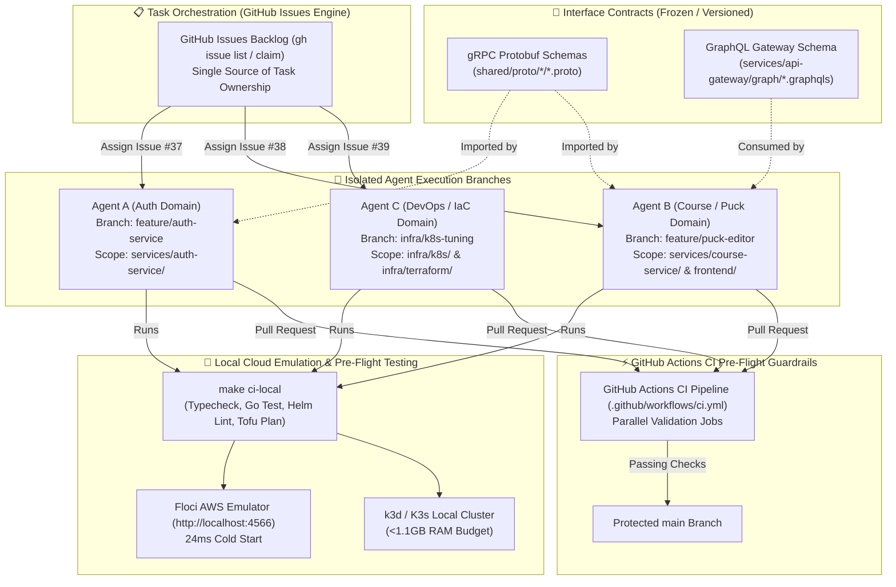

# 🛡️ StudEd Production Multi-Agent DevOps & System Design Architecture

> **Purpose**: Standardize concurrent multi-agent collaboration (Claude Code, Cursor, Antigravity, Gemini) across the StudEd monorepo without Git merge conflicts, contract drift, or broken builds.

---

## 🔬 Critical Analysis of Common Multi-Agent Anti-Patterns

### ❌ Anti-Pattern 1: File-Based Lock Registries in Git (`.agents/LOCKS.md`)
- **The Flaw**: Storing active agent locks in a tracked Git file (`LOCKS.md`) causes immediate Git merge conflicts when multiple agents push their feature branches to `main`.
- **Engineering Fix**: Task ownership must be coordinated via an external state registry (**GitHub Issues via `gh issue`**), never via Git-tracked state files.

### ❌ Anti-Pattern 2: Unverified Code Graph Dependencies (`graphifyy`)
- **The Flaw**: Relying on snapshot graph tools creates context drift the moment any file changes. Furthermore, restricting context below interface boundaries causes agents to miss breaking protobuf or schema changes.
- **Engineering Fix**: Code boundaries are governed deterministically by **Protobuf Interface Contracts (`shared/proto/`)** and **GraphQL Schemas (`services/api-gateway/graph/`)**.

---

## 🏗️ Production-Grade Multi-Agent Architecture



---

## 📜 4 Core Strategies for Concurrent Multi-Agent Execution

### Strategy 1: Issue-Driven Task Ownership (GitHub CLI)
1. Before starting a task, an agent queries `gh issue list` and claims the issue:
   ```bash
   gh issue comment <ISSUE_ID> --body "🤖 Claimed by Agent [Name] on branch feature/<domain>"
   ```
2. When completed, the agent closes the issue with commit references:
   ```bash
   gh issue close <ISSUE_ID> --comment "✅ Resolved in commit <HASH>"
   ```

### Strategy 2: Strict Interface-First Contract Bounding
- Backend microservices are completely decoupled via **gRPC Protobuf specs** (`shared/proto/`) and **GraphQL schemas** (`services/api-gateway/graph/`).
- **Rule**: If a feature requires new API fields, update the Protobuf/GraphQL contract file **first** in a modular commit. Once the contract is committed, Agent A (Backend) and Agent B (Frontend) can work concurrently without blocking each other.

### Strategy 3: Directory & Branch Isolation (Git Worktrees)
Agents must execute in isolated Git branches or Git worktrees to prevent workspace pollution:
```bash
# Agent A (Auth Service)
git checkout -b feature/auth-service

# Agent B (Frontend Puck Editor)
git checkout -b feature/puck-editor

# Agent C (Kubernetes & Helm)
git checkout -b infra/k8s-tuning
```

### Strategy 4: Mandatory Local Pre-Flight Verification (`make ci-local`)
Before creating a pull request or pushing to `main`, every agent MUST run:
```bash
make ci-local
```
`make ci-local` deterministically executes:
1. `bun run typecheck` & `bun run build` (Frontend)
2. `go test ./...` (Microservices & Shared packages)
3. `helm lint infra/helm/studed` (Kubernetes Helm charts)
4. `tofu plan` (OpenTofu IaC)

---

## 🎯 Summary Checklist for AI Agents

- [ ] Query `gh issue list` and comment to claim your target task.
- [ ] Ensure you are on a dedicated `feature/<domain>` branch.
- [ ] Respect directory scope boundaries (`services/auth-service/`, `frontend/`, `infra/`).
- [ ] Inspect `shared/proto/` or `shared/go/` before modifying API contracts.
- [ ] Run `make ci-local` and ensure 100% clean execution before pushing.
