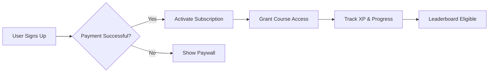

# Monetization Strategy

> [!info] Core Model
> StudEd operates behind a **paid signup process**. Users must purchase a subscription to gain access to Courses and platform features.

## Revenue Model

### Subscription Tiers (Proposed)

| Tier | Target | Features | Price Range (LKR/month) |
|------|--------|----------|-------------------------|
| **Basic** | Individual student | Access to one grade/subject, limited waves per day | 500–750 |
| **Standard** | Individual student | Full grade access, all waves, leaderboard participation | 1,000–1,500 |
| **Premium** | Individual student | Multi-grade access, AI tutor, priority support, bonus XP | 2,000–2,500 |
| **School License** | Schools / Classes | Bulk student enrollment, admin dashboard, progress reports, educator tools | Custom pricing |

### One-Time vs. Recurring

- **Primary:** Monthly/Annual recurring subscriptions.
- **Secondary:** One-time course purchases (future expansion).
- **School Licenses:** Annual contracts with tiered pricing based on student count.

## Payment Integration

- Local payment gateways (e.g., PayHere, Dialog Genie, bank transfers).
- International card support for overseas Sri Lankan students.
- Invoice generation for school bulk payments.

> [!todo] Research Required
> - Evaluate Sri Lankan payment providers.
> - Define VAT/tax handling for digital educational services.
> - Build retry logic for failed subscription renewals.

## Access Control Logic

## Free Trial Consideration

- **7-day free trial** for individual plans (optional).
- **Demo mode** for schools (limited waves, no leaderboard).
- No free tier for full course access — maintains premium positioning.

## Related Notes

- [[StudEd Project Overview]] — Project mission and value proposition.
- [[Target Audience]] — Who pays and why.
- [[Payment Integration]] — Technical implementation.
- [[Authentication & Authorization]] — User roles and access gates.
- [[Course Enrollment]] — How students unlock content after payment.
