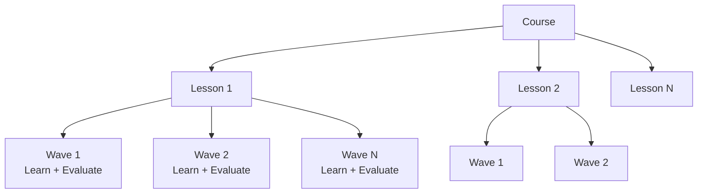

# StudEd Project Overview

> [!info] What is StudEd?
> **StudEd** is a premium, subscription-based educational platform strictly targeted at Sri Lankan schools. It caters to students from **Grade 1–11**, **O/L (Ordinary Level)**, and **A/L (Advanced Level)**.

## Mission

To create an interactive, gamified learning environment where students master subjects through structured **Courses**, **Lessons**, and **Waves** (levels), while educators can easily build rich, multimedia content with AI assistance.

## Core Value Proposition

- **Structured Learning:** A strict three-tier hierarchy (Course → Lesson → Wave) ensures progressive skill-building.
- **Interactive Content:** Every "Wave" combines a **Learn** phase (multimedia) with an **Evaluate** phase (quizzes & exercises).
- **AI-Powered Creation:** Educators use an intelligent, drag-and-drop [[MDX Editor]] to build lessons in minutes, with full **Sinhala language support**.
- **Gamified Motivation:** Students earn **XP**, climb **Leaderboards**, and achieve proficiency as they advance.
- **Premium Access:** The platform is monetized through a paid signup/subscription model.

## Target Audience

| Segment | Grades / Levels | Details |
|---------|-----------------|---------|
| Primary | Grade 1–5 | Foundational subjects, interactive learning |
| Junior Secondary | Grade 6–9 | Broad curriculum coverage |
| Senior Secondary | Grade 10–11 (O/L) | Exam preparation focus |
| Advanced Level | A/L | Subject specialization, rigorous evaluation |

> [!tip] See also
> - [Target Audience](Target-Audience.md) — Detailed personas and user segments.
> - [Monetization Strategy](Monetization-Strategy.md) — Pricing models and subscription tiers.

## Platform Hierarchy at a Glance

## Key Modules

1. **[Content Hierarchy](../02-Content-Hierarchy/Course-Lesson-Wave-Hierarchy.md)** — How Courses, Lessons, and Waves are structured.
2. **[Educator Portal](../03-Educator-Portal/Educator-Dashboard.md)** — Content creation, AI-assisted editing, and Sinhala support.
3. **[Student Portal](../04-Student-Portal/Student-Dashboard.md)** — Learning experience, progress tracking, and gamification.
4. **[Gamification](../05-Gamification/XP-System.md)** — XP, leaderboards, reattempt mechanics, and proficiency.
5. **[System Architecture](../01-Architecture/System-Architecture.md)** — Frontend, backend, and database design.

## Quick Links

- [System Architecture](../01-Architecture/System-Architecture.md)
- [Tech Stack](../07-Technical-Specs/Tech-Stack.md)
- [Database Schema](../01-Architecture/Database-Schema.md)
- [API Specifications](../07-Technical-Specs/API-Specifications.md)
- [Root README](../README.md)

---

*Last updated: [[2026-06-03]]*
