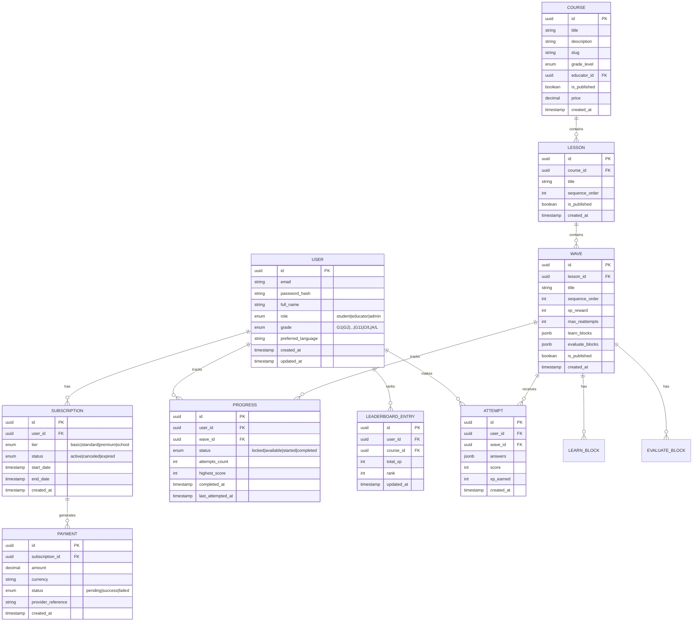

# Database Schema

> [!abstract] Overview
> StudEd uses **PostgreSQL** as its primary relational database. In the microservices architecture, each service owns its schema partition (e.g., Course Service owns `courses`, `lessons`, `waves`; Progress Service owns `progress`, `attempts`). The overall schema is designed around the core **Course → Lesson → Wave** hierarchy, with robust support for users, subscriptions, progress, and gamification.

## Entity Relationship Diagram

## Key Design Decisions

### 1. Wave Content Storage (`learn_blocks`, `evaluate_blocks`)

> [!warning] JSONB for Flexibility
> Wave content is stored as **JSONB** arrays to accommodate the flexible block-based structure of the [[MDX Editor]].
> Each block has a `type` (text, image, audio, mcq, fill-in-blank, drag-drop) and a `data` payload.
> 
> This avoids rigid table-per-block-type schemas while still allowing indexing on block types if needed.

### 2. Progress Tracking

- Every student gets a `PROGRESS` row per wave.
- `status` tracks availability: locked, available, started, completed.
- `attempts_count` enforces the [[Reattempt Mechanics|reattempt cap]].
- `highest_score` stores the best evaluation score.

### 3. XP & Leaderboards

- `ATTEMPT.xp_earned` records per-attempt XP (subject to cap logic).
- `LEADERBOARD_ENTRY` is a denormalized, periodically refreshed table for fast leaderboard queries.
- See [[XP-System]] and [[Leaderboards]] for business rules.

### 4. Sinhala Support

- All text fields use `UTF-8` encoding with proper collation.
- `preferred_language` on `USER` defaults to `si` (Sinhala) or `en`.
- Full-text search may require a dedicated Sinhala dictionary in PostgreSQL or external search (Elasticsearch).

## Indexes

| Table | Columns | Purpose |
|-------|---------|---------|
| `USER` | `email` | Login lookup |
| `USER` | `role`, `grade` | Admin filtering |
| `COURSE` | `slug`, `grade_level` | Public browsing |
| `LESSON` | `course_id`, `sequence_order` | Ordered lesson lists |
| `WAVE` | `lesson_id`, `sequence_order` | Ordered wave lists |
| `PROGRESS` | `user_id`, `wave_id` | Unique constraint + lookup |
| `PROGRESS` | `user_id`, `status` | Dashboard queries |
| `LEADERBOARD_ENTRY` | `course_id`, `total_xp DESC` | Ranked leaderboard |
| `ATTEMPT` | `user_id`, `wave_id` | Attempt history |

## Data Integrity

- **Foreign Key Constraints:** All `*_id` references enforce referential integrity.
- **Check Constraints:**
  - `WAVE.xp_reward >= 0`
  - `WAVE.max_reattempts >= 1`
  - `ATTEMPT.score >= 0`
- **Triggers (optional):**
  - Auto-update `LEADERBOARD_ENTRY` on new high-score attempt.
  - Auto-lock waves until prerequisites are met.

## Related Notes

- [[System Architecture]] — Full system overview.
- [[Backend Architecture]] — Service layer design.
- [[Course-Lesson-Wave-Hierarchy]] — Content structure logic.
- [[Authentication & Authorization]] — User roles and access.
- [[Payment Integration]] — Billing data flow.
