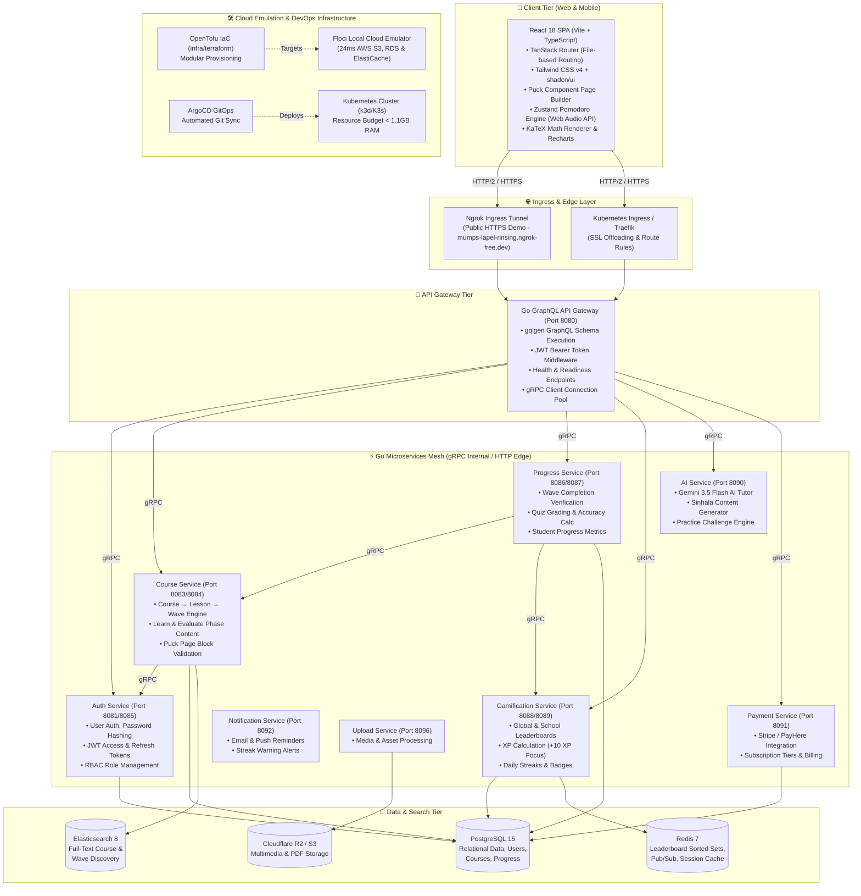

# System Architecture

> [!abstract] Executive Overview
> **StudEd** is engineered as a cloud-agnostic, microservices-driven platform combining a high-performance **React SPA frontend**, a decoupled **Go 1.22+ backend microservices mesh**, a unified **GraphQL Gateway**, and local cloud emulation via **Floci** and **OpenTofu IaC**. It is fully containerized for lightweight local development on 16GB RAM machines using **k3d (K3s)**, and ready for automated continuous delivery via **ArgoCD GitOps**.

---

## 🏗️ Master System Architecture Diagram

---

## 🧩 Architectural Layers Breakdown

### 1. Client Tier (Frontend SPA)
- **Framework**: Built with **Vite**, **React 18**, and **TypeScript 5**.
- **Routing**: **TanStack Router** provides type-safe, file-based routing.
- **Styling & UI**: **Tailwind CSS v4** coupled with **shadcn/ui** and **Base UI** primitives.
- **Visual Course Builder**: Integrates **Puck** drag-and-drop page editor for content creation.
- **Focus & Gamification Engine**: Built-in **Zustand** state store for Pomodoro focus timers featuring Web Audio API ambient sounds (ADHD Binaural beats, Brownian rain, Ocean breeze) and dynamic +10 XP rewards.

### 2. API Gateway & Ingress Tier
- **GraphQL API Gateway**: Built with Go using `gqlgen`. Consolidates downstream microservices into a unified GraphQL schema.
- **Authentication**: Validates JWT Bearer tokens issued by `auth-service`.
- **Public Tunnel Ingress**: Integrated with **Ngrok** (`make demo-public`) for instant, credential-free live public previews on static dev domains (`mumps-lapel-rinsing.ngrok-free.dev`).

### 3. Go Microservices Mesh
The backend is split into 8 microservices communicating internally via **gRPC (protobuf)**:
1. [Auth Service](file:///Users/warunaudarasampath/Documents/projects/studed/studed-doc/services/auth-service): Manages student/educator accounts, bcrypt password hashing, and JWT tokens.
2. [Course Service](file:///Users/warunaudarasampath/Documents/projects/studed/studed-doc/services/course-service): Manages the **Course → Lesson → Wave** curriculum hierarchy and Puck visual blocks.
3. [Progress Service](file:///Users/warunaudarasampath/Documents/projects/studed/studed-doc/services/progress-service): Tracks wave completions, quiz evaluation accuracy, and student progression.
4. [Gamification Service](file:///Users/warunaudarasampath/Documents/projects/studed/studed-doc/services/gamification-service): Manages XP calculations, Redis-backed leaderboards, streaks, and badges.
5. [Payment Service](file:///Users/warunaudarasampath/Documents/projects/studed/studed-doc/services/payment-service): Handles Stripe and PayHere billing workflows.
6. [AI Service](file:///Users/warunaudarasampath/Documents/projects/studed/studed-doc/services/ai-service): Integrates Gemini 3.5 Flash for AI tutoring, practice question generation, and Sinhala content translation.
7. [Notification Service](file:///Users/warunaudarasampath/Documents/projects/studed/studed-doc/services/notification-service): Delivers automated student alerts.
8. [Upload Service](file:///Users/warunaudarasampath/Documents/projects/studed/studed-doc/services/upload-service): Manages media processing and storage upload signatures.

### 4. Data & Persistence Tier
- **PostgreSQL 15**: Primary relational database storing core platform state.
- **Redis 7**: High-performance in-memory cache, pub/sub broker, and sorted set leaderboards.
- **Elasticsearch 8**: High-speed search index for course and wave catalog discovery.

### 5. DevOps, Cloud Emulation & GitOps Infrastructure
- **Local Cloud Emulation**: Uses **Floci** (`http://localhost:4566`) to emulate AWS S3, RDS, and ElastiCache in **24ms cold-start** without cloud costs or credentials.
- **Infrastructure as Code (IaC)**: Provisioned via **OpenTofu** (`infra/terraform/`).
- **Kubernetes (K3s/k3d)**: Single-node local cluster manifest suite (`infra/k8s/`) memory-tuned for **16GB Mac/PC laptops (<1.1GB RAM total cluster footprint)**.
- **GitOps Continuous Delivery**: Configured via **ArgoCD** (`infra/k8s/argocd/application.yaml`) for declarative GitHub repository deployment synchronization.

---

## 🔗 Architecture & Technical Documentation Index

- [Backend Architecture](Backend-Architecture.md) — Detailed Go microservices & gRPC specs.
- [Frontend Architecture](Frontend-Architecture.md) — React SPA, routing, state management & UI design system.
- [Database Schema](Database-Schema.md) — PostgreSQL models, GORM schema, and indexes.
- [Tech Stack](../07-Technical-Specs/Tech-Stack.md) — Full technology choices & version inventory.
- [API Specifications](../07-Technical-Specs/API-Specifications.md) — GraphQL schema and REST endpoints.
- [Kubernetes Architecture](../infra/k8s/README.md) — K8s manifests, resource limits & ArgoCD setup.
- [OpenTofu IaC Setup](../infra/terraform/README.md) — IaC modules & Floci emulation guide.
- [Root Project README](../README.md) — Main landing page & quickstart.