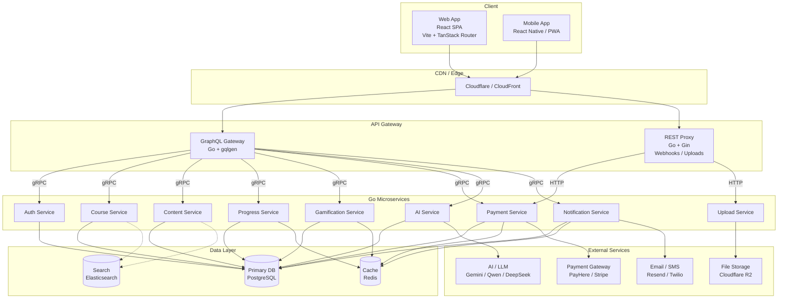

# System Architecture

> [!abstract] Overview
> StudEd follows a modern **microservices architecture** with a decoupled React SPA frontend, a Go-based backend composed of specialized microservices, and a unified **GraphQL** gateway. AI services and file storage are integrated as external components.

## Architecture Diagram

## Component Breakdown

### 1. Client Layer

| Platform | Tech | Purpose |
|----------|------|---------|
| **Web App** | [[Tech Stack\|React SPA (Vite + TanStack Router)]] | Primary student & educator interface |
| **Mobile** | React Native / PWA | Mobile-first access for students |

### 2. API Gateway Layer

- **GraphQL Gateway:** Go service using `gqlgen`. Combines subgraphs from all microservices into a single schema. Handles JWT verification, rate limiting, and request routing via gRPC.
- **REST Proxy:** Go service using `Gin` or `Echo`. Handles REST-only traffic: payment webhooks, multipart file uploads, and third-party integrations.

### 3. Microservices Layer

| Service | Language | Responsibility |
|---------|----------|----------------|
| **Auth Service** | Go | Registration, login, JWT, RBAC |
| **Course Service** | Go | Course/Lesson/Wave CRUD |
| **Content Service** | Go | Block JSONB, media metadata |
| **Progress Service** | Go | Completion tracking, attempts |
| **Gamification Service** | Go | XP, leaderboards, proficiency |
| **Payment Service** | Go | Subscriptions, billing, webhooks |
| **AI Service** | Go | LLM proxy, prompt engineering |
| **Notification Service** | Go | Email, SMS, push notifications |
| **Upload Service** | Go | File validation & S3 streaming |

### 4. Data Layer

| Store | Role | Data |
|-------|------|------|
| **PostgreSQL** | Primary database | Each service owns its schema/tablespace |
| **Redis** | Cache & sessions | Active sessions, leaderboard ZSETs, rate limits, pub/sub events |
| **Elasticsearch** | Full-text search | Course search, Sinhala text indexing |

### 5. External Services

| Service | Provider | Purpose |
|---------|----------|---------|
| **AI / LLM** | Gemini / Qwen / DeepSeek | AI-assisted content creation in [[MDX Editor]] |
| **File Storage** | Cloudflare R2 | Images, audio, graphics for [[Learn Component]] |
| **Payments** | PayHere / Stripe | Subscription billing |
| **Notifications** | Resend / Twilio | OTP, payment confirmations, progress alerts |

## Scalability Considerations

> [!tip] Design for Scale
> - **Independent scaling:** High-traffic services (Gamification, Progress) can scale horizontally without scaling the entire backend.
> - **Database per service:** Each microservice owns its PostgreSQL schema, preventing coupling.
> - **Read replicas:** PostgreSQL read replicas for high-traffic queries (leaderboards, course browsing).
> - **CDN:** Static assets (images, audio, frontend bundles) served from edge locations.
> - **Async jobs:** Asynq + Redis for XP calculations, report generation, and email digests.
> - **gRPC efficiency:** Binary protobuf over HTTP/2 reduces latency and payload size between services.

## Security

- HTTPS everywhere. TLS between services (mTLS optional with Istio/Linkerd).
- Input validation and sanitization (critical for user-generated MDX).
- Role-based access control (RBAC) with Casbin — see [[Authentication & Authorization]].
- Encrypted storage of payment tokens (PCI compliance considerations).
- JWT verification at the API Gateway layer before requests reach microservices.

## Related Notes

- [[Frontend Architecture]] — Detailed frontend structure.
- [[Backend Architecture]] — Microservices design, inter-service communication, and Go stack.
- [[Database Schema]] — Entity relationships and table design.
- [[Authentication & Authorization]] — Security and access control.
- [[API Specifications]] — GraphQL schema + REST endpoint documentation.
- [[Tech Stack]] — Complete technology choices.