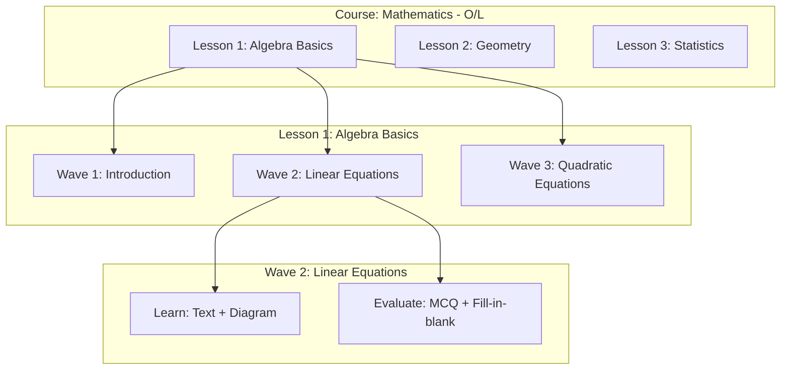
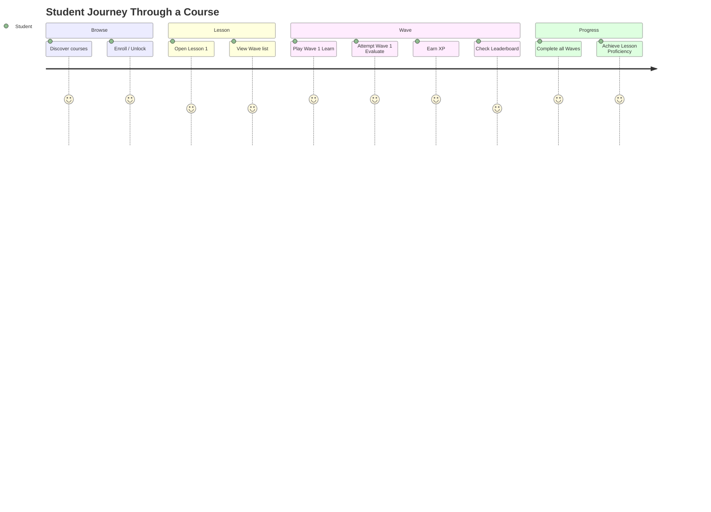

# Course-Lesson-Wave Hierarchy

> [!info] Core Structure
> StudEd organizes all learning content into a strict, three-tier hierarchy:
> **Course** → **Lesson** → **Wave**
> 
> A *Wave* is the platform's specific synonym for a "Level".

## Hierarchy Diagram

## Tier Definitions

### 1. Course

The top-level container. A Course represents a subject or syllabus unit (e.g., "Mathematics - O/L").

| Attribute | Type | Description |
|-----------|------|-------------|
| `title` | string | Course name |
| `description` | string | Overview and learning objectives |
| `slug` | string | URL-friendly identifier |
| `grade_level` | enum | Grade 1–11, O/L, A/L |
| `educator_id` | UUID | Creator/owner |
| `price` | decimal | Subscription price (if individual) |
| `is_published` | boolean | Visibility to students |

### 2. Lesson

A Lesson is a thematic unit within a Course. It groups related Waves together.

| Attribute | Type | Description |
|-----------|------|-------------|
| `course_id` | UUID | Parent course |
| `title` | string | Lesson name |
| `sequence_order` | int | Display order within course |
| `is_published` | boolean | Visibility |

### 3. Wave

A Wave is the atomic interactive unit. It is a "Level" that combines a **Learn** phase and an **Evaluate** phase.

| Attribute | Type | Description |
|-----------|------|-------------|
| `lesson_id` | UUID | Parent lesson |
| `title` | string | Wave name |
| `sequence_order` | int | Display order within lesson |
| `xp_reward` | int | XP awarded on completion |
| `max_reattempts` | int | Max allowed reattempts |
| `learn_blocks` | JSONB | Array of [[Learn Component]] blocks |
| `evaluate_blocks` | JSONB | Array of [[Evaluate Component]] blocks |
| `is_published` | boolean | Visibility |

> [!tip] Wave as the Core Interaction Unit
> Students do not "complete a Lesson" directly. They complete individual **Waves**.
> Lesson proficiency is derived from the aggregate completion of all its waves.
> See [[Proficiency System]] for details.

## Content Flow: Student Perspective

## Unlocking Logic

> [!warning] Sequential Progression
> By default, Waves within a Lesson unlock sequentially. Students must complete Wave *N* to unlock Wave *N+1*.
> This ensures progressive skill-building and prevents skipping.
> 
> **Exceptions:**
> - Educators may mark Waves as "optional" (unlocks don't block progression).
> - Admin may enable "free navigation" mode for review courses.

## Database Representation

See [[Database Schema]] for the full ER diagram and table definitions.

## Related Notes

- [[Wave Anatomy]] — Detailed breakdown of a single Wave.
- [[Learn Component]] — Multimedia content blocks inside a Wave.
- [[Evaluate Component]] — Quiz and exercise blocks inside a Wave.
- [[Wave Creation Workflow]] — How educators build this hierarchy.
- [[Progress Tracking]] — How student progress maps to this hierarchy.
- [[XP-System]] — How XP is tied to Waves.
