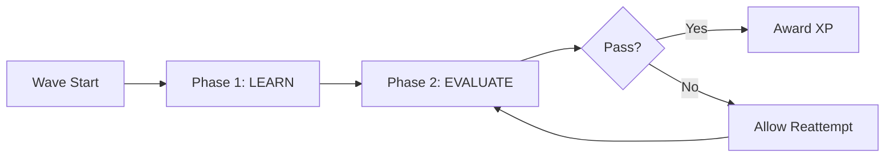
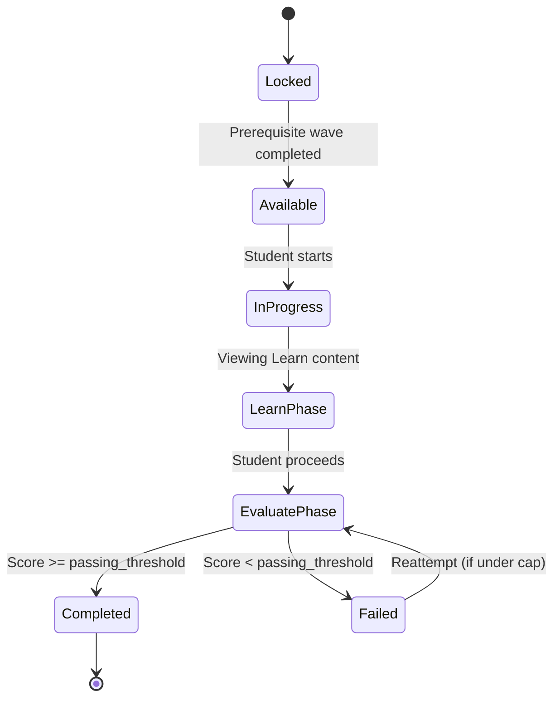

# Wave Anatomy

> [!info] Definition
> A **Wave** is StudEd's core interactive unit. It is an immersive, level-based environment that combines two distinct phases: **Learn** and **Evaluate**.
> 
> Think of a Wave as a mini-lesson + mini-quiz rolled into one playable "level".

## The Two Phases



### Phase 1: Learn

The **Learn** phase delivers the educational content. It is passive or lightly interactive, designed to introduce concepts before testing them.

- Built from [[Learn Component]] blocks.
- Can include text, images, graphics, audio, and music.
- Supports [[Sinhala Language Support|Sinhala]] and English.
- Created by educators via the [[MDX Editor]].
- Optionally AI-generated using the [[AI Integration|AI assistant]].

### Phase 2: Evaluate

The **Evaluate** phase tests understanding through interactive exercises.

- Built from [[Evaluate Component]] blocks.
- Includes quizzes, [[MCQ Component|MCQs]], [[Fill-in-the-blank Component|fill-in-the-blanks]], and [[Drag-and-Drop Component|drag-and-drop]] tasks.
- Provides immediate feedback (correct/incorrect with explanations).
- Score contributes to [[XP-System|XP]] and [[Proficiency System|proficiency]].

## Wave Lifecycle (Student View)



## Wave Block Schema (JSONB)

Each Wave stores its content as a structured JSONB array. Here is a conceptual schema:

```json
{
  "wave_id": "uuid",
  "title": "Linear Equations",
  "learn_blocks": [
    {
      "id": "block-1",
      "type": "text",
      "data": { "content": "A linear equation is..." }
    },
    {
      "id": "block-2",
      "type": "image",
      "data": { "src": "linear-graph.png", "alt": "Graph of y = mx + c" }
    },
    {
      "id": "block-3",
      "type": "audio",
      "data": { "src": "explanation.mp3" }
    }
  ],
  "evaluate_blocks": [
    {
      "id": "q-1",
      "type": "mcq",
      "data": {
        "question": "What is the slope of y = 2x + 3?",
        "options": ["2", "3", "5"],
        "correct_index": 0
      }
    },
    {
      "id": "q-2",
      "type": "fill-in-blank",
      "data": {
        "sentence": "The y-intercept is ___.",
        "answers": ["3"]
      }
    }
  ]
}
```

> [!warning] Block Type Extensibility
> The block schema must be versioned. Adding new block types (e.g., "video", "matching") should not break existing Waves.
> Consider a `version` field at the Wave level.

## Wave Metadata

| Property | Description |
|----------|-------------|
| `sequence_order` | Position within the parent Lesson |
| `xp_reward` | Base XP for completing the Evaluate phase |
| `max_reattempts` | Maximum number of retries (e.g., 3) |
| `passing_threshold` | Minimum score % to mark as "completed" |
| `estimated_duration` | Time in minutes (for UI display) |
| `difficulty` | "easy", "medium", "hard" |

## Editor Representation

In the [[MDX Editor]], a Wave is edited as a single document with two sections:
1. **Learn Section** — Drag-and-drop blocks for multimedia.
2. **Evaluate Section** — Drag-and-drop blocks for questions.

Both sections use the same block library, differentiated by context.

## Related Notes

- [[Course-Lesson-Wave-Hierarchy]] — How Waves fit into the bigger picture.
- [[Learn Component]] — Detailed block types for the Learn phase.
- [[Evaluate Component]] — Detailed block types for the Evaluate phase.
- [[Wave Creation Workflow]] — Educator's process for building a Wave.
- [[Wave Interaction]] — Student's experience playing a Wave.
- [[Reattempt Mechanics]] — How reattempts are capped and tracked.
- [[Database Schema]] — Full data model for Waves.
