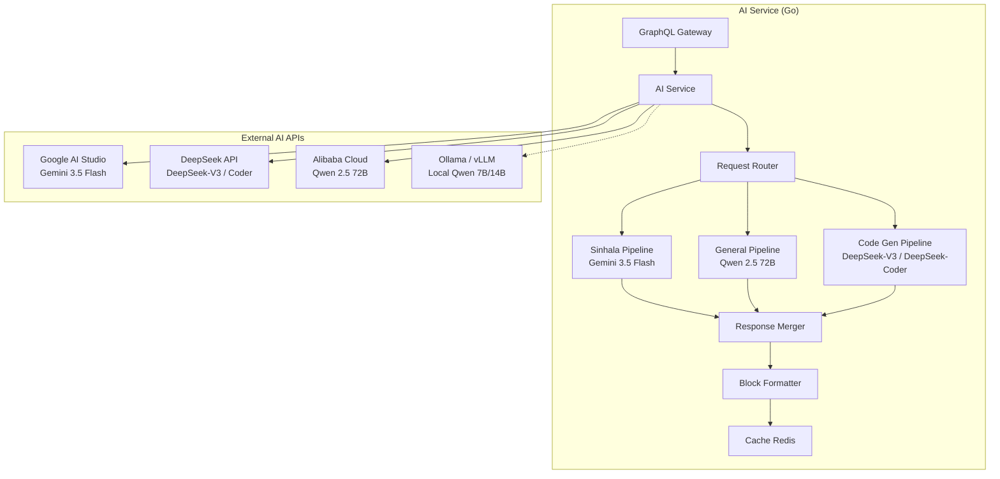
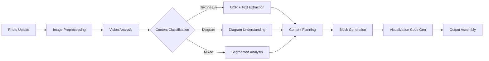

# AI Content Generation Service

> [!info] Purpose
> The **AI Content Generation Service** is a Go microservice that orchestrates **open-source and accessible AI models** — **Google Gemini 3.5 Flash** (for Sinhala OCR, text generation, and translation) and **Qwen 2.5 / DeepSeek-V3** (for general pedagogy, code generation, and visualization scripting) — to power the [[Educator AI Chat Interface]] and [[MDX Editor]] AI assistant.
>
> > [!tip] Open-Source First
> > StudEd avoids proprietary models (OpenAI GPT-4, Claude) to minimize costs, avoid vendor lock-in, and maintain data sovereignty. All models are accessible via standard HTTP APIs.

## Architecture



## Model Routing Logic

The service inspects each request and routes to the optimal open-source model:

```go
func (s *AIService) RouteRequest(ctx context.Context, req *GenerateRequest) (*BlockList, error) {
    // Detect Sinhala requirement
    if req.TargetLanguage == "si" || req.ContainsSinhalaPhoto {
        return s.geminiPipeline.Generate(ctx, req)
    }
    
    // Detect code generation need (Manim, 3Dmol, tscircuit, Matter.js)
    if req.RequiresVisualization {
        return s.deepseekPipeline.Generate(ctx, req)
    }
    
    // Default to Qwen for general pedagogy
    return s.qwenPipeline.Generate(ctx, req)
}
```

## Pipelines

### 1. Sinhala Pipeline (Gemini 3.5 Flash)

**Model:** `gemini-3.5-flash` via Google AI Studio API (free tier: 1,500 requests/day)

**Responsibilities:**
- OCR of handwritten Sinhala notes from photos
- Generating educational text in natural, formal Sinhala
- English ↔ Sinhala translation with pedagogical tone adjustment
- Audio narration script generation in Sinhala
- Sinhala grammar correction and simplification for grade levels

**Prompt Engineering:**

```
System: You are a Sri Lankan educator fluent in Sinhala. 
Generate content suitable for {grade} students in formal Sinhala.
Use clear sentence structures. Include relevant Sinhala scientific terminology.

User: [Photo of handwritten notes]
Generate a clear explanation of the Pythagorean theorem for Grade 10 students.
```

**Why Gemini 3.5 Flash for Sinhala?**

| Capability | Gemini 3.5 Flash Advantage |
|------------|---------------------------|
| **Sinhala OCR** | Native vision model handles Sinhala script with high accuracy |
| **Unicode rendering** | Perfect handling of Sinhala conjuncts and modifiers |
| **Code-switching** | Seamless mixing of Sinhala and English technical terms |
| **Cultural context** | Understands Sri Lankan curriculum references and examples |
| **Cost** | Free tier available; paid tier very affordable |
| **Audio TTS prep** | Generates phonetically accurate text for future TTS integration |

### 2. General Pedagogy Pipeline (Qwen 2.5 72B)

**Model:** `qwen2.5-72b-instruct` via Alibaba Cloud DashScope API or self-hosted via vLLM

**Responsibilities:**
- Curriculum alignment and learning objective mapping
- Content structure planning (how many blocks, what sequence)
- Pedagogical strategy selection (direct instruction, discovery, etc.)
- Question generation for Evaluate blocks
- Difficulty calibration for target grade

**Why Qwen 2.5?**
- State-of-the-art open-weights model (72B parameters)
- Strong multilingual performance including English
- Excellent reasoning and instruction following
- Very low API cost compared to proprietary alternatives
- Can be self-hosted for complete data privacy

### 3. Code Generation Pipeline (DeepSeek-V3 / DeepSeek-Coder)

**Models:**
- `deepseek-v3` for general reasoning and planning
- `deepseek-coder` for code generation tasks

**Responsibilities:**
- Generate Manim Python scripts for math animations
- Generate 3Dmol.js JavaScript configurations for molecular viewers
- Generate tscircuit TypeScript/React components for circuit simulations
- Generate Matter.js world configurations for physics simulations
- Validate generated code for safety and correctness

**Why DeepSeek?**
- State-of-the-art code generation (often beats GPT-4o on coding benchmarks)
- Extremely low API pricing (~$0.14 per million tokens vs $5–$15 for GPT-4o)
- Strong multi-language code support (Python, TypeScript, JavaScript)
- Open weights available for self-hosting

## Multi-Modal Photo Processing

When educators upload photos, the service runs a multi-stage pipeline:



### Stage 1: Image Preprocessing

- Resize to model-compatible dimensions (Gemini 3.5 Flash: up to 4MB).
- Convert HEIC → JPEG if needed.
- Generate thumbnail for UI preview.

### Stage 2: Vision Analysis

**Gemini 3.5 Flash Vision** analyzes the photo:

```json
{
  "photo_analysis": {
    "content_type": "handwritten_math_notes",
    "detected_language": "sinhala",
    "subjects": ["mathematics", "geometry"],
    "key_concepts": ["pythagorean theorem", "right triangles"],
    "has_equations": true,
    "has_diagrams": true,
    "has_tables": false,
    "visualization_needed": "manim_animation",
    "grade_estimate": "grade_10"
  }
}
```

### Stage 3: Segmented Content Extraction

If the photo contains multiple sections (e.g., text + diagram + example), the AI segments it.

### Stage 4: Block Generation

Each segment maps to a block type:

| Segment Type | Block Type | Model Used |
|--------------|------------|------------|
| Text | `text` | Gemini 3.5 Flash (Sinhala) / Qwen (English) |
| Diagram | `image` + `graphic` | Extracted as image + AI-enhanced SVG |
| Equation | `mathviz_manim` | DeepSeek-Coder generates Manim script |
| Molecule | `chemviz_3dmol` | DeepSeek generates 3Dmol config |
| Circuit | `elecsim_tscircuit` | DeepSeek generates tscircuit component |
| Physics setup | `mechsim_matterjs` | DeepSeek generates Matter.js world |
| Example problem | `text` + `evaluate` (MCQ) | Qwen generates question |

### Stage 5: Visualization Code Generation

For detected visualizations, the AI generates executable code:

**Manim Script Example (generated by DeepSeek-Coder):**
```python
from manim import *

class PythagoreanProof(Scene):
    def construct(self):
        triangle = Polygon(
            [-2, -1, 0], [2, -1, 0], [-2, 1.5, 0],
            color=BLUE
        )
        self.play(Create(triangle), run_time=2)
        self.wait(2)
        # ... animation continues
```

## Caching Strategy

| Cache Key | TTL | Purpose |
|-----------|-----|---------|
| `ai:ocr:{photo_hash}` | 24h | Avoid re-processing identical photos |
| `ai:sinhala:{text_hash}` | 1h | Cache translations and generations |
| `ai:viz:{concept_hash}` | 7d | Cache generated Manim/3Dmol/tscircuit code |
| `ai:blocks:{content_hash}` | 1h | Cache block structures |

## Cost Monitoring

| Model | Provider | Cost per 1K tokens | Typical Request Cost |
|-------|----------|-------------------|-------------------|
| **Gemini 3.5 Flash** | Google AI Studio | Free tier / $0.00015 | $0.01–$0.05 |
| **Gemini 3.5 Flash (vision)** | Google AI Studio | Free tier / $0.00060 | $0.02–$0.10 |
| **Qwen 2.5 72B** | DashScope | ~$0.0005 | $0.01–$0.05 |
| **DeepSeek-V3** | DeepSeek API | ~$0.00014 | $0.005–$0.02 |
| **DeepSeek-Coder** | DeepSeek API | ~$0.00014 | $0.01–$0.10 |
| **Qwen 2.5 7B (local)** | Ollama / vLLM | $0 (self-hosted) | $0 |

> [!warning] Budget Caps
> Per-educator daily limits:
> - Free tier: 10 photo uploads, 50 text generations
> - Standard: 100 photo uploads, 500 generations
> - Premium: Unlimited

## Error Handling

| Failure Mode | Response Strategy |
|--------------|-------------------|
| Gemini API timeout | Retry once, then fallback to Qwen with Sinhala prompt engineering |
| DeepSeek code generation fails | Return partial blocks + "code preview" for manual editing |
| Unsupported molecule for 3Dmol | Fallback to static image block |
| tscircuit compilation error | Show code editor + error message for manual fix |
| Photo too blurry for OCR | Educator receives: "Please retake photo with better lighting" |
| All AI APIs down | Queue for later processing; notify educator |

## Security & Safety

- All generated code is sandboxed before execution (Manim runs in isolated Docker containers).
- `eval()` and `exec()` are strictly forbidden in generated JavaScript.
- Only whitelisted npm packages can be referenced in tscircuit generated code.
- Generated SVGs are sanitized for XSS.
- No student PII is sent to AI APIs.

## API Endpoints (GraphQL)

```graphql
type Mutation {
  generateWaveFromPhotos(
    photos: [Upload!]!
    prompt: String!
    targetGrade: Grade!
    targetLanguage: String!
  ): WaveGenerationResult!
  
  regenerateBlock(
    waveId: ID!
    blockId: ID!
    instruction: String!
  ): Block!
  
  translateBlock(
    blockId: ID!
    targetLanguage: String!
  ): Block!
  
  generateVisualization(
    concept: String!
    vizType: VisualizationType!
    grade: Grade!
  ): VisualizationBlock!
}

type WaveGenerationResult {
  wave: Wave!
  confidence: Float!
  warnings: [String!]
  tokensUsed: TokenUsage!
}

type TokenUsage {
  geminiInput: Int!
  geminiOutput: Int!
  qwenInput: Int!
  qwenOutput: Int!
  deepseekInput: Int!
  deepseekOutput: Int!
}
```

## Related Notes

- [[Educator AI Chat Interface]] — Frontend chat panel.
- [[AI Integration]] — Original AI integration overview.
- [[Backend Architecture]] — Microservices layout.
- [[Sinhala Language Support]] — Sinhala technical requirements.
- [[Math-To-Manim Integration]] — Math visualization details.
- [[3Dmol.js Integration]] — Chemistry visualization details.
- [[tscircuit Integration]] — Electronics simulation details.
- [[Matter.js Integration]] — Physics simulation details.
