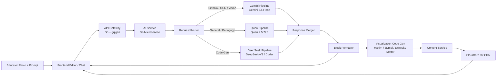

# AI Integration

> [!info] Purpose
> StudEd integrates an **AI agent** into the [[MDX Editor]] and [[Educator AI Chat Interface]] to dramatically reduce the time and effort educators spend creating [[Learn Component|Learn]] and [[Evaluate Component|Evaluate]] content.
>
> > [!tip] Open-Source First
> > All AI models used by StudEd are **open-source or freely accessible** to minimize costs and avoid vendor lock-in:
> > - **Sinhala tasks:** Google Gemini 3.5 Flash (free tier via AI Studio)
> > - **General pedagogy:** Qwen 2.5 72B (open weights, low-cost API)
> > - **Code generation:** DeepSeek-V3 / DeepSeek-Coder (state-of-the-art, extremely low cost)

## AI Capabilities

### 1. Generate Learn Content

Educators provide a topic or prompt, and the AI generates:

- **Explanatory text** tailored to the target grade level.
- **Image descriptions** for graphic generation or stock image search.
- **Audio narration scripts** for voiceovers.
- **Summaries** of long topics into bite-sized wave content.

> [!example] Example Prompt
> "Explain photosynthesis in simple Sinhala for Grade 7 students. Include why leaves are green."
> → Routed to **Gemini 3.5 Flash**

### 2. Generate Evaluate Questions

From existing Learn content or a topic prompt, the AI creates:

- **MCQs** with plausible distractors.
- **Fill-in-the-blank** sentences targeting key facts.
- **Drag-and-drop** pairings (e.g., match term to definition).

> [!example] Example Prompt
> "Generate 3 MCQs based on the text above. Make one question tricky."
> → Routed to **Qwen 2.5**

### 3. Photo-to-Wave Generation

The flagship AI feature. Educators upload photos and the AI:

- **OCR extraction** (Gemini 3.5 Flash Vision) of handwritten/textbook content in Sinhala or English.
- **Layout analysis** to identify text, diagrams, equations, and structures.
- **Auto-block generation** that maps photo content to appropriate Learn blocks.
- **Specialized visualization detection:**
  - Math diagrams → [[Math-To-Manim Integration|MathViz]] (Manim animation)
  - Chemical structures → [[3Dmol.js Integration|ChemViz]] (3D molecular viewer)
  - Circuit diagrams → [[tscircuit Integration|ElecSim]] (interactive schematic)
  - Physics setups → [[Matter.js Integration|MechSim]] (2D physics sim)

> [!example] Example Prompt
> "Upload: [photo of whiteboard] — This is my lesson on Newton's Second Law for Grade 11. Make it interactive."
> AI generates: Text explanation + Matter.js collision simulation + Manim force diagram + 3 MCQs.

### 4. Language Assistance

- **Translate** content between English and Sinhala using **Gemini 3.5 Flash**.
- **Simplify** complex text for younger grades.
- **Expand** brief notes into full explanations.
- **Rewrite** content to adjust tone or difficulty.

### 5. Content Improvement

- **Check for gaps:** "Does this wave cover all learning objectives?"
- **Suggest visuals:** "A diagram here would help students understand."
- **Accessibility tips:** "Add alt text to this image."

## Technical Architecture



> [!info] Multi-Model Orchestration
> The AI Service is a Go microservice that intelligently routes requests:
> - **Gemini 3.5 Flash** handles all Sinhala tasks (OCR, text generation, translation) and photo analysis.
> - **Qwen 2.5 72B** handles general pedagogy, curriculum planning, and question generation.
> - **DeepSeek-Coder** handles all code generation (Manim, 3Dmol, tscircuit, Matter.js).
> See [[AI Content Generation Service]] for the full backend design.

## Prompt Engineering Strategy

| Goal | System Prompt Strategy |
|------|------------------------|
| **Learn text (Sinhala)** | "You are a Sri Lankan educator. Write a clear explanation for {grade} students in formal Sinhala." → Gemini 3.5 Flash |
| **MCQ generation** | "Generate a multiple-choice question with 4 options. Only one is correct. Provide an explanation." → Qwen 2.5 |
| **Sinhala translation** | "Translate the following educational text into natural, formal Sinhala suitable for students." → Gemini 3.5 Flash |
| **Simplification** | "Rewrite this for a {grade} student. Use short sentences and simple words." → Gemini 3.5 Flash |
| **Manim code** | "Generate a Manim Python script that animates: {concept}. Use clean, commented code." → DeepSeek-Coder |
| **3Dmol config** | "Generate a 3Dmol.js configuration JSON for the molecule: {smiles}." → DeepSeek-Coder |

## Response Formatting

The AI must return structured data that maps directly to editor blocks:

```json
{
  "blocks": [
    {
      "type": "text",
      "data": { "content": "<p>Photosynthesis is...</p>" }
    },
    {
      "type": "mcq",
      "data": {
        "question": "What do plants need for photosynthesis?",
        "options": ["Sunlight", "Plastic", "Rocks"],
        "correct_index": 0,
        "explanation": "Plants use sunlight to convert CO2 and water into glucose."
      }
    }
  ]
}
```

## Cost & Rate Limiting

| Model | Provider | Cost | Free Tier |
|-------|----------|------|-----------|
| **Gemini 3.5 Flash** | Google AI Studio | Very low | 1,500 requests/day |
| **Qwen 2.5 72B** | DashScope / Self-hosted | Low | N/A |
| **DeepSeek-V3** | DeepSeek API | Extremely low (~$0.14/M tokens) | N/A |
| **Qwen 2.5 7B** | Ollama / vLLM | $0 (self-hosted) | Unlimited |

- Rate limits cap daily AI requests per user tier to control costs.
- Fallback: If all AI APIs are unavailable, editor still works fully manually.

## Privacy & Data Handling

- No student PII is sent to third-party AI APIs.
- All API calls include `doNotTrain` flags where supported.
- For maximum privacy, schools can self-host Qwen 7B/14B via Ollama/vLLM.
- Generated content is reviewed by educators before publishing.

## Related Notes

- [[MDX Editor]] — Where the AI features live.
- [[Wave Creation Workflow]] — How educators use AI during creation.
- [[Learn Component]] — Content the AI helps generate.
- [[Evaluate Component]] — Questions the AI helps generate.
- [[Sinhala Language Support]] — Language-specific AI considerations.
- [[Backend Architecture]] — AI service module design.
- [[Educator AI Chat Interface]] — Photo upload and AI chat UX.
- [[AI Content Generation Service]] — Multi-model AI backend (Gemini + Qwen + DeepSeek).
- [[Math-To-Manim Integration]] — Math animation AI generation.
- [[3Dmol.js Integration]] — Chemistry visualization AI generation.
- [[tscircuit Integration]] — Electronics simulation AI generation.
- [[Matter.js Integration]] — Physics simulation AI generation.
