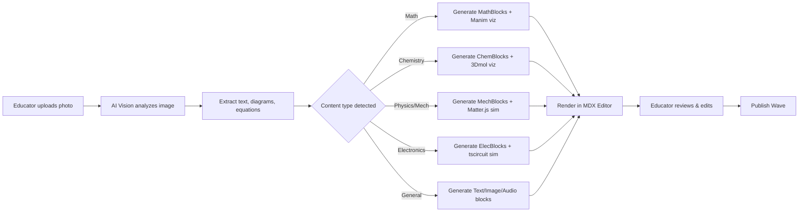
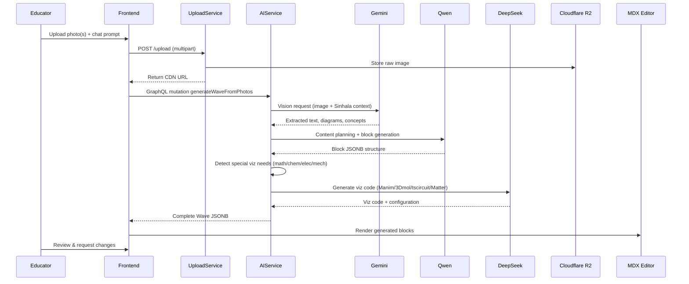

# Educator AI Chat Interface

> [!info] Purpose
> The **Educator AI Chat Interface** is a dedicated conversational panel inside the [[Educator Dashboard]] and [[MDX Editor]] where educators can upload photos of handwritten notes, textbook pages, whiteboards, or sketches. The AI agent analyzes the image and automatically builds a complete [[Wave Anatomy|Wave Learn layout]] with text, images, graphics, audio scripts, and specialized interactive visualizations.
>
> > [!tip] Open-Source AI
> > StudEd uses **Google Gemini 3.5 Flash** for Sinhala tasks and **Qwen 2.5 / DeepSeek** for general pedagogy and code generation. No proprietary models (OpenAI, Claude) are used.

## Core Concept

Instead of manually dragging components into the [[MDX Editor]], educators simply:

1. **Upload a photo** (or multiple photos) of their teaching material.
2. **Describe the target grade** and **subject** in chat.
3. **Receive a fully-built Wave** with all Learn components generated, formatted, and ready to review.
4. **Edit inline** or **regenerate** specific components before publishing.



## AI Model Routing

| Task | Model | Provider | Reason |
|------|-------|----------|--------|
| **Sinhala text generation/translation** | **Gemini 3.5 Flash** | Google AI Studio | Free tier, superior Sinhala unicode handling, grammar, cultural context |
| **Sinhala OCR from photos** | **Gemini 3.5 Flash (Vision)** | Google AI Studio | Native multilingual OCR including Sinhala script |
| **General content planning** | **Qwen 2.5 (72B)** | Alibaba Cloud / Self-hosted | Strong pedagogical reasoning, multilingual, open-weights |
| **Math visualization code (Manim)** | **DeepSeek-Coder** | DeepSeek API / Self-hosted | State-of-the-art code generation, very low cost |
| **Chemistry structure code (3Dmol)** | **DeepSeek-Coder** | DeepSeek API | JavaScript/WebGL code generation |
| **Electronics circuit code (tscircuit)** | **DeepSeek-Coder** | DeepSeek API | TypeScript/React component generation |
| **Mechanics simulation code (Matter.js)** | **DeepSeek-Coder** | DeepSeek API | Physics engine configuration code |

> [!tip] Gemini 3.5 Flash for Sinhala
> Google Gemini 3.5 Flash has demonstrated excellent performance on Sinhala language tasks including:
> - Accurate OCR of handwritten Sinhala notes
> - Natural translation between English ↔ Sinhala
> - Generating age-appropriate educational text in Sinhala
> - Understanding Sinhala mathematical terminology
> - **Free tier:** 1,500 requests/day available via Google AI Studio

## Photo Upload & Processing Flow



## Supported Photo Types

| Photo Type | AI Processing | Output Blocks |
|------------|---------------|---------------|
| **Handwritten notes** | OCR (Gemini 3.5 Flash Vision) → Text extraction | Text blocks, cleaned images |
| **Textbook pages** | OCR + Layout analysis | Text, images, diagrams, captions |
| **Whiteboard photos** | Content extraction + cleanup | Text, diagrams, summary blocks |
| **Sketch/diagram** | Diagram understanding + enhancement | Image block + interactive viz block |
| **Math problem set** | Equation extraction + step parsing | Text, MathTex, Manim animation block |
| **Chemical structures** | Molecule recognition | Text + 3Dmol.js molecular viewer block |
| **Circuit diagrams** | Component recognition | Text + tscircuit interactive block |
| **Physics setups** | System identification | Text + Matter.js simulation block |

## Chat Commands & Prompts

Educators can use natural language prompts:

| Prompt Example | AI Action |
|----------------|-----------|
| "Upload: [photo] — Create a wave on photosynthesis for Grade 7 in Sinhala" | Generates full Sinhala wave with text, images, audio script |
| "Upload: [photo] — This is a Pythagoras proof. Make it animated." | Generates text + Manim animation block |
| "Upload: [photo] — Water molecule structure. Make it 3D rotatable." | Generates text + 3Dmol.js block |
| "Upload: [photo] — Simple LED circuit. Students should simulate it." | Generates text + tscircuit interactive block |
| "Upload: [photo] — Pendulum experiment. Make it interactive." | Generates text + Matter.js physics sim block |
| "Regenerate the audio script in simpler Sinhala" | Re-runs Gemini 3.5 Flash with adjusted prompt |
| "Add 3 MCQs based on the text above" | Generates Evaluate blocks from Learn content |

## Generated Block Structure

When the AI processes photos, it returns a complete Wave JSONB:

```json
{
  "wave_id": "uuid",
  "title": "පිතගරස් ප්‍රමේයය (Pythagorean Theorem)",
  "language": "si",
  "learn_blocks": [
    {
      "id": "block-1",
      "type": "text",
      "data": { "content": "<p>පිතගරස් ප්‍රමේයය අනුව...</p>" }
    },
    {
      "id": "block-2",
      "type": "image",
      "data": { "src": "extracted-diagram.png", "alt": "කර්ණය සහ catheti" }
    },
    {
      "id": "block-3",
      "type": "mathviz_manim",
      "data": {
        "title": "Pythagorean Proof Animation",
        "script_id": "manim_abc123",
        "thumbnail": "thumb.png",
        "duration": 45
      }
    },
    {
      "id": "block-4",
      "type": "audio",
      "data": {
        "title": "Sinhala narration",
        "script": "පළමුව අපි τριγώνයේ කොටු දෙක බලමු...",
        "src": null
      }
    }
  ],
  "evaluate_blocks": [
    {
      "id": "q-1",
      "type": "mcq",
      "data": {
        "question": "කර්ණයේ දිග 5ක් නම්, cathetus එකක දිග 3ක් නම් අනෙක?",
        "options": ["3", "4", "5", "6"],
        "correct_index": 1
      }
    }
  ]
}
```

## Special Visualization Blocks (Auto-Generated)

The AI chat can automatically detect when a specialized visualization is appropriate and generate the corresponding block:

### Math → [[Math-To-Manim Integration|Manim Animation Block]]
- Detected by: equations, geometric proofs, calculus concepts, graph transformations
- AI (DeepSeek-Coder) generates Manim Python script → stored in Content Service → rendered to MP4/GIF

### Chemistry → [[3Dmol.js Integration|3D Molecular Viewer Block]]
- Detected by: chemical formulas, molecular structures, bonding diagrams
- AI (DeepSeek-Coder) generates 3Dmol.js configuration → embedded interactive WebGL viewer

### Electronics → [[tscircuit Integration|Circuit Simulation Block]]
- Detected by: circuit diagrams, component symbols, wiring layouts
- AI (DeepSeek-Coder) generates tscircuit React component → interactive schematic/PCB viewer

### Mechanics → [[Matter.js Integration|Physics Simulation Block]]
- Detected by: force diagrams, motion problems, collision scenarios
- AI (DeepSeek-Coder) generates Matter.js world configuration → interactive physics sandbox

## Inline Editing & Iteration

After generation, educators can:

1. **Chat to edit:** "Make the text shorter" or "Move the animation after the image."
2. **Drag to reorder:** Standard Puck drag-and-drop.
3. **Regenerate specific blocks:** Right-click a block → "Regenerate with AI."
4. **Manual override:** Edit any block directly in the editor.
5. **Batch regenerate:** Select multiple blocks → "Rewrite all in formal Sinhala."

## Error Handling & Fallbacks

| Scenario | Fallback |
|----------|----------|
| Gemini OCR fails on blurry photo | Prompt educator to retake or manually type key text |
| Manim render times out | Return code preview + "Render on publish" queue |
| 3Dmol.js unsupported molecule | Fallback to static 2D SVG image |
| tscircuit invalid circuit | Show error + suggest corrections in chat |
| Photo contains mixed subjects | Ask educator to clarify target topic |
| All AI APIs temporarily down | Queue for later; show "AI is processing..." |

## Privacy & Data Handling

- Photos are stored encrypted in Cloudflare R2 with educator-only access.
- AI vision APIs do not retain images for model training (configured via API params).
- Extracted text is owned by the educator; StudEd claims no rights over uploaded content.
- Student-facing Waves never contain the raw uploaded photo — only cleaned, generated blocks.
- No student PII is ever sent to AI APIs.

## Related Notes

- [[MDX Editor]] — Where generated blocks are rendered and edited.
- [[AI Integration]] — Backend AI service architecture.
- [[AI Content Generation Service]] — Multi-model orchestration details (Gemini + Qwen + DeepSeek).
- [[Wave Creation Workflow]] — Step-by-step educator process.
- [[Puck Research]] — Puck editor programming guide.
- [[Sinhala Language Support]] — Gemini 3.5 Flash Sinhala capabilities.
- [[Math-To-Manim Integration]] — Math animation block details.
- [[3Dmol.js Integration]] — Chemistry visualization block details.
- [[tscircuit Integration]] — Electronics simulation block details.
- [[Matter.js Integration]] — Physics simulation block details.
