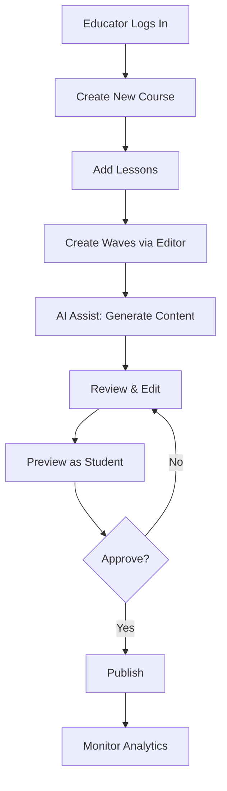

# Educator Dashboard

> [!info] Purpose
> The **Educator Dashboard** is the central hub where teachers, tutors, and content creators manage their Courses, Lessons, and Waves, monitor student engagement, and leverage AI-assisted tools.

## Dashboard Layout

```
┌─────────────────────────────────────────────────────────┐
│  Sidebar    │  Main Content Area                         │
│             │                                            │
│  🏠 Home    │  ┌──────────┐ ┌──────────┐ ┌──────────┐  │
│  📚 Courses │  │ Courses  │ │ Lessons  │ │ Waves    │  │
│  ✏️ Editor  │  │    12    │ │    45    │ │   210    │  │
│  📊 Analytics│ └──────────┘ └──────────┘ └──────────┘  │
│  ⚙️ Settings│                                            │
│             │  Recent Activity                           │
│             │  ─────────────────────────────────────   │
│             │  🟢 Published "Algebra Basics"             │
│             │  🟡 Draft "Geometry 101"                  │
│             │  🔵 340 students active this week         │
└─────────────────────────────────────────────────────────┘
```

## Core Sections

### 1. Home / Overview

- Quick stats: Total Courses, Lessons, Waves, Active Students.
- Recent activity feed (published content, student milestones).
- AI suggestions: "Students struggled with Wave 3 — consider adding a hint."
- Notifications: Pending reviews, system updates.

### 2. Course Manager

- **List View:** All courses with status (draft / published / archived).
- **Create Course:** Title, description, grade level, price (if applicable).
- **Organize Lessons:** Drag-and-drop reordering within a course.
- **Publish Flow:** Review → Preview → Publish.

### 3. Lesson Manager

- Nested under each Course.
- Add, edit, reorder Lessons.
- View wave count and completion rates per lesson.

### 4. Wave Manager

- The heart of content creation.
- Create a new Wave from a Lesson.
- Open the [[MDX Editor]] to build [[Learn Component|Learn]] and [[Evaluate Component|Evaluate]] blocks.
- Set [[Wave Anatomy|Wave metadata]]: XP reward, max reattempts, passing threshold.

### 5. Analytics

- **Course Performance:** Enrollment numbers, completion rates, average scores.
- **Wave-Level Insights:** Which waves have the highest failure rates? Where do students drop off?
- **Student Activity:** Heatmaps of active hours, device breakdown.
- **AI Insights:** Auto-generated summaries of common student mistakes.

### 6. AI Assistant Panel

- Accessible from the Editor and Dashboard.
- Prompt-based generation: "Generate a Learn section about photosynthesis in Sinhala."
- Auto-create MCQs from existing text.
- Summarize long content into bite-sized waves.

## Key Workflows



## Role & Permissions

| Role | Permissions |
|------|-------------|
| **Educator** | Create/edit own courses, view own analytics |
| **Head Educator** | Review and publish any course, manage other educators |
| **Admin** | Full platform access, user management, billing |

## Responsive Design

- Desktop-first for content creation (editor needs screen real estate).
- Tablet-friendly for on-the-go analytics review.
- Mobile read-only for quick checks.

## Related Notes

- [[Student Dashboard]] — The counterpart student interface.
- [[MDX Editor]] — Primary content creation tool.
- [[Wave Creation Workflow]] — Step-by-step guide for building a Wave.
- [[AI Integration]] — AI features available to educators.
- [[Sinhala Language Support]] — Multilingual content creation.
- [[Course-Lesson-Wave-Hierarchy]] — Content structure managed here.
- [[Analytics Dashboard]] — Detailed analytics design.
