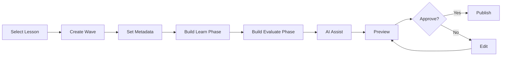

# Wave Creation Workflow

> [!info] Goal
> This document outlines the exact steps an educator follows to create a new **Wave** within a Lesson, populate it with [[Learn Component|Learn]] and [[Evaluate Component|Evaluate]] content, and publish it for students.

## Prerequisites

- Educator account with content creation permissions.
- A Course and Lesson already created (or create them inline).
- Understanding of the [[Course-Lesson-Wave-Hierarchy|three-tier hierarchy]].

## Step-by-Step Workflow

### Step 1: Navigate to the Lesson

1. Open the [[Educator Dashboard]].
2. Select the target **Course**.
3. Open the target **Lesson**.
4. Click **"Add New Wave"**.

### Step 2: Configure Wave Metadata

Fill in the Wave settings panel:

| Field | Description | Example |
|-------|-------------|---------|
| **Title** | Short, descriptive name | "Linear Equations Intro" |
| **Sequence Order** | Position in lesson | `2` |
| **Estimated Duration** | Time to complete (minutes) | `10` |
| **Difficulty** | Easy / Medium / Hard | `Medium` |
| **XP Reward** | Base XP on completion | `50` |
| **Max Reattempts** | Retry limit | `3` |
| **Passing Threshold** | % score to pass | `70%` |

### Step 3: Build the Learn Phase

1. Open the **Learn** tab in the [[MDX Editor]].
2. Drag blocks from the block palette:
   - [[Learn Component#Text Block|Text Block]] — Type or paste content.
   - [[Learn Component#Image Block|Image Block]] — Upload or embed an image.
   - [[Learn Component#Graphic Block|Graphic Block]] — Insert a chart or diagram.
   - [[Learn Component#Audio Block|Audio Block]] — Upload narration or music.
3. **(Optional) Use AI:**
   - Click the **AI Assistant** button.
   - Prompt: *"Explain linear equations in simple Sinhala for Grade 10 students."*
   - AI generates a text block (review and edit before accepting).

### Step 4: Build the Evaluate Phase

1. Open the **Evaluate** tab in the [[MDX Editor]].
2. Drag question blocks from the palette:
   - [[Evaluate Component#Multiple Choice Question (MCQ)|MCQ Block]]
   - [[Evaluate Component#Fill-in-the-Blank|Fill-in-the-Blank Block]]
   - [[Evaluate Component#Drag-and-Drop|Drag-and-Drop Block]]
3. **(Optional) Use AI:**
   - Select the Learn blocks you want to test.
   - Click **"Generate Questions"**.
   - AI suggests MCQs and fill-in-blanks based on the content.
   - Review, edit, and confirm.

### Step 5: Preview the Wave

1. Click **"Preview as Student"**.
2. The Wave renders exactly as a student would see it:
   - Learn phase scrolls naturally.
   - Evaluate phase accepts answers and shows feedback.
3. Test on both **desktop** and **mobile** viewports.

### Step 6: Publish or Save Draft

| Action | Result |
|--------|--------|
| **Save Draft** | Wave saved, visible only to educator. Can be edited later. |
| **Submit for Review** *(if enabled)* | Sent to Head Educator / Admin for approval. |
| **Publish** | Wave goes live. Students with access can now play it. |

> [!warning] Publishing is Irreversible for Live Students
> Once published and students have started attempting, major structural changes (deleting questions) may corrupt progress data. Use versioning or create a new wave instead.

## Workflow Diagram

## Tips for Efficient Creation

> [!tip] Best Practices
> 1. **Outline first:** Plan your Learn blocks before opening the editor.
> 2. **Use AI for drafts:** Let AI generate a first draft, then refine.
> 3. **Reuse blocks:** Copy blocks from existing waves to speed up creation.
> 4. **Test Evaluate yourself:** Try to get 0%, 50%, and 100% to verify scoring.
> 5. **Keep Waves short:** 5–10 minutes is the sweet spot for engagement.

## Related Notes

- [[Educator Dashboard]] — Where the workflow starts.
- [[MDX Editor]] — The primary creation tool.
- [[Wave Anatomy]] — Understanding what a Wave contains.
- [[Learn Component]] — Block types for the Learn phase.
- [[Evaluate Component]] — Block types for the Evaluate phase.
- [[AI Integration]] — How AI speeds up creation.
- [[Sinhala Language Support]] — Creating content in Sinhala.
