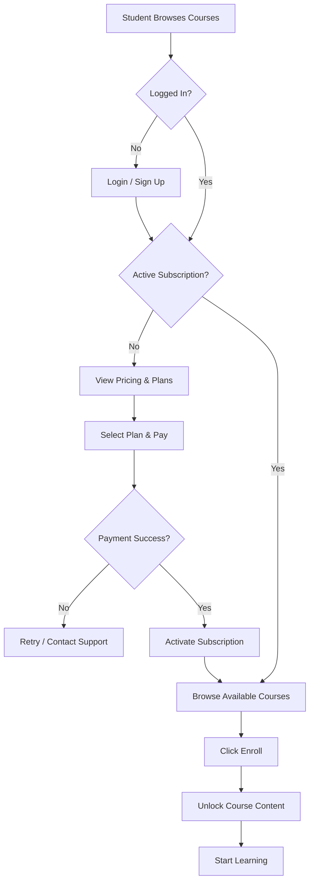

# Course Enrollment

> [!info] Purpose
> **Course Enrollment** governs how students gain access to Courses on StudEd. Because the platform is behind a paid signup, enrollment is tightly coupled with the [[Monetization Strategy|subscription and payment system]].

## Enrollment Flow

## Discovery

### Course Catalog

- Publicly browsable (even without login) to showcase value.
- Each Course card displays:
  - Title, subject, grade level.
  - Educator name and rating.
  - Number of Lessons and Waves.
  - Estimated total duration.
  - Preview: first Wave's Learn content is free (freemium hook).

### Filters & Search

- Filter by: Grade (1–11, O/L, A/L), Subject, Difficulty, Educator.
- Search by keyword (supports [[Sinhala Language Support|Sinhala]]).
- Sort by: Popular, Newest, Highest Rated.

## Access Tiers

| Tier | Course Access | Notes |
|------|---------------|-------|
| **Visitor (No Account)** | Preview only | Can see catalog, not play waves |
| **Free Trial** | Limited waves | 7-day trial, limited lessons |
| **Basic Subscriber** | One grade/subject | Restricted selection |
| **Standard Subscriber** | Full grade | All subjects for enrolled grade |
| **Premium Subscriber** | Multi-grade + bonus | All content + AI tutor + bonus XP |
| **School License** | Bulk enrollment | Admin assigns courses to classes |

## Enrollment Actions

### Individual Enrollment

1. Student selects a Course.
2. Clicks **"Enroll"** (or "Unlock" if already subscribed).
3. System checks subscription validity.
4. Course added to "My Courses".
5. All Lessons and Waves become accessible (subject to sequential unlocking).

### School / Bulk Enrollment

1. School admin purchases a license.
2. Admin uploads a CSV of student emails.
3. Students receive invite links.
4. Upon acceptance, students are auto-enrolled in assigned Courses.

## Unlocking Logic

> [!tip] Sequential Unlocks
> Within a Course, Lessons unlock sequentially. Within a Lesson, Waves unlock sequentially.
> This enforces the [[Course-Lesson-Wave-Hierarchy|structured learning path]].

| State | Meaning |
|-------|---------|
| **Locked** | Cannot access. Prerequisite not met or not enrolled. |
| **Available** | Enrolled and prerequisites met. Ready to start. |
| **Started** | Student has opened at least one Wave. |
| **Completed** | All Waves in the Lesson are done. |

## Re-enrollment & Access Expiry

- If a subscription expires, enrolled Courses become read-only or locked.
- Progress is **never deleted**. Renewing re-unlocks everything.
- Students can re-enroll in the same Course after renewal without data loss.

## Analytics for Admins

- Enrollment numbers per Course.
- Drop-off points (where students stop progressing).
- Revenue per Course (if individually priced).

## Related Notes

- [[Monetization Strategy]] — Pricing and subscription tiers.
- [[Payment Integration]] — Technical payment flow.
- [[Authentication & Authorization]] — User roles and access gates.
- [[Student Dashboard]] — Where enrolled courses are displayed.
- [[Progress Tracking]] — How enrollment state connects to progress.
