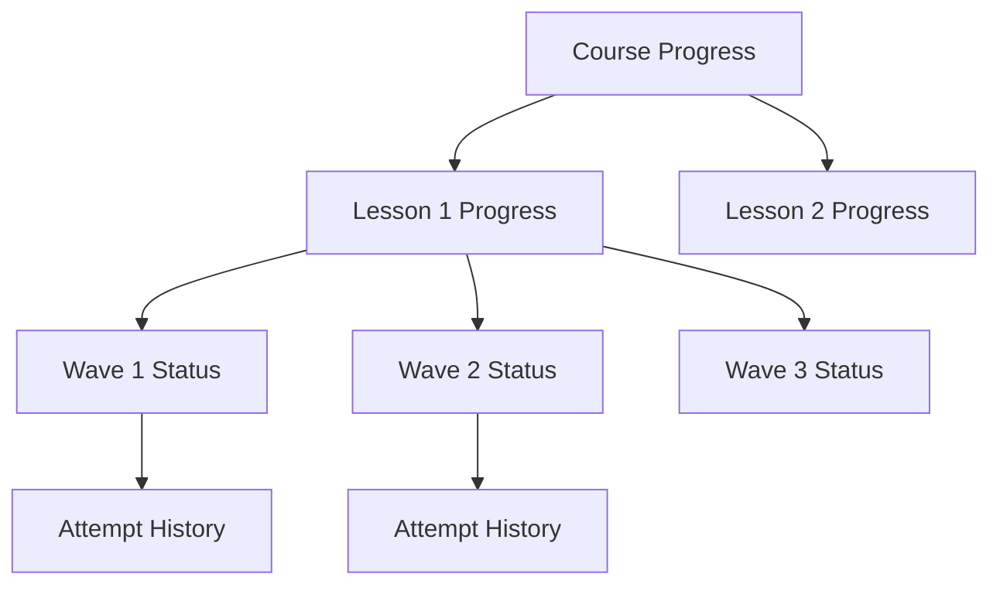
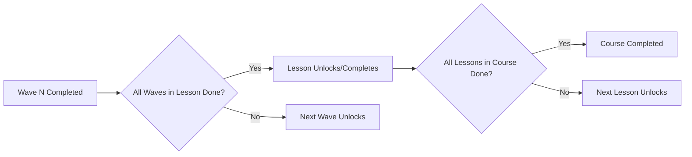

# Progress Tracking

> [!info] Purpose
> **Progress Tracking** captures every student action at the Wave, Lesson, and Course levels. It powers the [[Student Dashboard]], [[Gamification]] systems, and educator [[Analytics Dashboard|analytics]].

## Tracking Granularity

## Data Model

### Wave-Level Progress

Stored in the `PROGRESS` table (see [[Database Schema]]):

| Field | Meaning |
|-------|---------|
| `status` | `locked` → `available` → `started` → `completed` |
| `attempts_count` | How many times Evaluate was submitted |
| `highest_score` | Best score achieved (0–100) |
| `completed_at` | Timestamp of first successful completion |
| `last_attempted_at` | Timestamp of most recent attempt |

### Lesson-Level Progress

Derived from Wave progress:

- **Completion %:** `(completed_waves / total_waves) * 100`
- **Proficiency:** `true` if all Waves are `completed` AND average score >= threshold. See [[Proficiency System]].
- **Status:** `locked` / `available` / `in_progress` / `completed`

### Course-Level Progress

- **Completion %:** `(completed_lessons / total_lessons) * 100`
- **Total XP Earned:** Sum of XP from all completed Waves.
- **Current Rank:** Position on [[Leaderboards|Course Leaderboard]].

## Unlocking Logic

## Real-Time vs. Cached

| Data | Update Strategy | Reason |
|------|-----------------|--------|
| **Wave Status** | Real-time | Instant feedback for student |
| **Lesson %** | Real-time | UI progress bars |
| **XP Total** | Real-time + background verify | Gamification immediacy |
| **Leaderboard** | Cached (5-min refresh) | Aggregation is expensive |
| **Course Analytics** | Nightly batch | Heavy computation |

## Student-Facing Progress Views

### 1. Course Card

- Circular progress ring: "65% complete"
- Subtitle: "5 of 8 lessons done"

### 2. Lesson List

- Checkmarks for completed Waves.
- Partial fill for in-progress Lessons.
- Locked icon for unavailable Lessons.

### 3. Wave Path

- Visual "path" or timeline of Waves.
- Completed Waves glow or show a star.
- Current Wave pulses or highlights.

### 4. Detailed Stats (Profile)

- Total Waves completed.
- Average score per subject.
- Time spent learning.
- Streak calendar (GitHub-style contribution graph).

## Educator-Facing Analytics

- Class-wide completion rates.
- Average scores per Wave (identify difficult content).
- Time-on-task per Wave.
- Drop-off points (where students abandon).

## Edge Cases

| Scenario | Handling |
|----------|----------|
| Student refreshes mid-Wave | Resume from last viewed block |
| App crash during Evaluate | Save draft answers, allow resume |
| Subscription expires | Progress frozen but preserved |
| Wave is edited after completion | Keep original completion, flag for review |
| Reattempt after max reached | Blocked, show "Max attempts reached" |

## Privacy

- Students can only see their own progress.
- Leaderboards show anonymized usernames or first names only (configurable).
- Educators see aggregated data, not individual PII unless necessary.

## Related Notes

- [[Student Dashboard]] — Where progress is visualized.
- [[Wave Interaction]] — Where progress is generated.
- [[XP-System]] — How progress translates to points.
- [[Proficiency System]] — Lesson-level mastery logic.
- [[Database Schema]] — Progress table design.
- [[Analytics Dashboard]] — Educator-facing reports.
