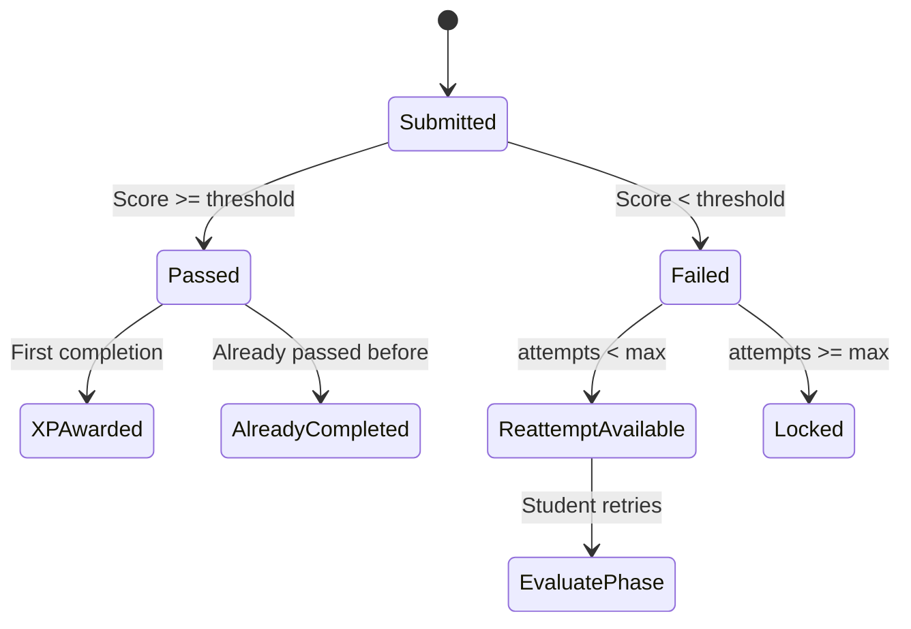

# Wave Interaction

> [!info] Purpose
> **Wave Interaction** describes the complete student experience from opening a Wave to receiving XP and feedback. It covers both the [[Learn Component|Learn]] phase (content consumption) and the [[Evaluate Component|Evaluate]] phase (assessment).

## Wave Player Layout

```
┌─────────────────────────────────────────────────────────┐
│  ← Back to Lesson    Wave 3 of 8    [XP: +50]          │
├─────────────────────────────────────────────────────────┤
│                                                         │
│  ┌─────────────────────────────────────────────────┐  │
│  │                                                 │  │
│  │         LEARN PHASE                             │  │
│  │                                                 │  │
│  │  [Text Block]                                   │  │
│  │  [Image Block]                                  │  │
│  │  [Audio Block]                                  │  │
│  │                                                 │  │
│  │              [Continue →]                       │  │
│  └─────────────────────────────────────────────────┘  │
│                                                         │
│  ┌─────────────────────────────────────────────────┐  │
│  │                                                 │  │
│  │         EVALUATE PHASE                          │  │
│  │                                                 │  │
│  │  Q1: What is the slope?                        │  │
│  │  ○ 2    ○ 3    ○ 5                            │  │
│  │                                                 │  │
│  │  Q2: Fill in the blank: y = ___x + 3          │  │
│  │  [________]                                     │  │
│  │                                                 │  │
│  │              [Submit Answers]                   │  │
│  └─────────────────────────────────────────────────┘  │
│                                                         │
└─────────────────────────────────────────────────────────┘
```

## Phase 1: Learn

### Entry

- Student clicks a Wave from the [[Student Dashboard|dashboard]] or Lesson view.
- The Wave loads. If previously started, it resumes at the last viewed block.
- A progress indicator shows "Block 1 of 5".

### Navigation

- **Scroll / Next:** Students advance through Learn blocks.
- **Back:** Students can revisit previous blocks.
- **Audio Controls:** Play/pause, speed adjustment for audio blocks.
- **Image Zoom:** Click to enlarge diagrams.

### Completion

- After the last Learn block, a prominent **"Start Evaluation"** button appears.
- This is a required transition — students cannot skip to Evaluate without viewing Learn.
- (Optional: Educator can disable this gate for review Waves.)

## Phase 2: Evaluate

### Entry

- The Evaluate phase loads with a brief transition animation.
- Instructions from the educator may appear at the top.

### Answering Questions

| Question Type | Interaction |
|---------------|-------------|
| **MCQ** | Tap/click option. Multi-select uses checkboxes. |
| **Fill-in-Blank** | Type into inline input fields. |
| **Drag-and-Drop** | Touch/drag items to drop zones. |

### Submission

- Student reviews all answers.
- Clicks **"Submit"**.
- System validates: all questions answered? (Warn if not.)

## Feedback & Scoring

### Immediate Feedback Mode

- After submission, each question is marked ✅ or ❌.
- Correct answer and explanation shown (if educator provided).
- Total score displayed: "You scored 8/10 (80%)".

### Delayed Feedback Mode

- (Future) Submit and see score only. Explanations revealed later.

## Result States



### Passing

- Score >= passing threshold.
- XP awarded (subject to [[Reattempt Mechanics|reattempt rules]]).
- Progress updated: Wave marked **Completed**.
- If all Waves in Lesson are done, [[Proficiency System|Lesson Proficiency]] achieved.
- Confetti / success animation for first-time pass.

### Failing

- Score < passing threshold.
- Feedback shown.
- If reattempts remain, a **"Try Again"** button appears.
- If no reattempts remain, Wave stays **Failed** (can be reviewed but not re-attempted for XP).

## XP Notification

- A toast or popup shows XP earned.
- "+50 XP! 🎉"
- Links to [[Leaderboards]]: "See your new rank!"

## Accessibility

- Keyboard navigation for all question types.
- Screen-reader friendly labels.
- High-contrast mode for visual impairments.
- Pause functionality for students who need breaks.

## Related Notes

- [[Wave Anatomy]] — Technical structure of a Wave.
- [[Learn Component]] — Block types in the Learn phase.
- [[Evaluate Component]] — Question types in the Evaluate phase.
- [[XP-System]] — How completion maps to XP.
- [[Reattempt Mechanics]] — Rules for retrying.
- [[Proficiency System]] — How Waves lead to Lesson mastery.
- [[Progress Tracking]] — How the system records attempts.
