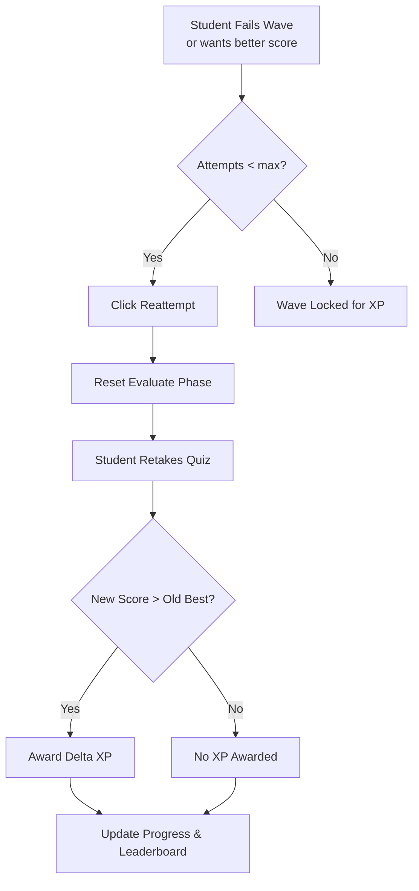

# Reattempt Mechanics

> [!info] Purpose
> **Reattempts** allow students to improve their understanding and score on a Wave, earning additional [[XP-System|XP]] up to a capped limit. This encourages mastery without enabling infinite farming.

## Core Rules

1. **Each Wave has a `max_reattempts` limit.** Set by the educator (default: 3).
2. **Reattempts are only allowed if the previous best score was not 100%.**
3. **XP is only awarded for a new high score.** The delta between old and new score determines bonus XP.
4. **Once `max_reattempts` is reached, the Wave is locked for further XP gains.** It can still be reviewed.

## Reattempt Flow



## XP Calculation on Reattempt

```
old_best_score = PROGRESS.highest_score
new_score = current_attempt_score

if new_score > old_best_score:
    old_xp = wave.xp_reward * (old_best_score / 100)
    new_xp = wave.xp_reward * (new_score / 100)
    delta_xp = new_xp - old_xp
    award(delta_xp)
    update PROGRESS.highest_score = new_score
else:
    award(0)
```

> [!example] Example
> - Wave XP reward: 100
> - Attempt 1: Score 60% → 60 XP awarded. `highest_score` = 60.
> - Attempt 2: Score 75% → Delta = 15 XP. Total from wave = 75 XP.
> - Attempt 3: Score 70% → No XP (70 < 75).
> - Attempt 4: Score 80% → Delta = 5 XP. Total from wave = 80 XP.
> - Attempt 5+: Blocked (max_reattempts = 3, so 3 retries + 1 original = 4 total).

> [!warning] Attempt Counting
> Define clearly: does `max_reattempts` mean total attempts or retries after the first?
> **Recommended:** `max_reattempts` = number of **additional** attempts allowed after the first.
> So `max_reattempts = 3` means 1 original + 3 retries = 4 total attempts.

## Student UI for Reattempts

### Wave Card

- Shows: "Best Score: 75%" and "Attempts: 2/4".
- If attempts remain: **"Reattempt"** button is active.
- If max reached: **"Review Only"** button (read-only mode).

### Evaluate Results Screen

- After submission:
  - "Your best score is now 80% (+5 XP)!"
  - "You have 1 reattempt remaining."
  - Or: "No reattempts left. Great job!"

## Educator Configuration

When creating a Wave (see [[Wave Creation Workflow]]), educators set:

| Setting | Default | Range |
|---------|---------|-------|
| `max_reattempts` | 3 | 1–10 (0 = unlimited, not recommended) |
| `passing_threshold` | 70% | 50%–100% |
| `xp_reward` | 50 | 10–500 |

> [!tip] Pedagogical Guidance
> - **Easy Waves:** Lower reattempt cap (1–2). Encourage confidence.
> - **Hard Waves:** Higher cap (3–5). Encourage persistence.
> - **Review Waves:** Unlimited or no Evaluate phase.

## Anti-Gaming

- **Cooldown:** Optional 5-minute wait between reattempts.
- **Question Pool:** (Future) Pull from a pool so retries don't see identical questions.
- **Client Validation:** Server always recalculates score; client cannot spoof.

## Related Notes

- [[XP-System]] — How reattempts affect total XP.
- [[Wave Interaction]] — Where reattempts are triggered.
- [[Wave Creation Workflow]] — Where educators set reattempt limits.
- [[Progress Tracking]] — How attempt history is stored.
- [[Gamification]] — Overview of all game mechanics.
- [[Database Schema]] — `PROGRESS.attempts_count` and `max_reattempts` fields.
