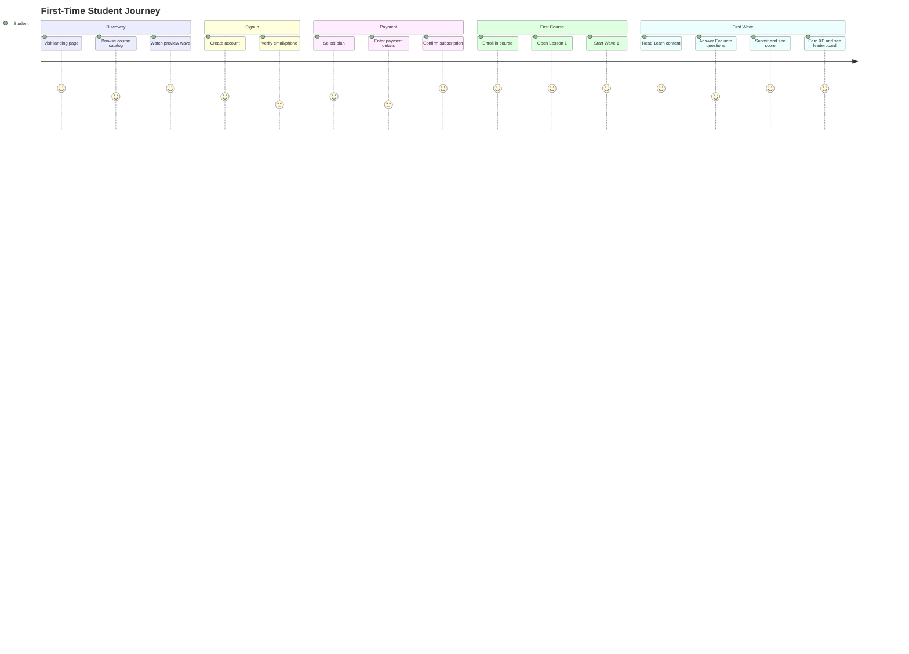
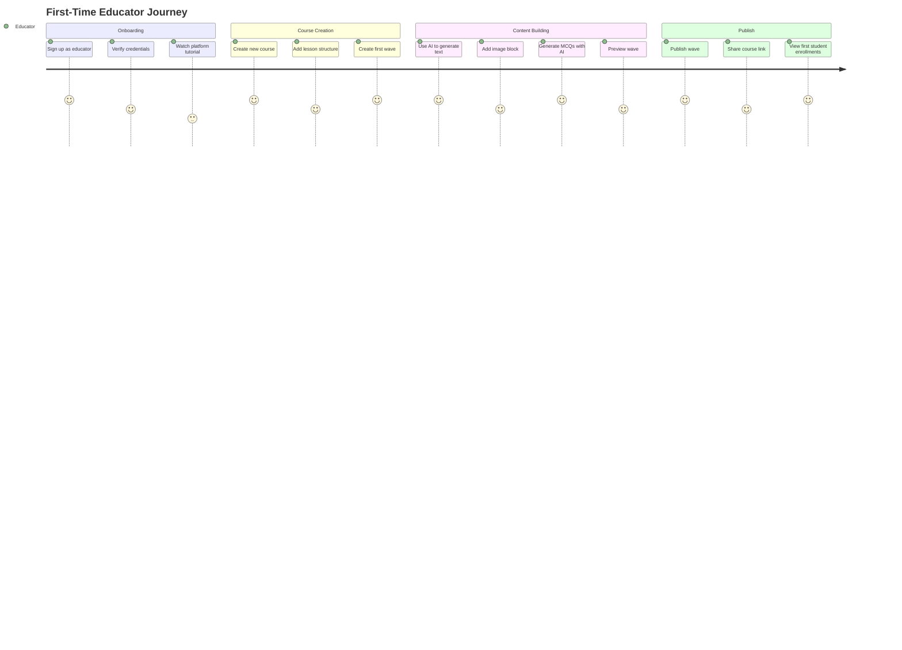

# User Journeys

> [!info] Purpose
> This document maps the key **user journeys** for StudEd's primary personas: the **Student**, the **Educator**, and the **School Administrator**.

## Journey 1: First-Time Student

**Goal:** Sign up, subscribe, and complete the first Wave.

## Journey 2: Returning Student

**Goal:** Resume learning, maintain streak, and climb the leaderboard.

1. **Login** → Auto-redirect to [[Student Dashboard]].
2. **"Continue Learning"** card shows last active Wave.
3. **Resume Wave** → Pick up where left off.
4. **Complete Wave** → See XP gain.
5. **Check Leaderboard** → See rank change.
6. **View Streak** → Confirm daily activity maintained.
7. **Explore New Courses** → Enroll if on Premium tier.

## Journey 3: First-Time Educator

**Goal:** Create an account, build a Course, and publish the first Wave.

## Journey 4: Returning Educator

**Goal:** Monitor analytics and improve content based on student performance.

1. **Login** → [[Educator Dashboard]] loads.
2. **Analytics Overview** → Check course completion rates.
3. **Drill Down** → Identify Wave with lowest average score.
4. **Edit Wave** → Add hint text or simplify question.
5. **Re-publish** → Updated content goes live.
6. **Check Notifications** → Respond to student feedback.

## Journey 5: School Administrator

**Goal:** Purchase bulk licenses and manage student access.

1. **Request Demo** → Sales call or self-serve signup.
2. **Purchase License** → Select student count, generate invoice.
3. **Upload Student List** → CSV import or manual entry.
4. **Assign Courses** → Link classes to specific Courses.
5. **Monitor Usage** → Admin dashboard shows active students, progress summaries.
6. **Renew License** → Annual renewal workflow.

## Pain Points & Opportunities

| Journey | Pain Point | Design Opportunity |
|---------|-----------|------------------|
| Student Signup | Complex payment for minors | Parent/guardian checkout flow |
| First Wave | Anxiety about evaluation | Reassuring UI, clear instructions |
| Educator Onboarding | Unfamiliar with block editors | Interactive tutorial walkthrough |
| Content Creation | Writer's block | Prominent AI assistant button |
| Admin Bulk Upload | CSV errors | Real-time validation and preview |

## Related Notes

- [[Student Dashboard]] — Destination for student journeys.
- [[Educator Dashboard]] — Destination for educator journeys.
- [[Wave Interaction]] — Core student interaction flow.
- [[Wave Creation Workflow]] — Core educator interaction flow.
- [[Course Enrollment]] — Student access flow.
- [[Monetization Strategy]] — Payment and subscription flows.
