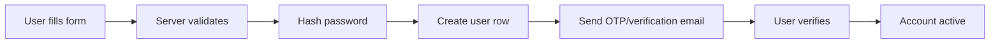
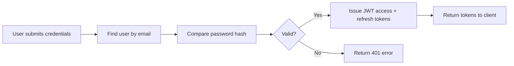

# Authentication & Authorization

> [!info] Purpose
> This document defines how users authenticate, how sessions are managed, and how access to resources is controlled based on roles and subscription status.

## User Roles

| Role | Description | Permissions |
|------|-------------|-------------|
| `student` | Learner | Enroll in courses, play waves, view own progress |
| `educator` | Content creator | Create/edit own courses, view own analytics |
| `head_educator` | Senior educator | Review/publish any course, manage educators |
| `admin` | Platform admin | Full access, user management, billing oversight |

## Authentication Flow

### Registration



### Login



### Token Strategy

| Token | Type | Expiry | Storage |
|-------|------|--------|---------|
| **Access Token** | JWT | 15 minutes | HTTP-only cookie or memory |
| **Refresh Token** | JWT | 7 days | HTTP-only cookie |

> [!warning] Security
> Access tokens must NOT be stored in `localStorage` to prevent XSS theft. Use HTTP-only cookies or secure in-memory storage.

## Authorization Rules

### Resource Ownership

- Educators can only edit **their own** Courses, Lessons, and Waves.
- Head educators and admins can edit **any** content.
- Students can only view content they are **enrolled in** and have **active subscriptions** for.

### Subscription Gates

```
ALLOW if:
  role == 'admin' OR
  role == 'educator' AND action == 'create' OR
  role == 'student' AND subscription.active == true AND user.enrolled_in(course)

DENY otherwise with 403 or paywall redirect.
```

### API Endpoint Guards

| Endpoint | Allowed Roles |
|----------|---------------|
| `POST /courses` | educator, head_educator, admin |
| `PATCH /courses/:id` | owner, head_educator, admin |
| `GET /waves/:id` | enrolled student, content owner, admin |
| `POST /waves/:id/submit` | enrolled student with active sub |
| `GET /leaderboard` | any authenticated user |
| `POST /ai/generate-learn` | educator, head_educator, admin (rate limited) |

## Password Policy

- Minimum 8 characters.
- At least one uppercase, one lowercase, one number.
- Common password blacklist check.
- Bcrypt hashing (cost factor 12).

## Multi-Factor Authentication (Future)

- OTP via SMS for high-value actions (password reset, subscription change).
- TOTP app support for educators and admins.

## GDPR / Privacy Compliance

- Right to access: Export all user data.
- Right to deletion: Anonymize progress, delete PII.
- Consent tracking for marketing emails.
- Data retention: Keep anonymized analytics after account deletion.

## Related Notes

- [[Backend Architecture]] — Auth service module.
- [[API Specifications]] — Auth endpoints.
- [[Monetization Strategy]] — Subscription-based access control.
- [[Course Enrollment]] — How enrollment connects to auth.
- [[Database Schema]] — User and role tables.
