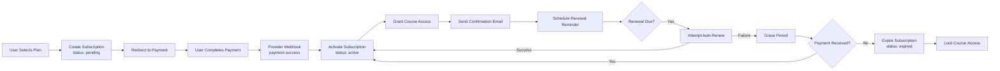

# Payment Integration

> [!info] Purpose
> This document describes how StudEd handles subscription payments, from checkout to webhook processing to access control.

## Supported Payment Methods

| Method | Provider | Audience |
|--------|----------|----------|
| **Credit/Debit Cards** | Stripe / PayHere | All users |
| **Mobile Wallets** | PayHere (Dialog, Mobitel) | Sri Lankan students |
| **Bank Transfer** | Manual / PayHere | School licenses |
| **Installments** | PayHere | High-value annual plans |

## Subscription Lifecycle



## Webhook Handling

### Events Processed

| Event | Action |
|-------|--------|
| `payment_intent.succeeded` | Mark payment as paid, activate subscription |
| `payment_intent.payment_failed` | Mark payment failed, notify user, retry logic |
| `invoice.paid` | Extend subscription end_date |
| `invoice.payment_failed` | Enter grace period, send dunning email |
| `customer.subscription.deleted` | Expire subscription, lock access |

### Idempotency

- All webhook handlers check `provider_reference` to prevent duplicate processing.
- Database transactions ensure atomic updates (payment + subscription + access).

## Access Gating

```
MIDDLEWARE: checkSubscription(req, res, next)
  IF user.role == 'admin' OR user.role == 'educator':
    RETURN next()
  
  sub = getActiveSubscription(user.id)
  IF sub.status == 'active' AND sub.end_date > now():
    RETURN next()
  ELSE IF sub.status == 'grace_period':
    RETURN res.json({ warning: 'Subscription expires in 3 days' })
  ELSE:
    RETURN res.status(403).json({ error: 'Subscription required' })
```

## School License Flow

1. School admin requests a quote.
2. Admin generates an invoice (manual or via system).
3. School pays via bank transfer.
4. Admin marks payment as received.
5. System creates a `school_license` subscription.
6. Admin uploads student list.
7. Students receive invite emails with auto-enrollment.

## Retry & Dunning

| Attempt | Timing | Action |
|---------|--------|--------|
| 1 | Day 1 (due date) | Auto-charge card |
| 2 | Day 3 | Retry charge, send email |
| 3 | Day 7 | Retry charge, send SMS |
| 4 | Day 10 | Final retry |
| 5 | Day 14 | Expire subscription, lock access |

## Refund Policy (Proposed)

- **7-day full refund** for monthly plans if no Waves completed.
- **Prorated refund** for annual plans (unused months).
- **No refund** for school licenses after student accounts are activated.

## Financial Reporting

- Monthly recurring revenue (MRR) dashboard for admins.
- Churn rate tracking.
- Revenue by plan tier and payment method.
- Export to CSV for accounting.

## Related Notes

- [[Monetization Strategy]] — Pricing and business model.
- [[API Specifications]] — Payment endpoints.
- [[Backend Architecture]] — Payment service module.
- [[Database Schema]] — Subscription and payment tables.
- [[Authentication & Authorization]] — User access tied to subscription.
