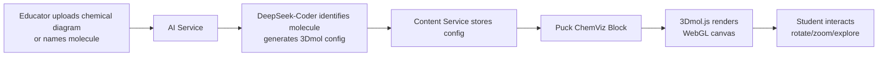

# 3Dmol.js Integration

> [!info] Overview
> [**3Dmol.js**](https://github.com/3dmol/3Dmol.js) is a WebGL-accelerated JavaScript library for online molecular visualization. It supports multiple molecular formats (PDB, SDF, MOL2, XYZ, CIF, etc.) and rendering styles (cartoon, stick, sphere, surface). It is embeddable via script tag or npm package.
>
> In StudEd, 3Dmol.js powers the **ChemViz Block** inside the [[Learn Component]], enabling students to rotate, zoom, and explore 3D molecular structures directly inside a Wave.

## What It Does

3Dmol.js enables:
- **3D molecular rendering** from PDB files, SMILES strings, or programmatic data
- **Multiple visual styles:** cartoon, stick, line, sphere, cross, surface
- **Interactive manipulation:** rotate, zoom, pan, atom selection
- **Surface computation:** VDW, SAS, molecular surfaces with color mapping
- **Geometric annotations:** arrows, cylinders, spheres for highlighting
- **Labeling:** atom labels, residue names, custom text

## Integration Architecture



## StudEd ChemViz Block

### Block Schema

```json
{
  "id": "chemviz-1",
  "type": "chemviz_3dmol",
  "data": {
    "title": "Water Molecule (H₂O)",
    "description": "Interactive 3D view of water molecule",
    "molecule": {
      "source_type": "pdb",
      "source_value": "pdb:1UBQ",
      "smiles": null
    },
    "style": {
      "cartoon": { "color": "spectrum" },
      "stick": { "radius": 0.15, "colorscheme": "Jmol" }
    },
    "surface": {
      "type": "VDW",
      "opacity": 0.7,
      "color": "white"
    },
    "camera": {
      "position": { "x": 0, "y": 0, "z": 50 },
      "zoom": 1.0
    },
    "interactivity": {
      "rotate": true,
      "zoom": true,
      "pan": true,
      "click_to_identify": true,
      "hover_labels": true
    },
    "annotations": [
      {
        "type": "label",
        "text": "Hydrogen Bond",
        "position": { "x": 1.0, "y": 0.5, "z": 0.0 },
        "color": "red"
      }
    ],
    "dimensions": { "width": "100%", "height": 400 }
  }
}
```

### Frontend Component

```tsx
import { useEffect, useRef } from 'react';

// 3Dmol.js is loaded via CDN or npm: npm install 3dmol

declare const $3Dmol: any;

export function ChemVizBlock({ block }: { block: ChemVizBlockData }) {
  const containerRef = useRef<HTMLDivElement>(null);
  
  useEffect(() => {
    if (!containerRef.current || typeof $3Dmol === 'undefined') return;
    
    const viewer = $3Dmol.createViewer(containerRef.current, {
      backgroundColor: "white",
      id: block.id,
    });
    
    const config = block.data;
    
    // Load molecule
    if (config.molecule.source_type === 'pdb') {
      $3Dmol.download(config.molecule.source_value, viewer, {}, () => {
        // Apply styles
        if (config.style.cartoon) {
          viewer.setStyle({}, { cartoon: config.style.cartoon });
        }
        if (config.style.stick) {
          viewer.setStyle({}, { stick: config.style.stick });
        }
        
        // Add surface
        if (config.surface) {
          viewer.addSurface($3Dmol.SurfaceType.VDW, {
            opacity: config.surface.opacity,
            color: config.surface.color,
          }, {});
        }
        
        // Add annotations
        config.annotations?.forEach((anno: any) => {
          if (anno.type === 'label') {
            viewer.addLabel(anno.text, {
              position: anno.position,
              backgroundColor: anno.color,
              fontColor: 'white',
            });
          }
        });
        
        viewer.render();
        viewer.zoomTo();
      });
    }
    
    return () => {
      viewer.removeAllLabels();
      viewer.removeAllSurfaces();
    };
  }, [block]);
  
  return (
    <div className="chemviz-container rounded-xl border border-gray-200 overflow-hidden">
      <div className="p-3 bg-gray-50 border-b border-gray-200">
        <h4 className="font-medium text-gray-900">{block.data.title}</h4>
        <p className="text-sm text-gray-500">{block.data.description}</p>
      </div>
      <div 
        ref={containerRef}
        style={{ height: block.data.dimensions.height }}
        className="w-full relative"
      />
      <div className="p-2 bg-gray-50 border-t border-gray-200 flex gap-2 text-xs text-gray-500">
        <span>🖱️ Drag to rotate</span>
        <span>🔍 Scroll to zoom</span>
        <span>👆 Click atoms</span>
      </div>
    </div>
  );
}
```

## AI-Generated Configuration

When an educator uploads a chemistry diagram, the AI Service generates the 3Dmol configuration:

### Example Prompt to DeepSeek-Coder

```
Analyze this chemistry photo and generate a 3Dmol.js configuration JSON.
The photo shows a benzene ring with hydroxyl group attached (phenol).
Target: A/L Chemistry students.

Requirements:
1. Use stick rendering with Jmol color scheme
2. Add VDW surface at 50% opacity
3. Label the hydroxyl oxygen and hydrogen
4. Enable full interactivity
5. Set camera to show the ring face-on
```

### Generated Config

```json
{
  "title": "Phenol Molecule (C₆H₅OH)",
  "molecule": {
    "source_type": "smiles",
    "source_value": "c1ccccc1O"
  },
  "style": {
    "stick": { "radius": 0.15, "colorscheme": "Jmol" }
  },
  "surface": {
    "type": "VDW",
    "opacity": 0.5,
    "color": "white"
  },
  "annotations": [
    {
      "type": "label",
      "text": "-OH (Hydroxyl)",
      "atom_index": 6,
      "color": "red"
    }
  ],
  "camera": {
    "position": { "x": 0, "y": 0, "z": 30 },
    "zoom": 1.2
  }
}
```

## Puck Custom Component Integration

```typescript
import type { Config } from "@puckeditor/core";

export const chemVizConfig: Config = {
  components: {
    ChemViz: {
      fields: {
        title: { type: "text" },
        molecule_smiles: { type: "text" },
        style_preset: {
          type: "select",
          options: [
            { label: "Stick", value: "stick" },
            { label: "Cartoon", value: "cartoon" },
            { label: "Sphere", value: "sphere" },
          ],
        },
      },
      defaultProps: { title: "Molecule Viewer", molecule_smiles: "", style_preset: "stick" },
      render: ({ title, molecule_smiles, style_preset }) => (
        <ChemVizViewer smiles={molecule_smiles} style={style_preset} title={title} />
      ),
    },
  },
};
```

## Data Sources

| Source | Format | How to Use |
|--------|--------|------------|
| **RCSB PDB** | PDB ID | `pdb:4N8T` — auto-downloads from RCSB |
| **SMILES string** | SMILES | Convert to 3D via RDKit (backend) then load |
| **SDF/MOL file** | File | Upload via Upload Service, reference by URL |
| **Programmatic** | JSON | Define atoms and bonds directly |

### Backend SMILES to 3D Conversion

```python
# AI Service internal helper
from rdkit import Chem
from rdkit.Chem import AllChem

def smiles_to_3d_data(smiles: str) -> dict:
    mol = Chem.MolFromSmiles(smiles)
    mol = Chem.AddHs(mol)
    AllChem.EmbedMolecule(mol, AllChem.ETKDG())
    AllChem.UFFOptimizeMolecule(mol)
    
    # Extract atom coordinates
    conf = mol.GetConformer()
    atoms = []
    for i, atom in enumerate(mol.GetAtoms()):
        pos = conf.GetAtomPosition(i)
        atoms.append({
            "elem": atom.GetSymbol(),
            "x": pos.x, "y": pos.y, "z": pos.z,
        })
    
    return {"atoms": atoms, "bonds": [...]}
```

## Performance Considerations

| Factor | Recommendation |
|--------|---------------|
| **Bundle size** | 3Dmol.js ~500KB minified. Lazy-load per ChemViz block. |
| **WebGL support** | Check `!!document.createElement('canvas').getContext('webgl')` |
| **Mobile** | Reduce default canvas size to 300px height on mobile |
| **Complex molecules** | >1000 atoms may lag on low-end devices. Show "Simplify view" option. |
| **Memory** | Call `viewer.removeAllSurfaces()` on unmount |

## Fallbacks

| Scenario | Fallback |
|----------|----------|
| WebGL not supported | Show static 2D SVG image of molecule |
| Large molecule (>2000 atoms) | Default to stick-only, no surface |
| SMILES invalid | Show error + "Please check molecular formula" |
| Network PDB download fails | Use cached copy or show placeholder |

## Related Notes

- [[Educator AI Chat Interface]] — Where educators request molecular visualizations.
- [[AI Content Generation Service]] — DeepSeek-Coder config generation pipeline.
- [[Learn Component]] — Where ChemViz blocks appear in Waves.
- [[MDX Editor]] — Editor integration for ChemViz blocks.
- [[Puck Research]] — Puck custom component implementation details.
