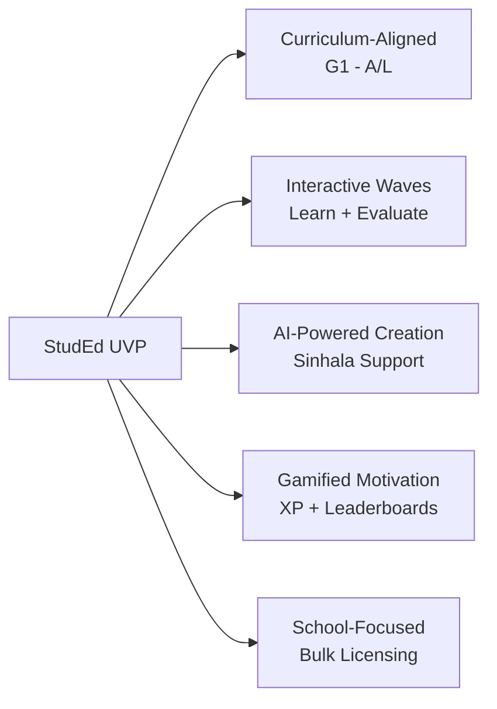

# Competitive Analysis

> [!info] Purpose
> Understanding the competitive landscape helps position StudEd uniquely and avoid feature parity traps.

## Competitors

### 1. Udemy / Coursera (Global)

| Aspect | Their Strength | StudEd Differentiation |
|--------|---------------|----------------------|
| **Audience** | General adult learners | Strictly Sri Lankan school students (G1–A/L) |
| **Content** | Video lectures | Interactive Waves (Learn + Evaluate) |
| **Gamification** | Certificates | Real-time XP, leaderboards, reattempts |
| **Language** | English dominant | Full Sinhala support |
| **Pricing** | Per-course or subscription | School-focused licenses + student subs |

### 2. local EdTech Platforms (Sri Lanka)

| Platform | Model | StudEd Advantage |
|----------|-------|------------------|
| **e-thaksalawa** | Government free platform | Premium interactive content, gamification |
| **LearnWare** | Tablet-based content | Web-first, AI-assisted creation, leaderboard |
| **Various YouTube tutors** | Free video | Structured curriculum, assessment, progress tracking |

### 3. Duolingo / Kahoot (Gamification-focused)

| Aspect | Their Strength | StudEd Differentiation |
|--------|---------------|----------------------|
| **Gamification** | Highly polished | Applied to formal Sri Lankan curriculum |
| **Content** | Generic language/trivia | Curriculum-aligned, educator-created |
| **Creation** | Platform-controlled | Educator + AI-powered content creation |
| **Hierarchy** | Flat (lessons) | Strict Course→Lesson→Wave with proficiency |

## StudEd's Unique Value Proposition

## SWOT Analysis

### Strengths

- Tailored for Sri Lankan curriculum and language.
- Unique "Wave" concept with built-in assessment.
- AI reduces educator content creation burden.
- Gamification increases student engagement.

### Weaknesses

- New entrant, no brand recognition.
- Dependent on educator adoption for content volume.
- Higher development cost due to interactive editor.

### Opportunities

- Partnerships with schools and tuition classes.
- Government curriculum alignment certifications.
- Expansion to Tamil language support (future).
- Mobile-first growth in rural areas.

### Threats

- Free competitors (government platforms, YouTube).
- Established global players entering Sri Lanka.
- Low digital literacy among some educators.
- Internet connectivity issues in rural areas.

## Key Takeaways

> [!tip] Focus on Differentiation
> - Do not compete with Udemy on breadth.
> - Do not compete with YouTube on price (free).
> - Compete on **structured interactivity**, **Sinhala support**, **school integration**, and **AI-assisted creation**.

## Related Notes

- [[StudEd Project Overview]] — Mission and value proposition.
- [[Target Audience]] — Who we serve and why.
- [[Monetization Strategy]] — How we capture value.
- [[User Journeys]] — How we deliver a superior experience.
