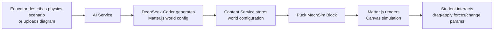

# Matter.js Integration

> [!info] Overview
> [**Matter.js**](https://github.com/liabru/matter-js) is a 2D rigid body physics engine for the web. It supports rigid bodies, compound bodies, constraints, collisions, gravity, and more — all rendered to HTML5 Canvas. With 18.2k GitHub stars, it is one of the most popular JavaScript physics libraries.
>
> In StudEd, Matter.js powers the **MechSim Block** inside the [[Learn Component]], enabling students to interact with physics simulations: pendulums, collisions, projectile motion, bridge building, and more.

## What It Does

Matter.js enables:
- **Rigid body physics:** Boxes, circles, polygons with realistic collisions
- **Constraints & springs:** Ropes, chains, pendulums, springs
- **Forces & gravity:** Adjustable gravity, wind, attractors
- **Compound bodies:** Complex shapes made of multiple parts
- **Collision events:** Detect and respond to collisions programmatically
- **Time scaling:** Slow-motion or speed-up for observation
- **Mouse interaction:** Drag bodies, apply forces with cursor
- **Multiple renderers:** Canvas (built-in), custom WebGL, or no renderer (headless)

## Integration Architecture



## StudEd MechSim Block

### Block Schema

```json
{
  "id": "mechsim-1",
  "type": "mechsim_matterjs",
  "data": {
    "title": "Pendulum Motion",
    "description": "Simple pendulum with adjustable length and mass",
    "scenario_type": "pendulum",
    "world_config": {
      "gravity": { "x": 0, "y": 1, "scale": 0.001 },
      "bounds": { "width": 800, "height": 600 },
      "bodies": [
        {
          "id": "pivot",
          "type": "circle",
          "position": { "x": 400, "y": 50 },
          "radius": 10,
          "isStatic": true,
          "render": { "fillStyle": "#333" }
        },
        {
          "id": "bob",
          "type": "circle",
          "position": { "x": 400, "y": 350 },
          "radius": 30,
          "density": 0.04,
          "render": { "fillStyle": "#3B82F6" }
        }
      ],
      "constraints": [
        {
          "id": "string",
          "bodyA": "pivot",
          "bodyB": "bob",
          "length": 300,
          "stiffness": 1,
          "render": { "strokeStyle": "#666", "lineWidth": 2 }
        }
      ]
    },
    "editable_params": [
      {
        "label": "String Length",
        "property": "string.length",
        "type": "slider",
        "min": 100,
        "max": 500,
        "step": 10,
        "default": 300
      },
      {
        "label": "Bob Mass",
        "property": "bob.density",
        "type": "slider",
        "min": 0.01,
        "max": 0.1,
        "step": 0.01,
        "default": 0.04
      },
      {
        "label": "Gravity",
        "property": "gravity.scale",
        "type": "slider",
        "min": 0,
        "max": 0.002,
        "step": 0.0001,
        "default": 0.001
      }
    ],
    "measurements": [
      {
        "label": "Period",
        "type": "computed",
        "formula": "2 * PI * sqrt(length / gravity)"
      },
      {
        "label": "Velocity",
        "type": "live",
        "source": "bob.velocity"
      }
    ],
    "educational_overlays": {
      "show_forces": true,
      "show_velocity": true,
      "show_trajectory": true,
      "show_energy_bar": true
    },
    "dimensions": { "width": "100%", "height": 600 }
  }
}
```

### Frontend Component

```tsx
import { useEffect, useRef, useState, useCallback } from 'react';
import Matter from 'matter-js';

const { Engine, Render, Runner, Bodies, Composite, Constraint, Mouse, MouseConstraint, Events } = Matter;

export function MechSimBlock({ block }: { block: MechSimBlockData }) {
  const canvasRef = useRef<HTMLDivElement>(null);
  const engineRef = useRef<Matter.Engine | null>(null);
  const [measurements, setMeasurements] = useState<Record<string, number>>({});
  const [params, setParams] = useState(block.data.editable_params);
  
  const initSimulation = useCallback(() => {
    if (!canvasRef.current) return;
    
    // Cleanup previous
    if (engineRef.current) {
      Matter.Render.stop(engineRef.current as any);
      Matter.Runner.stop(engineRef.current as any);
    }
    
    const width = canvasRef.current.clientWidth;
    const height = block.data.dimensions.height;
    
    // Create engine
    const engine = Engine.create({
      gravity: block.data.world_config.gravity,
    });
    engineRef.current = engine;
    
    // Create renderer
    const render = Render.create({
      element: canvasRef.current,
      engine: engine,
      options: {
        width,
        height,
        wireframes: false,
        background: '#f8fafc',
      },
    });
    
    // Build world from config
    const worldConfig = block.data.world_config;
    const bodies = new Map<string, Matter.Body>();
    
    worldConfig.bodies.forEach((bodyConfig: any) => {
      let body;
      if (bodyConfig.type === 'circle') {
        body = Bodies.circle(
          bodyConfig.position.x,
          bodyConfig.position.y,
          bodyConfig.radius,
          {
            isStatic: bodyConfig.isStatic,
            density: bodyConfig.density,
            render: bodyConfig.render,
          }
        );
      } else if (bodyConfig.type === 'rectangle') {
        body = Bodies.rectangle(
          bodyConfig.position.x,
          bodyConfig.position.y,
          bodyConfig.width,
          bodyConfig.height,
          {
            isStatic: bodyConfig.isStatic,
            render: bodyConfig.render,
          }
        );
      }
      if (body) {
        body.id = bodyConfig.id;
        bodies.set(bodyConfig.id, body);
        Composite.add(engine.world, body);
      }
    });
    
    // Add constraints
    worldConfig.constraints.forEach((constraintConfig: any) => {
      const constraint = Constraint.create({
        bodyA: bodies.get(constraintConfig.bodyA),
        bodyB: bodies.get(constraintConfig.bodyB),
        length: constraintConfig.length,
        stiffness: constraintConfig.stiffness,
        render: constraintConfig.render,
      });
      Composite.add(engine.world, constraint);
    });
    
    // Add mouse control
    const mouse = Mouse.create(render.canvas);
    const mouseConstraint = MouseConstraint.create(engine, {
      mouse: mouse,
      constraint: { stiffness: 0.2, render: { visible: false } },
    });
    Composite.add(engine.world, mouseConstraint);
    render.mouse = mouse;
    
    // Live measurements
    Events.on(engine, 'afterUpdate', () => {
      const newMeasurements: Record<string, number> = {};
      block.data.measurements.forEach((m: any) => {
        if (m.type === 'live' && m.source === 'bob.velocity') {
          const bob = bodies.get('bob');
          if (bob) {
            newMeasurements[m.label] = Math.sqrt(bob.velocity.x ** 2 + bob.velocity.y ** 2);
          }
        }
      });
      setMeasurements(newMeasurements);
    });
    
    // Run
    Runner.run(Runner.create(), engine);
    Render.run(render);
  }, [block]);
  
  useEffect(() => {
    initSimulation();
    return () => {
      if (engineRef.current) {
        Matter.Render.stop(engineRef.current as any);
      }
    };
  }, [initSimulation]);
  
  return (
    <div className="mechsim-container rounded-xl border border-gray-200 overflow-hidden">
      {/* Header */}
      <div className="p-3 bg-gray-50 border-b border-gray-200">
        <h4 className="font-medium text-gray-900">{block.data.title}</h4>
        <p className="text-sm text-gray-500">{block.data.description}</p>
      </div>
      
      {/* Parameters */}
      {block.data.editable_params.length > 0 && (
        <div className="p-3 bg-blue-50 border-b border-blue-100 flex gap-4 flex-wrap">
          {block.data.editable_params.map((param: any) => (
            <div key={param.property} className="flex flex-col">
              <label className="text-xs font-medium text-blue-700">{param.label}</label>
              <input
                type="range"
                min={param.min}
                max={param.max}
                step={param.step}
                defaultValue={param.default}
                onChange={(e) => {
                  // Update simulation parameter
                  const value = parseFloat(e.target.value);
                  // Apply to engine... (implementation depends on param mapping)
                }}
                className="w-32"
              />
            </div>
          ))}
        </div>
      )}
      
      {/* Canvas */}
      <div 
        ref={canvasRef}
        style={{ height: block.data.dimensions.height }}
        className="w-full bg-white"
      />
      
      {/* Measurements */}
      {Object.keys(measurements).length > 0 && (
        <div className="p-3 bg-green-50 border-t border-green-100 flex gap-6 text-sm">
          {Object.entries(measurements).map(([label, value]) => (
            <span key={label} className="text-green-700">
              {label}: {value.toFixed(2)}
            </span>
          ))}
        </div>
      )}
      
      {/* Instructions */}
      <div className="p-2 bg-gray-50 border-t border-gray-200 text-xs text-gray-500 text-center">
        🖱️ Drag objects • ⚡ Change parameters to see effects
      </div>
    </div>
  );
}
```

## AI-Generated World Configurations

When an educator describes a physics scenario, DeepSeek-Coder generates the Matter.js world configuration:

### Example Prompt to DeepSeek-Coder

```
Generate a Matter.js world configuration JSON for:
"Newton's Cradle with 5 metal balls. Students can drag a ball to start the simulation."
Target: A/L Physics students.

Requirements:
1. Realistic collision restitution (0.95)
2. Balls suspended by rigid constraints at top
3. Mouse drag enabled on all balls
4. Show velocity vectors as educational overlay
5. Canvas size: 800x400
```

### Generated Config

```json
{
  "title": "Newton's Cradle",
  "description": "Demonstration of elastic collisions and momentum conservation",
  "scenario_type": "newtons_cradle",
  "world_config": {
    "gravity": { "x": 0, "y": 1, "scale": 0.001 },
    "bounds": { "width": 800, "height": 400 },
    "bodies": [
      {
        "id": "frame_top",
        "type": "rectangle",
        "position": { "x": 400, "y": 20 },
        "width": 600, "height": 10,
        "isStatic": true,
        "render": { "fillStyle": "#333" }
      },
      {
        "id": "ball_1",
        "type": "circle",
        "position": { "x": 250, "y": 250 },
        "radius": 25,
        "restitution": 0.95,
        "friction": 0.005,
        "density": 0.08,
        "render": { "fillStyle": "#C0C0C0", "strokeStyle": "#666", "lineWidth": 2 }
      }
      // ... balls 2-5
    ],
    "constraints": [
      {
        "id": "string_1",
        "bodyA": "frame_top",
        "bodyB": "ball_1",
        "pointA": { "x": -150, "y": 0 },
        "length": 220,
        "stiffness": 1,
        "render": { "strokeStyle": "#444", "lineWidth": 1 }
      }
      // ... strings 2-5
    ]
  },
  "editable_params": [
    {
      "label": "Restitution",
      "property": "global.restitution",
      "type": "slider",
      "min": 0.5, "max": 1.0, "step": 0.01, "default": 0.95
    }
  ],
  "educational_overlays": {
    "show_velocity": true,
    "show_momentum": true,
    "show_energy": true
  }
}
```

## Puck Custom Component Integration

```typescript
import type { Config } from "@puckeditor/core";

export const mechSimConfig: Config = {
  components: {
    MechSim: {
      fields: {
        title: { type: "text" },
        scenario_type: {
          type: "select",
          options: [
            { label: "Pendulum", value: "pendulum" },
            { label: "Collision", value: "collision" },
            { label: "Projectile", value: "projectile" },
            { label: "Spring", value: "spring" },
            { label: "Newton's Cradle", value: "newtons_cradle" },
            { label: "Custom", value: "custom" },
          ],
        },
        world_config: { type: "text" },
      },
      defaultProps: {
        title: "Physics Simulation",
        scenario_type: "custom",
        world_config: "{}",
      },
      render: ({ title, scenario_type, world_config }) => (
        <MechSimBlockComponent title={title} scenario_type={scenario_type} world_config={world_config} />
      ),
    },
  },
};
```

## Pre-Built Scenario Library

To speed up educator workflows, provide pre-built Matter.js scenarios:

| Scenario | Description | A/L Topic |
|----------|-------------|-----------|
| **Simple Pendulum** | Adjustable length, mass, gravity | Oscillations |
| **Projectile Motion** | Cannonball with angle/velocity sliders | Mechanics |
| **Elastic Collision** | Two carts with variable masses | Momentum |
| **Inelastic Collision** | Carts with sticky contact | Momentum |
| **Spring Mass System** | Vertical spring with damping | SHM |
| **Newton's Cradle** | 5-ball momentum transfer | Collisions |
| **Inclined Plane** | Block sliding with friction | Forces |
| **Circular Motion** | Conical pendulum | Rotational dynamics |
| **Planetary Orbit** | 2-body gravitational system | Gravitation |

## Performance Considerations

| Factor | Recommendation |
|--------|---------------|
| **Bundle size** | matter-js ~80KB minified. Acceptable for eager loading. |
| **Body count** | Keep <200 bodies for 60fps on mobile |
| **Collision pairs** | Use collision filtering to reduce pairs |
| **Renderer** | Disable wireframes for production; use sprites for complex shapes |
| **Memory** | Call `Engine.clear(engine)` + `Render.stop(render)` on unmount |

## Fallbacks

| Scenario | Fallback |
|----------|----------|
| Canvas not supported | Static diagram + text explanation |
| Complex simulation lags | Reduce body count, disable shadows |
| Invalid physics config | Show error overlay + "Reset to default" button |
| Touch interaction broken | Add explicit touch event handlers |

## Related Notes

- [[Educator AI Chat Interface]] — Where educators request physics simulations.
- [[AI Content Generation Service]] — DeepSeek-Coder world config generation pipeline.
- [[Learn Component]] — Where MechSim blocks appear in Waves.
- [[MDX Editor]] — Editor integration for MechSim blocks.
- [[Puck Research]] — Puck custom component implementation details.
- [[Puck Research]] — Puck custom component integration.
