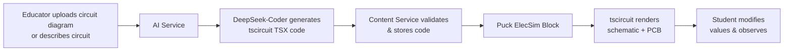
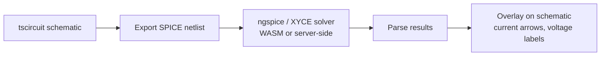

# tscircuit Integration

> [!info] Overview
> [**tscircuit**](https://github.com/tscircuit/tscircuit) is an open-source library that lets you design real electronics using **TypeScript and React**. It uses React Fiber to render circuits into web pages, enabling schematic diagrams, PCB layouts, and even exportable manufacturing files (Gerbers, BOM, Pick & Place).
>
> In StudEd, tscircuit powers the **ElecSim Block** inside the [[Learn Component]], allowing students to interact with circuit schematics, modify component values, and visualize current flow — all inside a Wave.

## What It Does

tscircuit enables:
- **Schematic rendering:** Resistors, capacitors, ICs, LEDs, transistors in circuit diagrams
- **PCB layout visualization:** Real PCB routing and component placement
- **Interactive parameters:** Change resistor values, swap components, toggle switches
- **SPICE simulation integration:** (via external solver) current/voltage analysis
- **Export to manufacturing:** Gerber, BOM, Pick & Place files
- **React component model:** Circuits are React components — fully programmable

## Integration Architecture



## StudEd ElecSim Block

### Block Schema

```json
{
  "id": "elecsim-1",
  "type": "elecsim_tscircuit",
  "data": {
    "title": "Simple LED Circuit",
    "description": "LED with current-limiting resistor",
    "circuit_code": "import { Circuit, Resistor, LED, Ground, Trace } from '@tscircuit/core'\n\nexport default () => (\n  <Circuit>\n    <Resistor name=\"R1\" resistance=\"220ohm\" footprint=\"0805\" pcbX=\"2mm\" pcbY=\"0\" />\n    <LED name=\"D1\" color=\"red\" footprint=\"0603\" pcbX=\"4mm\" pcbY=\"0\" />\n    <Ground name=\"GND\" pcbX=\"6mm\" pcbY=\"0\" />\n    <Trace path={['.R1 > .left', '.D1 > .anode']} />\n    <Trace path={['.D1 > .cathode', '.GND']} />\n  </Circuit>\n)",
    "editable_params": [
      {
        "component": "R1",
        "property": "resistance",
        "label": "Resistor Value",
        "type": "select",
        "options": ["100ohm", "220ohm", "1kohm", "10kohm"],
        "default": "220ohm"
      },
      {
        "component": "D1",
        "property": "color",
        "label": "LED Color",
        "type": "select",
        "options": ["red", "green", "blue", "yellow"],
        "default": "red"
      }
    ],
    "simulation": {
      "enabled": true,
      "type": "spice",
      "voltage_source": "5V",
      "show_current_flow": true,
      "show_voltage_drop": true
    },
    "view_modes": ["schematic", "pcb"],
    "default_view": "schematic",
    "dimensions": { "width": "100%", "height": 500 }
  }
}
```

### Frontend Component

```tsx
import { useState, useEffect, Suspense, lazy } from 'react';

// Lazy load tscircuit viewer components
const SchematicViewer = lazy(() => import('@tscircuit/schematic-viewer'));
const PCBViewer = lazy(() => import('@tscircuit/pcb-viewer'));

export function ElecSimBlock({ block }: { block: ElecSimBlockData }) {
  const [viewMode, setViewMode] = useState<'schematic' | 'pcb'>(block.data.default_view);
  const [params, setParams] = useState<Record<string, string>>(() => {
    const initial: Record<string, string> = {};
    block.data.editable_params.forEach(p => {
      initial[`${p.component}.${p.property}`] = p.default;
    });
    return initial;
  });
  
  // Generate circuit with current params
  const circuitCode = generateCircuitCode(block.data.circuit_code, params);
  
  return (
    <div className="elecsim-container rounded-xl border border-gray-200 overflow-hidden">
      {/* Header */}
      <div className="p-3 bg-gray-50 border-b border-gray-200 flex justify-between items-center">
        <div>
          <h4 className="font-medium text-gray-900">{block.data.title}</h4>
          <p className="text-sm text-gray-500">{block.data.description}</p>
        </div>
        <div className="flex gap-2">
          {block.data.view_modes.map(mode => (
            <button
              key={mode}
              onClick={() => setViewMode(mode)}
              className={`px-3 py-1 rounded text-sm ${viewMode === mode ? 'bg-blue-500 text-white' : 'bg-white border'}`}
            >
              {mode === 'schematic' ? '🔌 Schematic' : '📟 PCB'}
            </button>
          ))}
        </div>
      </div>
      
      {/* Parameters Panel */}
      {block.data.editable_params.length > 0 && (
        <div className="p-3 bg-blue-50 border-b border-blue-100 flex gap-4 flex-wrap">
          {block.data.editable_params.map(param => (
            <div key={`${param.component}.${param.property}`}>
              <label className="text-xs font-medium text-blue-700">{param.label}</label>
              <select
                value={params[`${param.component}.${param.property}`]}
                onChange={(e) => setParams(prev => ({
                  ...prev,
                  [`${param.component}.${param.property}`]: e.target.value
                }))}
                className="ml-2 text-sm border rounded px-2 py-1"
              >
                {param.options.map(opt => (
                  <option key={opt} value={opt}>{opt}</option>
                ))}
              </select>
            </div>
          ))}
        </div>
      )}
      
      {/* Viewer */}
      <div style={{ height: block.data.dimensions.height }} className="w-full bg-white">
        <Suspense fallback={<div className="p-8 text-center">Loading circuit viewer...</div>}>
          {viewMode === 'schematic' ? (
            <SchematicViewer circuitJson={parseTscircuit(circuitCode)} />
          ) : (
            <PCBViewer circuitJson={parseTscircuit(circuitCode)} />
          )}
        </Suspense>
      </div>
      
      {/* Simulation Readout */}
      {block.data.simulation?.enabled && (
        <div className="p-3 bg-green-50 border-t border-green-100">
          <div className="flex gap-6 text-sm">
            <span className="text-green-700">⚡ Voltage: 5V</span>
            <span className="text-green-700">🔌 Current: {calculateCurrent(params)}mA</span>
            <span className="text-green-700">💡 LED Power: {calculatePower(params)}mW</span>
          </div>
        </div>
      )}
    </div>
  );
}

// Helper to parse tscircuit code and generate circuit-json
function parseTscircuit(code: string): any {
  // In production, this would use @tscircuit/core to compile TSX to circuit-json
  // For now, return mock data
  return { type: "circuit", elements: [] };
}

function calculateCurrent(params: Record<string, string>): string {
  const r = parseInt(params['R1.resistance'] || '220');
  return (5 / (r / 1000)).toFixed(1);
}

function calculatePower(params: Record<string, string>): string {
  const r = parseInt(params['R1.resistance'] || '220');
  const i = 5 / (r / 1000);
  return ((5 - 2) * i).toFixed(1); // Assuming 2V LED drop
}
```

## AI-Generated tscircuit Code

When an educator uploads a circuit diagram, the AI Service generates tscircuit React components:

### Example Prompt to DeepSeek-Coder

```
Analyze this circuit diagram photo and generate a tscircuit React component.
The photo shows a simple series circuit: 9V battery → switch → 100Ω resistor → LED → ground.
Target: O/L Physics students.

Requirements:
1. Use @tscircuit/core components
2. Make resistor value and LED color editable by students
3. Include SPICE simulation annotations
4. Show current flow animation
5. Add educational labels in Sinhala where possible
```

### Generated Code

```tsx
import { Circuit, Resistor, LED, Ground, Battery, Trace, Switch } from '@tscircuit/core';

export const SimpleLedCircuit = ({ resistorValue = "100ohm", ledColor = "red" }) => (
  <Circuit>
    <Battery name="BAT1" voltage="9V" footprint="battery" pcbX="0" pcbY="0" />
    <Switch name="SW1" footprint="tactile" pcbX="2mm" pcbY="0" />
    <Resistor name="R1" resistance={resistorValue} footprint="0805" pcbX="4mm" pcbY="0" />
    <LED name="D1" color={ledColor} footprint="0603" pcbX="6mm" pcbY="0" />
    <Ground name="GND" pcbX="8mm" pcbY="0" />
    
    <Trace path={['.BAT1 > .plus', '.SW1 > .pin1']} />
    <Trace path={['.SW1 > .pin2', '.R1 > .left']} />
    <Trace path={['.R1 > .right', '.D1 > .anode']} />
    <Trace path={['.D1 > .cathode', '.GND']} />
  </Circuit>
);
```

## Puck Custom Component Integration

```typescript
import type { Config } from "@puckeditor/core";

export const elecSimConfig: Config = {
  components: {
    ElecSim: {
      fields: {
        title: { type: "text" },
        circuit_code: { type: "text" },
        view_mode: {
          type: "select",
          options: [
            { label: "Schematic", value: "schematic" },
            { label: "PCB", value: "pcb" },
          ],
        },
      },
      defaultProps: {
        title: "Circuit Simulation",
        circuit_code: "",
        view_mode: "schematic",
      },
      render: ({ title, circuit_code, view_mode }) => (
        <ElecSimBlockComponent title={title} circuit_code={circuit_code} view_mode={view_mode} />
      ),
    },
  },
};
```

## SPICE Simulation Integration

For true circuit simulation (current/voltage analysis), tscircuit can integrate with a SPICE solver:



### Go Service Integration

```go
// AI Service can call a SPICE microservice
func (s *AIService) SimulateCircuit(ctx context.Context, netlist string) (*SimulationResult, error) {
    // Call ngspice WASM or remote solver
    resp, err := s.spiceClient.Solve(ctx, &spice.SolveRequest{
        Netlist: netlist,
        Analyses: []string{"OP", "DC"},
    })
    // Parse node voltages and branch currents
    return &SimulationResult{
        NodeVoltages: resp.NodeVoltages,
        BranchCurrents: resp.BranchCurrents,
    }, nil
}
```

## Performance Considerations

| Factor | Recommendation |
|--------|---------------|
| **Bundle size** | @tscircuit/core + viewers ~1MB. Lazy-load per ElecSim block. |
| **Compilation** | TSX → circuit-json happens client-side or in Web Worker |
| **Complex circuits** | >50 components may lag. Simplify or paginate |
| **Mobile** | Default to schematic view; hide PCB on small screens |

## Fallbacks

| Scenario | Fallback |
|----------|----------|
| tscircuit compilation error | Show code editor + error message for manual fix |
| Component not in library | Fallback to generic "chip" symbol + label |
| SPICE solver unavailable | Show schematic only, no simulation overlay |
| Browser unsupported | Static PNG image of circuit |

## Related Notes

- [[Educator AI Chat Interface]] — Where educators request circuit simulations.
- [[AI Content Generation Service]] — DeepSeek-Coder code generation pipeline.
- [[Learn Component]] — Where ElecSim blocks appear in Waves.
- [[MDX Editor]] — Editor integration for ElecSim blocks.
- [[Puck Research]] — Puck custom component implementation details.
- [[Puck Research]] — Puck custom component integration.
