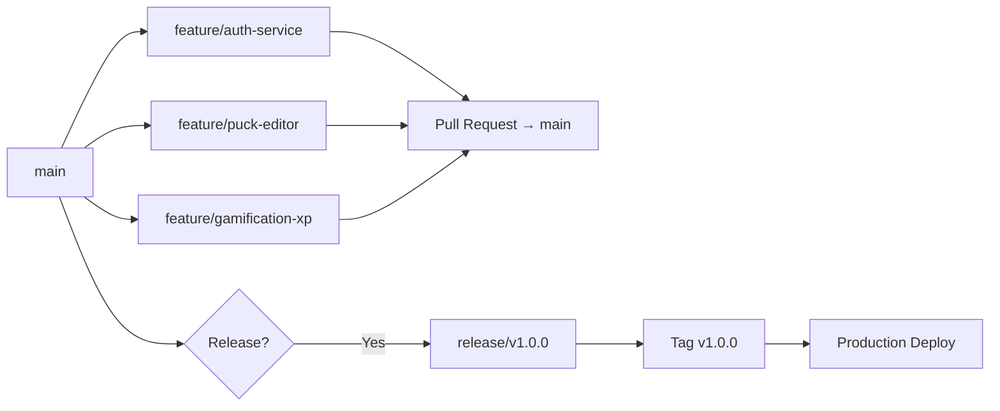

# Development Plan

> [!info] Overview
> This document defines the **Git repository structure**, **submodule strategy**, **branching model**, and **development workflow** for the StudEd platform. The goal is to enable parallel development across the frontend, backend microservices, shared libraries, and AI tooling while maintaining clean version control and deployment pipelines.

## Repository Structure

StudEd uses a **monorepo with Git submodules** approach. The main repository (`studed-platform`) orchestrates the full stack, while specialized components (visualization engines, AI pipelines) live in their own repos and are included as submodules.

```
studed-platform/                    # Main monorepo
├── .gitmodules                     # Submodule definitions
├── docker-compose.yml               # Dev orchestration
├── Makefile                         # Common tasks
├── README.md
├── AGENTS.md
├── docs/                            # Architecture docs, API specs
│
├── frontend/                        # React SPA (Vite + TanStack Router)
│   ├── package.json
│   ├── vite.config.ts
│   ├── src/
│   │   ├── routes/                  # TanStack Router file-based routes
│   │   ├── components/              # shadcn/ui + custom components
│   │   ├── graphql/                 # Queries, mutations, fragments
│   │   ├── hooks/
│   │   ├── stores/                  # Zustand stores
│   │   └── lib/
│   └── Dockerfile
│
├── services/                        # Go microservices
│   ├── api-gateway/                 # GraphQL + REST gateway
│   ├── auth-service/
│   ├── user-service/
│   ├── course-service/
│   ├── content-service/
│   ├── progress-service/
│   ├── gamification-service/
│   ├── payment-service/
│   ├── ai-service/
│   ├── notification-service/
│   └── upload-service/
│
├── shared/                          # Shared libraries
│   ├── go/                          # Shared Go packages (types, utils)
│   ├── proto/                       # Protobuf definitions
│   └── graphql-schema/              # Shared GraphQL schema fragments
│
├── infra/                           # Infrastructure as Code
│   ├── k8s/                         # Kubernetes manifests
│   ├── terraform/                   # Cloud resources (if needed)
│   └── docker/                      # Base Docker images
│
├── ai/                              # AI tooling & prompts
│   ├── prompts/                     # System prompts for Gemini, Qwen, DeepSeek
│   ├── manim-pipeline/              # Math-To-Manim integration scripts
│   └── evals/                       # Model evaluation suites
│
└── submodules/                      # Git submodules
    ├── math-to-manim/               # github.com/HarleyCoops/Math-To-Manim
    ├── 3dmol-js/                    # github.com/3dmol/3Dmol.js
    ├── tscircuit/                   # github.com/tscircuit/tscircuit
    └── matter-js/                   # github.com/liabru/matter-js
```

## Git Submodule Strategy

### Why Submodules?

| Submodule | Reason | Integration |
|-----------|--------|-------------|
| **Math-To-Manim** | Large Python project with its own dependency tree. Updated independently. | AI Service calls its CLI inside Docker. |
| **3Dmol.js** | Mature library with its own release cycle. We pin to stable versions. | Frontend npm dependency + vendored build. |
| **tscircuit** | Rapidly evolving ecosystem. We track specific sub-packages. | Frontend npm dependency + build scripts. |
| **matter-js** | Stable physics engine. Minimal changes needed. | Frontend npm dependency. |

### Submodule Workflow

```bash
# Clone the main repo with all submodules
git clone --recurse-submodules git@github.com:studed/studed-platform.git

# Or clone then init
git clone git@github.com:studed/studed-platform.git
cd studed-platform
git submodule update --init --recursive

# Update all submodules to their latest tracked commit
git submodule update --remote

# Update a specific submodule
cd submodules/math-to-manim
git pull origin main
cd ../..
git add submodules/math-to-manim
git commit -m "Update math-to-manim to v1.2.0"

# Pin a submodule to a specific tag
cd submodules/3dmol-js
git checkout v2.5.5
cd ../..
git add submodules/3dmol-js
git commit -m "Pin 3Dmol.js to v2.5.5"
```

### .gitmodules

```ini
[submodule "submodules/math-to-manim"]
    path = submodules/math-to-manim
    url = https://github.com/HarleyCoops/Math-To-Manim.git
    branch = main

[submodule "submodules/3dmol-js"]
    path = submodules/3dmol-js
    url = https://github.com/3dmol/3Dmol.js.git
    branch = master

[submodule "submodules/tscircuit"]
    path = submodules/tscircuit
    url = https://github.com/tscircuit/tscircuit.git
    branch = main

[submodule "submodules/matter-js"]
    path = submodules/matter-js
    url = https://github.com/liabru/matter-js.git
    branch = master
```

## Branching Model: GitHub Flow + Release Branches

StudEd uses a hybrid of **GitHub Flow** (for daily development) and **release branches** (for production deployments).



### Branch Types

| Branch | Naming | Purpose | Lifespan |
|--------|--------|---------|----------|
| **`main`** | `main` | Always deployable. Protected. Requires PR + review. | Permanent |
| **`feature/***` | `feature/short-desc` | New features, enhancements. | Days to weeks |
| **`bugfix/***` | `bugfix/issue-123` | Bug fixes. | Days |
| **`hotfix/***` | `hotfix/critical-bug` | Production emergencies. Branched from `main`. | Hours |
| **`release/***` | `release/v1.x.x` | Stabilization before production. | Days |
| **`chore/***` | `chore/update-deps` | Maintenance, dependency updates. | Hours to days |
| **`docs/***` | `docs/api-specs` | Documentation-only changes. | Hours |

### Branch Rules

- **No direct commits to `main`**. All changes go through Pull Requests.
- **Feature branches** are branched from the latest `main`.
- **Hotfix branches** are branched from `main`, merged back to `main`, and cherry-picked to active `release/*` branches.
- **Squash merge** is the default merge strategy for clean history.
- **Delete feature branches** after merge.

### Pull Request Requirements

```
✅ CI checks pass (build, test, lint)
✅ At least 1 code review approval
✅ No merge conflicts with main
✅ PR description includes: What, Why, How
✅ Screenshots/GIFs for UI changes
✅ Submodule updates documented in PR
```

## Service-Level Development

### Go Microservices

Each service is an independent Go module:

```
services/auth-service/
├── go.mod                          # module github.com/studed/auth-service
├── go.sum
├── main.go
├── internal/
│   ├── handler/                    # HTTP/gRPC handlers
│   ├── service/                    # Business logic
│   ├── repository/               # DB access
│   └── model/                    # Domain models
├── proto/                          # Service-specific protobuf
├── migrations/                     # sqlc / goose migrations
├── Dockerfile
└── Makefile                        # make build, make test, make run
```

### Frontend

```
frontend/
├── package.json
├── src/
│   ├── routes/                     # TanStack Router routes
│   ├── components/                 # UI components
│   │   ├── ui/                     # shadcn/ui primitives
│   │   ├── puck-blocks/            # Puck custom block components
│   │   ├── learn/                  # Learn phase renderers
│   │   ├── evaluate/               # Evaluate phase renderers
│   │   └── gamification/           # XP, badges, leaderboards
│   ├── graphql/                    # urql operations
│   ├── hooks/
│   ├── stores/                     # Zustand
│   └── lib/
├── public/
├── Dockerfile
└── vite.config.ts
```

## CI/CD Pipeline (GitHub Actions)

### Workflow Files

```
.github/workflows/
├── ci.yml                          # Runs on every PR
├── frontend-build.yml              # Frontend-specific checks
├── go-test.yml                     # Go service tests
├── proto-check.yml                 # Protobuf compatibility
├── docker-build.yml                # Docker image builds
└── deploy-staging.yml              # Deploy to staging
```

### CI Pipeline per PR

```
1. lint (frontend ESLint + biome, Go golangci-lint)
2. type-check (frontend tsc, Go go vet)
3. test (frontend vitest, Go go test ./...)
4. proto-check (breaking change detection)
5. build (frontend vite build, Go go build)
6. docker-build (all services)
```

### Deployment Pipeline

| Environment | Trigger | Target |
|-------------|---------|--------|
| **Development** | Push to `feature/*` | Local Docker Compose |
| **Staging** | Merge to `main` | Fly.io staging / K8s staging namespace |
| **Production** | Tag `v*.*.*` | Fly.io production / K8s prod namespace |

## Development Workflow

### Daily Developer Workflow

```bash
# 1. Start your day
make dev-up                    # Builds and runs PostgreSQL, Redis, Elasticsearch, auth-service, course-service, and api-gateway in Docker Compose

# 2. Pick up a task
gh issue develop 42            # Creates branch feature/auth-jwt from issue #42

# 3. Work on your service
cd services/auth-service
air                            # Go live reload

# 4. Work on frontend
cd frontend
npm run dev                    # Vite dev server on localhost:5173

# 5. Commit frequently
git add .
git commit -m "feat(auth): add JWT refresh token logic"

# 6. Push and open PR
git push -u origin feature/auth-jwt
gh pr create --fill            # Uses commit message as PR title

# 7. After merge, clean up
git checkout main
git pull origin main
git branch -d feature/auth-jwt
```

### Makefile Targets

```makefile
.PHONY: dev-up dev-down dev-logs seed test lint build deploy

# Development
 dev-up:
  docker compose -f docker-compose.yml up --build -d

 dev-down:
  docker compose -f docker-compose.yml down

 dev-logs:
  docker compose logs -f

 seed:
  ./scripts/seed.sh

# Testing
 test:
  $(MAKE) test-go
  $(MAKE) test-frontend

 test-go:
  cd services/api-gateway && go test ./...
  # ... repeat for all services

 test-frontend:
  cd frontend && npm run test

# Linting
 lint:
  cd frontend && npm run lint
  golangci-lint run ./services/...

# Building
 build:
  docker-compose -f docker-compose.yml build

# Deployment
 deploy-staging:
  fly deploy --config fly.staging.toml

 deploy-prod:
  fly deploy --config fly.prod.toml
```

## Submodule Update Schedule

| Submodule | Update Cadence | Owner | Review Process |
|-----------|---------------|-------|---------------|
| **Math-To-Manim** | Weekly | AI Team | Test render pipeline before merge |
| **3Dmol.js** | Monthly | Frontend Team | Verify ChemViz blocks still render |
| **tscircuit** | Bi-weekly | Frontend Team | Check schematic viewer compatibility |
| **matter-js** | Monthly | Frontend Team | Run physics sim smoke tests |

## Release Checklist

Before tagging a release:

- [ ] All `feature/*` branches merged to `main`
- [ ] `main` CI is green
- [ ] Version bumped in `frontend/package.json`
- [ ] Go services version tags updated
- [ ] Changelog updated
- [ ] Submodule versions pinned to tested commits
- [ ] Database migrations tested on staging
- [ ] Smoke tests pass on staging
- [ ] Rollback plan documented

```bash
# Release process
git checkout -b release/v1.2.0
# ... final fixes ...
git tag -a v1.2.0 -m "Release v1.2.0 - Puck editor + DeepSeek AI"
git push origin v1.2.0
# GitHub Actions auto-deploys to production
```

## Related Notes

- [[Tech Stack]] — Technology choices.
- [[Frontend Architecture]] — Frontend structure.
- [[Backend Architecture]] — Go microservices structure.
- [[System Architecture]] — High-level system design.
- [[API Specifications]] — GraphQL + REST endpoint docs.
- [[Puck Research]] — Puck editor programming guide.
- [[Math-To-Manim Integration]] — Math-To-Manim submodule usage.
