# Link Map

> [!info] Purpose
> This note maps the relationships between the most important notes in the StudEd vault, showing how concepts connect across folders.

## Hub Notes (Central Entry Points)

These notes link to many others and serve as starting points:

- [[StudEd Project Overview]] — The root note. Links to all major modules.
- [[Tag Index]] — This note.
- [[Glossary]] — Definitions hub.

## Relationship Diagram

```mermaid
graph TD
    A[StudEd Project Overview] --> B[01-Architecture]
    A --> C[02-Content-Hierarchy]
    A --> D[03-Educator-Portal]
    A --> E[04-Student-Portal]
    A --> F[05-Gamification]
    A --> G[06-UI-UX]
    A --> H[07-Technical-Specs]
    A --> I[08-Research-&-References]

    B --> B1[System Architecture]
    B --> B2[Frontend Architecture]
    B --> B3[Backend Architecture]
    B --> B4[Database Schema]

    C --> C1[Course-Lesson-Wave-Hierarchy]
    C --> C2[Wave Anatomy]
    C --> C3[Learn Component]
    C --> C4[Evaluate Component]

    D --> D1[Educator Dashboard]
    D --> D2[Wave Creation Workflow]
    D --> D3[MDX Editor]
    D --> D4[AI Integration]
    D --> D5[Sinhala Language Support]
    D --> D6[Educator AI Chat]
    D --> D7[AI Content Generation Service]

    E --> E1[Student Dashboard]
    E --> E2[Course Enrollment]
    E --> E3[Wave Interaction]
    E --> E4[Progress Tracking]

    F --> F1[XP-System]
    F --> F2[Leaderboards]
    F --> F3[Reattempt Mechanics]
    F --> F4[Proficiency System]

    G --> G1[Design System]
    G --> G2[User Journeys]
    G --> G3[Component Library]
    G --> G4[Screen Designs]

    H --> H1[Tech Stack]
    H --> H2[API Specifications]
    H --> H3[Authentication & Authorization]
    H --> H4[Payment Integration]

    I --> I1[Puck Research]
    I --> I2[Competitive Analysis]
    I --> I3[Math-To-Manim Integration]
    I --> I4[3Dmol.js Integration]
    I --> I5[tscircuit Integration]
    I --> I6[Matter.js Integration]

    D3 --> C3
    D3 --> C4
    D4 --> D3
    D4 --> D6
    D4 --> D7
    D5 --> C3
    D5 --> C4
    D5 --> D3
    D5 --> E3
    D6 --> D3
    D6 --> D7
    D6 --> I4
    D6 --> I5
    D6 --> I6
    D6 --> I7
    D7 --> D4

    E3 --> C2
    E3 --> C3
    E3 --> C4
    E3 --> F1
    E3 --> F3
    E3 --> F4
    E4 --> F1
    E4 --> F4

    F1 --> F2
    F2 --> E1
    F3 --> F1
    F4 --> F1

    B4 --> C1
    B4 --> E4
    B4 --> F1
    B4 --> H4

    I1 --> C3
    I2 --> C3
    I3 --> C3
    I4 --> C3
    I5 --> C3
    I6 --> C3
```

## Cross-Cutting Links

| From | To | Relationship |
|------|-----|--------------|
| [[MDX Editor]] | [[Learn Component]] | Editor creates Learn blocks |
| [[MDX Editor]] | [[Evaluate Component]] | Editor creates Evaluate blocks |
| [[AI Integration]] | [[MDX Editor]] | AI assists inside the editor |
| [[Sinhala Language Support]] | [[MDX Editor]] | Editor must support Sinhala input |
| [[Wave Interaction]] | [[Wave Anatomy]] | Student plays the anatomy |
| [[Wave Interaction]] | [[Learn Component]] | Student consumes Learn blocks |
| [[Wave Interaction]] | [[Evaluate Component]] | Student answers Evaluate blocks |
| [[XP-System]] | [[Wave Interaction]] | XP awarded on Wave completion |
| [[Reattempt Mechanics]] | [[Wave Interaction]] | Reattempt triggered after play |
| [[Progress Tracking]] | [[XP-System]] | Progress data feeds XP calculation |
| [[Database Schema]] | [[Course-Lesson-Wave-Hierarchy]] | Schema models the hierarchy |
| [[Frontend Architecture]] | [[Component Library]] | Components implement the architecture |
| [[Backend Architecture]] | [[API Specifications]] | APIs expose backend services |
| [[Educator AI Chat Interface]] | [[MDX Editor]] | Chat panel generates blocks in editor |
| [[Educator AI Chat Interface]] | [[AI Content Generation Service]] | Chat sends requests to AI service |
| [[AI Content Generation Service]] | [[Math-To-Manim Integration]] | AI generates Manim animation blocks |
| [[AI Content Generation Service]] | [[3Dmol.js Integration]] | AI generates 3Dmol viewer blocks |
| [[AI Content Generation Service]] | [[tscircuit Integration]] | AI generates tscircuit simulation blocks |
| [[AI Content Generation Service]] | [[Matter.js Integration]] | AI generates Matter.js physics blocks |
| [[Puck Research]] | [[Learn Component]] | Puck custom components render Learn content |
| [[Math-To-Manim Integration]] | [[Learn Component]] | MathViz blocks appear in Learn phase |
| [[3Dmol.js Integration]] | [[Learn Component]] | ChemViz blocks appear in Learn phase |
| [[tscircuit Integration]] | [[Learn Component]] | ElecSim blocks appear in Learn phase |
| [[Matter.js Integration]] | [[Learn Component]] | MechSim blocks appear in Learn phase |

## Orphaned Notes (None Intended)

All notes in this vault are designed to link to at least one other note. If you find an orphaned note, please add relevant wikilinks.

## How to Use This Map

> [!tip] Navigation Tip
> When exploring the vault, use this map to jump between related concepts.
> In Obsidian, hover over any `[[Link]]` to preview the note.
> Use the **Graph View** (Ctrl/Cmd + G) to see a visual network of all links.

## Related Notes

- [[Tag Index]] — Search notes by tag.
- [[Glossary]] — Understand StudEd terminology.
- [[StudEd Project Overview]] — Start here if you're new.
