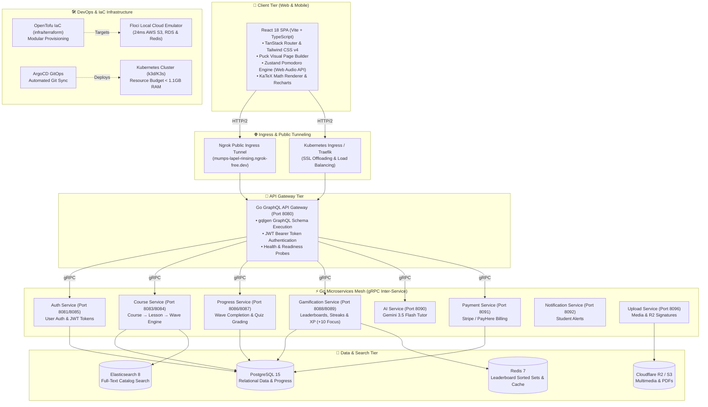

# 🎓 StudEd — Premium Interactive E-Learning & Gamified Platform

> **StudEd** is a next-generation, subscription-based e-learning platform designed for Sri Lankan national curriculum students (Grade 1–11 O/L, G.C.E. A/L Science/Math/Tech) as well as global English-speaking students. 
>
> Built around a strict **Course → Lesson → Wave** curriculum structure, StudEd combines interactive multimedia learning (**Learn Phase**), automated quizzes (**Evaluate Phase**), AI-assisted course creation, and a science-backed **Pomodoro Focus Engine** with real-time XP gamification.

---

## 🌟 Key Features & Innovations

- 📚 **Structured Curriculum Hierarchy**: **Course → Lesson → Wave**. Every Wave features a **Learn Phase** (multimedia & math blocks) and an **Evaluate Phase** (interactive exercises).
- 🐍 **Featured Python 10 Challenges Course**: Interactive programming curriculum designed for hands-on coding practice.
- ⏱️ **Pomodoro Focus Engine**: Includes client-side ADHD Binaural Beats, Brownian Rain, and Ocean Breeze soundscapes via the Web Audio API, rewarding students with **+10 XP per 25-minute focus session**.
- 🎨 **Visual Drag-and-Drop Editor**: Built with **Puck**, allowing educators to design rich multimedia lessons with zero coding.
- ⚡ **Sub-Second Live Demo Ingress**: Single-command public demo pipeline powered by **Ngrok** (`make demo-public`) and optimized Vite production preview bundling.
- ☁️ **Floci Local Cloud Emulation**: Emulates AWS S3, RDS, and ElastiCache in **~24ms cold-start** without cloud bills or credential leaks.
- ☸️ **16GB Laptop-Tuned Kubernetes**: Declarative K8s manifest suite (<1.1GB total memory footprint) with **ArgoCD GitOps** continuous delivery.

---

## 🏗️ Master System Architecture Diagram



---

## 🛠️ Technology Stack Overview

| Category | Technology | Description |
| :--- | :--- | :--- |
| **Frontend** | React 18, Vite 8, TypeScript 5, Bun, TanStack Router | High-performance SPA with file-based routing and sub-millisecond builds. |
| **UI & Styling** | Tailwind CSS v4, shadcn/ui, Base UI, Puck Builder, KaTeX | Modern UI primitives, visual page builder, and math rendering. |
| **Backend Services** | Go 1.22+, `gqlgen` GraphQL, gRPC (Protobuf) | 8 decoupled Go microservices communicating via gRPC. |
| **Database & Cache** | PostgreSQL 15, Redis 7, Elasticsearch 8 | ACID data persistence, sorted set leaderboards, and full-text search. |
| **Cloud & DevOps** | OpenTofu v1.12, Floci v0.1.8, K3s/k3d, ArgoCD | Infrastructure as Code, local AWS cloud emulation, and GitOps delivery. |
| **AI Integration** | Gemini 3.5 Flash, DeepSeek-Coder | AI tutoring, Sinhala translation, and interactive exercise generation. |

---

## 🚀 Quickstart & Operational Commands

### 1. Single-Command Live Public Demo (Ngrok Tunnel)
Expose the full platform on a secure, public HTTPS URL for reviewers and external stakeholders:
```bash
make demo-public
```
> **Live Demo URL**: [`https://mumps-lapel-rinsing.ngrok-free.dev`](https://mumps-lapel-rinsing.ngrok-free.dev)  
> **Demo Student Credentials**: `demo.student@studed.lk` / `password123`  
> **Demo Educator Credentials**: `demo.educator@studed.lk` / `password123`

### 2. Docker Compose Local Backend
Launch PostgreSQL, Redis, Elasticsearch, and all Go microservices locally:
```bash
# Start backend stack
make dev-up

# Seed mock database (Python 10 Challenges + O/L & A/L courses)
make seed

# Start frontend dev server
make frontend-dev
```

### 3. Local Kubernetes Cluster (`k3d` / K3s)
Run the entire StudEd platform inside a lightweight local Kubernetes cluster (<1.1GB RAM budget):
```bash
# Deploy Kubernetes stack
make k8s-up

# Check pod readiness
make k8s-status

# Teardown local cluster
make k8s-down
```

### 4. Infrastructure as Code (OpenTofu + Floci Cloud Emulator)
Validate local AWS infrastructure emulation:
```bash
make iac-init
make iac-plan
make iac-apply
```

---

## 📂 Documentation Sitemap & Sitemap Links

Explore the comprehensive documentation suite for technical details, business goals, and architecture:

- 📊 **Architecture & Systems**:
  - [System Architecture](01-Architecture/System-Architecture.md) — Master system diagram and service topology.
  - [Backend Architecture](01-Architecture/Backend-Architecture.md) — Go microservices, gRPC protocols & layout.
  - [Frontend Architecture](01-Architecture/Frontend-Architecture.md) — React SPA, routing & UI component design.
  - [Database Schema](01-Architecture/Database-Schema.md) — PostgreSQL schema, tables & indexing strategy.
- 🎯 **Project & Business Specs**:
  - [StudEd Project Overview](00-Project-Overview/StudEd-Project-Overview.md) — Mission, hierarchy & value proposition.
  - [Target Audience](00-Project-Overview/Target-Audience.md) — Student personas (G1–11, O/L, A/L).
  - [Monetization Strategy](00-Project-Overview/Monetization-Strategy.md) — Subscription pricing & revenue model.
- 🔧 **Technical Specifications**:
  - [Tech Stack](07-Technical-Specs/Tech-Stack.md) — Complete technology matrix & version breakdown.
  - [API Specifications](07-Technical-Specs/API-Specifications.md) — GraphQL queries, mutations & REST endpoints.
- ⚙️ **Infrastructure & DevOps**:
  - [Kubernetes & GitOps Guide](infra/k8s/README.md) — Cloud-agnostic K8s manifests & ArgoCD setup.
  - [OpenTofu & Floci Guide](infra/terraform/README.md) — OpenTofu IaC & Floci AWS emulator setup.
- 🤖 **Developer Guidelines**:
  - [Agent Workflow & AI Directives](AGENTS.md) — Core coding principles & commit standards.
