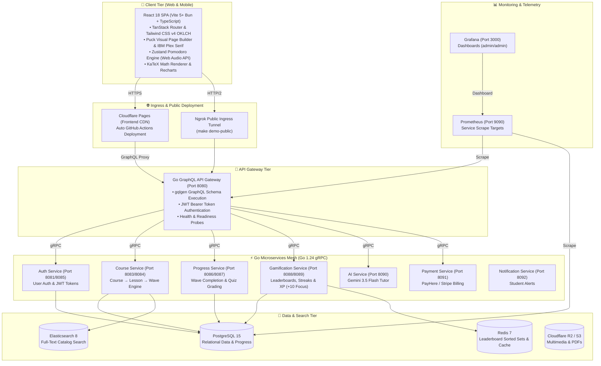

# 🎓 StudEd — Premium Interactive E-Learning & Gamified Platform

> **StudEd** is a next-generation, subscription-based e-learning platform designed for Sri Lankan national curriculum students (Grade 1–11 O/L, G.C.E. A/L Science/Math/Tech) as well as global English-speaking students. 
>
> Built around a strict **Course → Lesson → Wave** curriculum structure, StudEd combines interactive multimedia learning (**Learn Phase**), automated quizzes (**Evaluate Phase**), AI-assisted course creation, and a science-backed **Pomodoro Focus Engine** with real-time XP gamification.

---

## 🌟 Key Features & Innovations

- 🎨 **OKLCH Multi-Hue Learning Design System**: Science-backed color psychology with subject-specific OKLCH palettes:
  - **Core Platform**: Emerald/Forest Green (`oklch(0.484 0.164 145)`)
  - **Mathematics & Science**: Ocean Blue (`oklch(0.579 0.191 252)`)
  - **History & Commerce**: Warm Amber (`oklch(0.67 0.185 55)`)
  - **AI & Advanced Level (A/L)**: Knowledge Violet (`oklch(0.581 0.192 295)`)
  - **Dark Mode**: Soft, luminous high-legibility green (`oklch(0.76 0.15 145)`).
- ✍️ **IBM Plex Serif Typography**: Premium academic typography suite combining IBM Plex Serif, Noto Serif Sinhala, and Inter.
- 🚀 **Automated Cloudflare Pages CI/CD**: Seamless GitHub Actions deployment pipeline (`frontend-deploy.yml`) building and deploying `frontend/dist` on `main` push.
- 📊 **Full Observability Suite**: Provisioned **Prometheus** (Port 9090) and **Grafana** (Port 3000, `admin`/`admin`) with metrics exporters for PostgreSQL and Redis.
- 🐍 **Featured Python 10 Challenges Course**: Interactive programming curriculum designed for hands-on coding practice.
- ⏱️ **Pomodoro Focus Engine**: Client-side ADHD Binaural Beats, Brownian Rain, and Ocean Breeze soundscapes synthesized via the Web Audio API (+10 XP per 25min focus session).
- 🎨 **Visual Drag-and-Drop Editor**: Built with **Puck**, allowing educators to design rich multimedia lessons with zero coding.
- ☁️ **Floci Local Cloud Emulation**: Emulates AWS S3, RDS, and ElastiCache in **~24ms cold-start** without cloud bills or credential leaks.

---

## ☁️ Production Deployment (GCP + Cloudflare + Neon)

The live deployment runs the backend on **GKE** (private nodes, Workload
Identity, Cloud Armor WAF, managed TLS), the frontend on **Cloudflare Pages**
(automated via `.github/workflows/frontend-deploy.yml`), and Postgres on **Neon**.

```bash
make prod-deploy       # one command: infra + backend + frontend + demo seed
make prod-status       # health/cost snapshot
make prod-stop         # standby: node pool -> 0 (stops ~all node charges)
make prod-start        # wake back up
make prod-destroy      # full teardown to $0 (audit with make prod-teardown-audit)
```

Auto scale-down: an hourly Cloud Scheduler → Cloud Run job (`idle-scout`)
scales the cluster to zero after 2h without traffic.

| Doc | Contents |
| :--- | :--- |
| [DEPLOYMENT.md](DEPLOYMENT.md) | One-command lifecycle, prerequisites, teardown |
| [docs/ARCHITECTURE.md](docs/ARCHITECTURE.md) | Full component diagram + security posture |
| [docs/GCP-ARCHITECTURE-SPEC.md](docs/GCP-ARCHITECTURE-SPEC.md) | GCP official symbol mappings & layer specifications |
| [docs/CICD-PIPELINE.md](docs/CICD-PIPELINE.md) | Industrial-grade DevOps CI/CD & GitOps pipeline diagram |
| [docs/COSTS.md](docs/COSTS.md) | Billing risk analysis + cost controls |
| [docs/DECISIONS.md](docs/DECISIONS.md) | Deployment journey, gotchas, git workflow |

---

## 🏗️ Master System Architecture Diagram



```mermaid
graph TB
    subgraph Client_Tier ["📱 Client Tier (Web & Mobile)"]
        ReactApp["React 18 SPA (Vite 5+ Bun + TypeScript)<br/>• TanStack Router & Tailwind CSS v4 OKLCH<br/>• Puck Visual Page Builder & IBM Plex Serif<br/>• Zustand Pomodoro Engine (Web Audio API)<br/>• KaTeX Math Renderer & Recharts"]
    end

    subgraph Ingress_Tier ["🌐 Ingress & Public Deployment"]
        CloudflarePages["Cloudflare Pages (Frontend CDN)<br/>Auto GitHub Actions Deployment"]
        Ngrok["Ngrok Public Ingress Tunnel<br/>(make demo-public)"]
    end

    subgraph Gateway_Tier ["🚪 API Gateway Tier"]
        APIGateway["Go GraphQL API Gateway (Port 8080)<br/>• gqlgen GraphQL Schema Execution<br/>• JWT Bearer Token Authentication<br/>• Health & Readiness Probes"]
    end

    subgraph Service_Tier ["⚡ Go Microservices Mesh (Go 1.24 gRPC)"]
        AuthSvc["Auth Service (Port 8081/8085)<br/>User Auth & JWT Tokens"]
        CourseSvc["Course Service (Port 8083/8084)<br/>Course → Lesson → Wave Engine"]
        ProgressSvc["Progress Service (Port 8086/8087)<br/>Wave Completion & Quiz Grading"]
        GamifySvc["Gamification Service (Port 8088/8089)<br/>Leaderboards, Streaks & XP (+10 Focus)"]
        AISvc["AI Service (Port 8090)<br/>Gemini 3.5 Flash Tutor"]
        PaymentSvc["Payment Service (Port 8091)<br/>PayHere / Stripe Billing"]
        NotifySvc["Notification Service (Port 8092)<br/>Student Alerts"]
    end

    subgraph Observability_Tier ["📊 Monitoring & Telemetry"]
        Prometheus["Prometheus (Port 9090)<br/>Service Scrape Targets"]
        Grafana["Grafana (Port 3000)<br/>Dashboards (admin/admin)"]
    end

    subgraph Data_Tier ["💾 Data & Search Tier"]
        PostgresDB[(PostgreSQL 15<br/>Relational Data & Progress)]
        RedisCache[(Redis 7<br/>Leaderboard Sorted Sets & Cache)]
        ElasticSearch[(Elasticsearch 8<br/>Full-Text Catalog Search)]
        Storage[(Cloudflare R2 / S3<br/>Multimedia & PDFs)]
    end

    ReactApp -->|HTTPS| CloudflarePages
    ReactApp -->|HTTP/2| Ngrok
    Ngrok --> APIGateway
    CloudflarePages -->|GraphQL Proxy| APIGateway

    APIGateway -->|gRPC| AuthSvc
    APIGateway -->|gRPC| CourseSvc
    APIGateway -->|gRPC| ProgressSvc
    APIGateway -->|gRPC| GamifySvc
    APIGateway -->|gRPC| AISvc
    APIGateway -->|gRPC| PaymentSvc

    AuthSvc --> PostgresDB
    CourseSvc --> PostgresDB
    CourseSvc --> ElasticSearch
    ProgressSvc --> PostgresDB
    GamifySvc --> PostgresDB
    GamifySvc --> RedisCache

    Prometheus -->|Scrape| APIGateway
    Prometheus -->|Scrape| PostgresDB
    Grafana -->|Dashboard| Prometheus
```

---

## 🛠️ Technology Stack Overview

| Category | Technology | Version | Description |
| :--- | :--- | :--- | :--- |
| **Frontend** | React 18, Vite 5+, TypeScript 5, Bun, TanStack Router | 1.x | High-performance SPA with file-based routing and sub-second builds. |
| **UI & Styling** | Tailwind CSS v4, shadcn/ui, Base UI, Puck, KaTeX | 4.x | OKLCH multi-hue design tokens, visual page builder, IBM Plex Serif fonts. |
| **Backend Services** | Go, `gqlgen` GraphQL, gRPC (Protobuf), Gin | 1.24+ | Decoupled Go microservices communicating via gRPC. |
| **Database & Cache** | PostgreSQL 15, Redis 7, Elasticsearch 8 | 15 / 7 / 8 | ACID data persistence, sorted set leaderboards, and full-text search. |
| **Observability** | Prometheus, Grafana, Exporters | 3.2 / 11.5 | Golden signals metrics monitoring, dashboards (`admin`/`admin`). |
| **Cloud & CI/CD** | Cloudflare Pages, OpenTofu, Floci, GitHub Actions | latest | Automated CD pipeline, IaC provisioning, local cloud emulation. |
| **AI Integration** | Gemini 3.5 Flash, Qwen 2.5, DeepSeek-Coder | latest | AI tutoring, Sinhala translation, and exercise generation. |

---

## 🚀 Quickstart & Operational Commands

### 1. Single-Command Live Public Demo (Ngrok Tunnel)
Expose the full platform on a secure, public HTTPS URL for reviewers and external stakeholders:
```bash
make demo-public
```
> **Live Demo URL**: [`https://mumps-lapel-rinsing.ngrok-free.dev`](https://mumps-lapel-rinsing.ngrok-free.dev)  
> **Demo Student Credentials**: `demo.student@studed.lk` / `password123`  
> **Demo Educator Credentials**: `demo.educator@studed.lk` / `password123`

### 2. Docker Compose Local Backend
Launch PostgreSQL, Redis, Elasticsearch, and all Go microservices locally:
```bash
# Start backend stack
make dev-up

# Seed mock database (Python 10 Challenges + O/L & A/L courses)
make seed

# Start frontend dev server
make frontend-dev
```

### 3. Local Kubernetes Cluster (`k3d` / K3s)
Run the entire StudEd platform inside a lightweight local Kubernetes cluster (<1.1GB RAM budget):
```bash
# Deploy Kubernetes stack
make k8s-up

# Check pod readiness
make k8s-status

# Teardown local cluster
make k8s-down
```

### 4. Infrastructure as Code (OpenTofu + Floci Cloud Emulator)
Validate local AWS infrastructure emulation:
```bash
make iac-init
make iac-plan
make iac-apply
```

---

## 📂 Documentation Sitemap & Sitemap Links

Explore the comprehensive documentation suite for technical details, business goals, and architecture:

- 📊 **Architecture & Systems**:
  - [System Architecture](01-Architecture/System-Architecture.md) — Master system diagram and service topology.
  - [Backend Architecture](01-Architecture/Backend-Architecture.md) — Go microservices, gRPC protocols & layout.
  - [Frontend Architecture](01-Architecture/Frontend-Architecture.md) — React SPA, routing & UI component design.
  - [Database Schema](01-Architecture/Database-Schema.md) — PostgreSQL schema, tables & indexing strategy.
- 🎯 **Project & Business Specs**:
  - [StudEd Project Overview](00-Project-Overview/StudEd-Project-Overview.md) — Mission, hierarchy & value proposition.
  - [Target Audience](00-Project-Overview/Target-Audience.md) — Student personas (G1–11, O/L, A/L).
  - [Monetization Strategy](00-Project-Overview/Monetization-Strategy.md) — Subscription pricing & revenue model.
- 🔧 **Technical Specifications**:
  - [Tech Stack](07-Technical-Specs/Tech-Stack.md) — Complete technology matrix & version breakdown.
  - [API Specifications](07-Technical-Specs/API-Specifications.md) — GraphQL queries, mutations & REST endpoints.
- ⚙️ **Infrastructure & DevOps**:
  - [Kubernetes & GitOps Guide](infra/k8s/README.md) — Cloud-agnostic K8s manifests & ArgoCD setup.
  - [OpenTofu & Floci Guide](infra/terraform/README.md) — OpenTofu IaC & Floci AWS emulator setup.
- 🤖 **Developer Guidelines**:
  - [Agent Workflow & AI Directives](AGENTS.md) — Core coding principles & commit standards.
