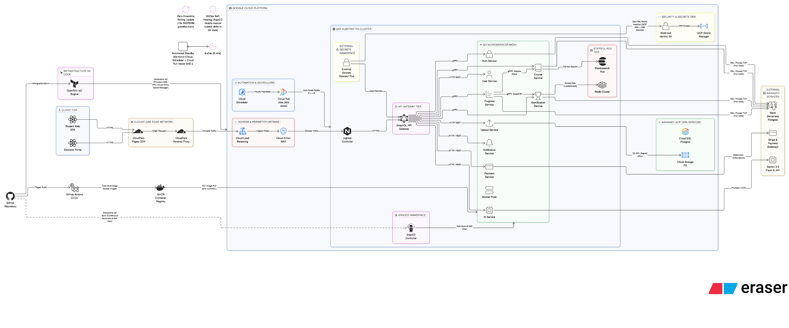
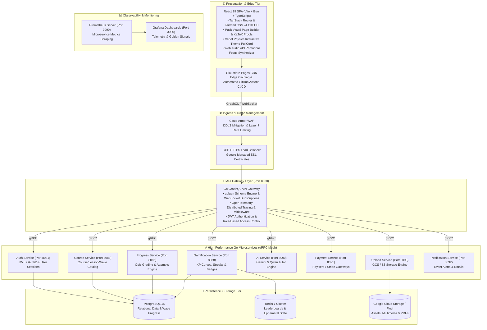

<p align="center">
  <picture>
    
  </picture>
</p>

<h1 align="center">StudEd — Next-Gen Gamified E-Learning Platform</h1>

<p align="center">
  <strong>Production-Grade Interactive Learning Engine &amp; Cloud-Native Microservices Mesh</strong><br>
  <em>Tailored for Sri Lankan National Curriculums (Grade 1–11, O/L, A/L) &amp; Global Students</em>
</p>

<p align="center">
  <a href="https://github.com/studed/studed-doc/actions"></a>
  <a href="https://golang.org"></a>
  <a href="https://react.dev"></a>
  <a href="https://www.typescriptlang.org"></a>
  <a href="https://tailwindcss.com"></a>
  <a href="https://graphql.org"></a>
  <a href="https://grpc.io"></a>
  <a href="https://cloud.google.com/kubernetes-engine"></a>
  <a href="https://opentofu.org"></a>
  <a href="https://pages.cloudflare.com"></a>
</p>

---

## 🌟 Executive Overview

**StudEd** is an enterprise-grade, gamified e-learning platform built to transform primary and secondary education. Designed around an interactive **Course → Lesson → Wave** taxonomy, StudEd breaks rigid curriculum syllabi into bite-sized, interactive learning journeys comprising a dual-phase pedagogy:

1. **Learn Phase**: Immersive rich-media lesson content featuring 3D molecular structures (3Dmol.js), interactive physics simulations, live electronic schematics (tscircuit), and step-by-step LaTeX math proofs (KaTeX).
2. **Evaluate Phase**: Gamified checkpoints, interactive quizzes, multi-variant assessments, and instant grading that gate course progression.

StudEd blends cognitive science with game mechanics: **ADHD-friendly binaural soundscapes (Pomodoro Focus Engine)**, **Verlet physics pullcords**, **animated 3D mascot companions**, **streak multipliers**, **hexagonal XP tiers**, and **live leaderboards**.

---

## 💎 Core Platform Highlights

```
┌────────────────────────────────────────────────────────────────────────────────────────┐
│                                   STUDED ECOSYSTEM                                     │
├─────────────────────────┬──────────────────────────┬───────────────────────────────────┤
│ 🎮 Gamified Learning    │ ⚡ High-Scale Backend     │ ☁️ Cloud & Observability          │
│ • Course → Lesson → Wave│ • 11 Go Microservices    │ • GCP GKE Multi-Zone Cluster      │
│ • Learn & Evaluate Flow │ • GraphQL Gateway (gqlgen│ • Cloud Armor WAF & SSL Policies │
│ • Hexagonal XP & Tiers  │ • gRPC Internal Mesh     │ • Floci Local Cloud Emulation     │
│ • Streak Multipliers    │ • Redis 7 Sorted Sets    │ • OpenTofu Dual-Target IaC        │
│ • Pomodoro Sound Engine │ • Postgres 15 ACID Layer │ • Prometheus & Grafana Telemetry  │
└─────────────────────────┴──────────────────────────┴───────────────────────────────────┘
```

* 🎨 **Theme-Aware OKLCH Design System**: Science-backed color psychology with subject-tailored palettes (Forest Green core, Ocean Blue math/science, Amber history/commerce, Violet AI/A-Levels) rendered with seamless Light/Dark modes.
* 🧩 **Visual Course Builder (Puck)**: Drag-and-drop course composition tool allowing educators to assemble interactive lessons, molecular models, and animated simulations with zero coding.
* 🤖 **AI Co-Tutor & Generator**: Multi-LLM synthesis (Gemini 3.5 Flash, Qwen 2.5, DeepSeek-Coder) for trilingual translations (English, Sinhala, Tamil) and automated question generation.
* ⏱️ **Web Audio Synthesizer**: Client-side ADHD binaural beats, brownian rain, and ocean soundscapes synthesized in real time (+10 XP bonus per 25-minute focus session).
* 🛡️ **Zero-Trust Security**: Workload Identity federation, Google Secret Manager integrated via External Secrets Operator (ESO), Cloud Armor DDoS/WAF protection, and Kyverno policy enforcement.

---

## 🏛️ Master System Architecture

<p align="center">
  
</p>


```mermaid
graph TB
    subgraph Client_Tier ["📱 Presentation & Edge Tier"]
        ReactApp["React 19 SPA (Vite + Bun + TypeScript)<br/>• TanStack Router & Tailwind CSS v4 OKLCH<br/>• Puck Visual Page Builder & KaTeX Proofs<br/>• Verlet Physics Interactive Theme PullCord<br/>• Web Audio API Pomodoro Focus Synthesizer"]
        CFPages["Cloudflare Pages CDN<br/>Edge Caching & Automated GitHub Actions CI/CD"]
        ReactApp --> CFPages
    end

    subgraph Ingress_Tier ["🌐 Ingress & Traffic Management"]
        CloudArmor["Cloud Armor WAF<br/>DDoS Mitigation & Layer 7 Rate Limiting"]
        GCP_LB["GCP HTTPS Load Balancer<br/>Google-Managed SSL Certificates"]
        CFPages -->|GraphQL / WebSocket| CloudArmor
        CloudArmor --> GCP_LB
    end

    subgraph Gateway_Tier ["🚪 API Gateway Layer (Port 8080)"]
        APIGateway["Go GraphQL API Gateway<br/>• gqlgen Schema Engine & WebSocket Subscriptions<br/>• OpenTelemetry Distributed Tracing & Middleware<br/>• JWT Authentication & Role-Based Access Control"]
        GCP_LB --> APIGateway
    end

    subgraph Service_Mesh ["⚡ High-Performance Go Microservices (gRPC Mesh)"]
        AuthSvc["Auth Service (Port 8081)<br/>JWT, OAuth2 & User Sessions"]
        CourseSvc["Course Service (Port 8083)<br/>Course/Lesson/Wave Catalog"]
        ProgressSvc["Progress Service (Port 8086)<br/>Quiz Grading & Attempts Engine"]
        GamifySvc["Gamification Service (Port 8088)<br/>XP Curves, Streaks & Badges"]
        AISvc["AI Service (Port 8090)<br/>Gemini & Qwen Tutor Engine"]
        PaymentSvc["Payment Service (Port 8091)<br/>PayHere / Stripe Gateways"]
        UploadSvc["Upload Service (Port 8093)<br/>GCS / S3 Storage Engine"]
        NotifySvc["Notification Service (Port 8092)<br/>Event Alerts & Emails"]

        APIGateway -->|gRPC| AuthSvc
        APIGateway -->|gRPC| CourseSvc
        APIGateway -->|gRPC| ProgressSvc
        APIGateway -->|gRPC| GamifySvc
        APIGateway -->|gRPC| AISvc
        APIGateway -->|gRPC| PaymentSvc
        APIGateway -->|gRPC| UploadSvc
        APIGateway -->|gRPC| NotifySvc
    end

    subgraph Data_Tier ["💾 Persistence & Storage Tier"]
        PostgresDB[(PostgreSQL 15<br/>Relational Data & Wave Progress)]
        RedisCache[(Redis 7 Cluster<br/>Leaderboards & Ephemeral State)]
        GCS_Bucket[(Google Cloud Storage / Floci<br/>Assets, Multimedia & PDFs)]

        AuthSvc --> PostgresDB
        CourseSvc --> PostgresDB
        ProgressSvc --> PostgresDB
        GamifySvc --> PostgresDB
        GamifySvc --> RedisCache
        UploadSvc --> GCS_Bucket
    end

    subgraph Observability_Tier ["📊 Observability & Monitoring"]
        Prometheus["Prometheus Server (Port 9090)<br/>Microservice Metrics Scraping"]
        Grafana["Grafana Dashboards (Port 3000)<br/>Telemetry & Golden Signals"]
        Prometheus --> Grafana
    end
```

---

## 🛠️ Complete Technology Matrix

| Layer | Technologies & Frameworks | Details |
| :--- | :--- | :--- |
| **Frontend Core** | React 19, TypeScript 5.8, Vite, Bun, TanStack Router | File-based type-safe routing, ultra-fast cold builds, zero-layout-shift UI. |
| **UI & Aesthetics** | Tailwind CSS v4, Base UI, shadcn/ui, Puck, KaTeX | OKLCH color spaces, IBM Plex Serif typography, dynamic Verlet physics. |
| **Backend & Mesh** | Go 1.24+, `gqlgen` GraphQL, gRPC (Protobuf), Gin | Asynchronous microservices communicating over low-latency binary gRPC. |
| **Data & Caching** | PostgreSQL 15, Redis 7 (Sorted Sets), GCS / Cloudflare R2 | ACID relational records, sub-millisecond rank indexing, object storage. |
| **Cloud & DevOps** | GCP GKE Standard, Cloudflare Pages, OpenTofu, Kyverno | Multi-zonal resilience, automated GitOps, IaC-managed infrastructure. |
| **Local Emulation** | Floci (Local Cloud), GCS Emulator, Podman / Docker Bake | 24ms cloud resource emulation without internet dependencies or cloud bills. |
| **Observability** | OpenTelemetry, Prometheus, Grafana | Distributed tracing across gateway & mesh, pre-configured dashboard suites. |
| **Security & Governance** | Workload Identity, ESO, Cloud Armor, Kyverno Policies | Zero-trust secrets syncing, policy enforcement, rate limiting, and WAF. |

---

## 🚀 Getting Started (Local Development)

### Prerequisites
* **Go**: `1.24+`
* **Node & Bun**: `Node 22+` / `Bun 1.2+`
* **Container Runtime**: Docker (Colima recommended on macOS)
* **OpenTofu**: `v1.8+` *(optional for IaC)*

### 1. Launch Complete Stack Locally
Start all databases, storage emulators, and Go microservices in one command:

```bash
# 1. Start all infrastructure & Go microservices in background
make dev-up

# 2. Seed database with full courses (Python 10 Challenges, O/L & A/L curriculums)
make seed

# 3. Launch Frontend Development Server
cd frontend && bun install && bun run dev
```

The frontend will be available at **`http://localhost:5173`** and the GraphQL API at **`http://localhost:8080/query`**.

---

### 2. Demo Credentials

| Role | Email | Password | Scope |
| :--- | :--- | :--- | :--- |
| **Student** | `demo.student@studed.lk` | `password1234` | Interactive Wave Player, Quests, Pomodoro, XP & Leaderboard |
| **Educator** | `demo.educator@studed.lk` | `password1234` | Puck Wave Authoring, Course Publishing & Analytics |

### 3. Single-Command Live Public Demo (Ngrok Tunnel)
Expose the full platform on a secure, public HTTPS URL for reviewers and external stakeholders:
```bash
make demo-public
```
> **Live Demo URL**: [`https://mumps-lapel-rinsing.ngrok-free.dev`](https://mumps-lapel-rinsing.ngrok-free.dev)  
> **Demo Student Credentials**: `demo.student@studed.lk` / `password1234`  
> **Demo Educator Credentials**: `demo.educator@studed.lk` / `password1234`

---

## 🧪 Testing & Validation Suite

StudEd includes an extensive multi-tier regression matrix covering all Go services, shared libraries, TypeScript frontend, and Kubernetes Kyverno admission policies:

```bash
# Run the comprehensive master regression suite
make regression-test
```

Individual suite commands:
* **Frontend Typecheck & Tests**: `cd frontend && bun run typecheck && bunx vitest run`
* **Go Microservices Tests**: `make go-test`
* **Kyverno Policy Tests**: `kyverno test infra/k8s/kyverno/`

---

## ☁️ Production GCP Deployment & Teardown

The production environment provisions a resilient, multi-zonal GKE cluster on Google Cloud Platform with automated scale-to-zero capabilities to eliminate idle billing:

```bash
# Deploy full production infrastructure on GCP
make prod-deploy

# Check cluster health, pods, and ingress status
make prod-status

# Standby Mode: Scale node pool to 0 (pauses VM billing)
make prod-stop

# Wake cluster back up
make prod-start

# Complete teardown to $0 (auto-cleans GKE, disks, VPC, and routes)
make prod-destroy
```

> [!TIP]
> Use `./scripts/gcp/verify-teardown.sh` at any time to verify that active GCP billing resources are at absolute zero.

---

## 📂 Project Structure

```
studed-doc/
├── .github/workflows/          # CI/CD: Cloudflare Pages & Container Bake workflows
├── frontend/                   # React 19 + Vite SPA
│   ├── src/
│   │   ├── components/         # Auth, Gamification, Layout, Puck Blocks, Scenes, UI
│   │   ├── graphql/            # urql queries and mutations
│   │   ├── routes/             # TanStack file-based routes (/login, /register, /courses, etc.)
│   │   ├── stores/             # Zustand stores (Auth, Pomodoro, UI Prefs)
│   │   └── styles/             # Tailwind CSS v4 & OKLCH token definitions
├── proto/                      # Protobuf gRPC service contracts
├── services/                   # Go Microservices
│   ├── ai-service/             # AI Tutoring & generation
│   ├── api-gateway/            # Unified GraphQL gateway (gqlgen)
│   ├── auth-service/           # User authentication & JWT
│   ├── content-service/        # Course materials & media
│   ├── course-service/         # Course/Lesson/Wave catalog
│   ├── gamification-service/   # XP, Leaderboards & Streaks
│   ├── notification-service/   # Alerts & student messaging
│   ├── payment-service/        # PayHere & Stripe integration
│   ├── progress-service/       # Wave completion & scoring
│   ├── upload-service/         # File uploads & storage
│   └── user-service/           # Student & Educator profile management
├── shared/go/                  # Shared Go packages (otel, logger, metrics, retry, auth)
├── infra/
│   ├── gcp/terraform/          # Production GCP OpenTofu / Terraform IaC
│   ├── k8s/                    # Cloud-agnostic Kubernetes manifests & Kyverno policies
│   └── terraform/              # Local OpenTofu IaC (Floci Cloud Emulator)
├── scripts/                    # GCP automation, teardown, and seed helpers
├── docker-compose.yml          # Local microservices & emulator topology
├── Makefile                    # Unified developer task runner
└── README.md
```

---

## 📚 In-Depth Documentation

* 📖 [**GCP Architecture Specification**](docs/GCP-ARCHITECTURE-SPEC.md) — Layered network topology, Cloud Armor WAF & GKE setup.
* 🚀 [**DevOps CI/CD & GitOps Pipeline**](docs/CICD-PIPELINE.md) — Industrial-grade pipeline design, Cloudflare Pages & ArgoCD.
* 💰 [**Cost Analysis & Idle-Scout Automation**](docs/COSTS.md) — Billing mitigation, node pool hibernation & budget caps.
* 📐 [**System Architecture Spec**](01-Architecture/System-Architecture.md) — Full service mesh breakdown and protocols.
* 🎯 [**Pedagogy & Curriculum Overview**](00-Project-Overview/StudEd-Project-Overview.md) — National curriculum breakdown & product vision.

---

<p align="center">
  <sub>Built with ❤️ by the StudEd Engineering Team · Licensed under Apache-2.0</sub>
</p>
