# 🗺️ StudEd User Journeys, Route Directory & Test Plan Specifications

> **Target Audience**: AI Agent Developers, E2E Test Engineers (Playwright), and QA Engineers.
> This document specifies every frontend route in the StudEd platform, detailing user roles, state mutations, backend microservices, GraphQL operations, and step-by-step test execution plans.

---

## 🧭 Route Map Overview

```mermaid
graph TD
    subgraph Guest_Routes ["🔓 Guest Routes"]
        R_Index["/ (Landing Page)"]
        R_Login["/login (Login)"]
        R_Register["/register (Signup)"]
        R_Catalog["/courses (Catalog)"]
        R_Detail["/courses/$courseId (Details)"]
    end

    subgraph Student_Routes ["🧑‍🎓 Student Portal Routes"]
        R_Dash["/dashboard (Student Dashboard)"]
        R_Wave["/waves/$waveId (Learn & Evaluate)"]
        R_Leader["/leaderboard (Leaderboards)"]
        R_Achieve["/achievements (Badges & Streaks)"]
        R_Settings["/settings (Profile & Curriculum)"]
        R_Sub["/subscription (Billing & Checkout)"]
    end

    subgraph Educator_Routes ["👨‍🏫 Educator Portal Routes"]
        R_EduDash["/educator (Educator Dashboard)"]
        R_EduCourses["/educator/courses (Course List)"]
        R_EduNew["/educator/courses/new (Create Course)"]
        R_EduCourseDetail["/educator/courses/$courseId (Course Editor)"]
        R_EduEdit["/educator/courses/$courseId/edit (Meta Edit)"]
        R_EduLesson["/educator/courses/$courseId/lessons/$lessonId"]
        R_EduWaveBuilder["/educator/courses/$courseId/lessons/$lessonId/waves/$waveId"]
        R_EduLeader["/educator/leaderboard"]
        R_EduAchieve["/educator/achievements"]
        R_EduSettings["/educator/settings"]
    end

    R_Index --> R_Login
    R_Index --> R_Register
    R_Login --> R_Dash
    R_Login --> R_EduDash
    R_Dash --> R_Wave
    R_Dash --> R_Sub
    R_EduCourses --> R_EduNew
    R_EduCourses --> R_EduWaveBuilder
```

---

## 📂 1. Student User Journeys & Route Specifications

### Route: `/` (Landing Page)
- **Role**: `GUEST` / `STUDENT` / `EDUCATOR`
- **Component**: [`frontend/src/routes/index.tsx`](file:///Users/warunaudarasampath/Documents/projects/studed/studed-doc/frontend/src/routes/index.tsx)
- **Backend Services**: None (Static SSR / SPA Landing)
- **Key Features**: Hero section, Sri Lankan curriculum selector (Grade 1–11 O/L, G.C.E. A/L, Python 10 Challenges), feature cards, CTA to Register/Login.
- **🧪 Test Plan Specification (`test-001-landing.spec.ts`)**:
  1. Navigate to `/`.
  2. Assert title contains "StudEd".
  3. Verify hero CTA "Start Learning Free" redirects to `/register`.
  4. Verify "Educator Portal" button redirects to `/login`.

---

### Route: `/login` (Authentication)
- **Role**: `GUEST`
- **Component**: [`frontend/src/routes/login.tsx`](file:///Users/warunaudarasampath/Documents/projects/studed/studed-doc/frontend/src/routes/login.tsx)
- **Backend Services**: `auth-service` (gRPC Port 8081)
- **GraphQL Mutation**: `mutation Login($email: String!, $password: String!)`
- **State Mutation**: Issues Access Token & Refresh Token; stores user session in Auth Context.
- **🧪 Test Plan Specification (`test-002-auth-login.spec.ts`)**:
  1. Navigate to `/login`.
  2. Input email `demo.student@studed.lk` and password `password123`.
  3. Click Submit button.
  4. Assert response contains `accessToken` and redirects to `/dashboard`.
  5. Repeat test for invalid credentials and assert error alert message appears.

---

### Route: `/dashboard` (Student Dashboard & Focus Timer)
- **Role**: `STUDENT`
- **Component**: [`frontend/src/routes/dashboard.tsx`](file:///Users/warunaudarasampath/Documents/projects/studed/studed-doc/frontend/src/routes/dashboard.tsx)
- **Backend Services**: `course-service`, `progress-service`, `gamification-service`
- **GraphQL Queries**: `query GetStudentDashboard`, `query GetEnrolledCourses`
- **Key Features**: Enrolled course cards, national exam countdown (G.C.E. O/L / A/L), Pomodoro focus timer with ambient soundscapes (ADHD Binaural, Brownian Rain), XP counter.
- **🧪 Test Plan Specification (`test-003-student-dashboard.spec.ts`)**:
  1. Authenticate as `demo.student@studed.lk`.
  2. Navigate to `/dashboard`.
  3. Verify enrolled course card "Python 10 Challenges" is visible.
  4. Start Pomodoro focus timer widget; verify timer ticks down.
  5. Assert total XP counter renders value from `gamification-service`.

---

### Route: `/courses/$courseId` (Course Detail & Enrollment)
- **Role**: `STUDENT`
- **Component**: [`frontend/src/routes/courses.$courseId.tsx`](file:///Users/warunaudarasampath/Documents/projects/studed/studed-doc/frontend/src/routes/courses.$courseId.tsx)
- **Backend Services**: `course-service`, `progress-service`
- **GraphQL Operations**: `query GetCourse($id: ID!)`, `mutation EnrollCourse($courseId: ID!)`
- **State Mutation**: Inserts enrollment record in `progress-service` DB; unlocks course waves.
- **🧪 Test Plan Specification (`test-004-course-enrollment.spec.ts`)**:
  1. Navigate to `/courses/c1-python-10`.
  2. Assert course title "Python 10 Challenges" is displayed.
  3. Click "Enroll Free" button.
  4. Assert GraphQL `enrollInCourse` mutation succeeds.
  5. Verify button label changes to "Continue Learning".

---

### Route: `/waves/$waveId` (Interactive Wave Learning Workspace)
- **Role**: `STUDENT`
- **Component**: [`frontend/src/routes/waves.$waveId.tsx`](file:///Users/warunaudarasampath/Documents/projects/studed/studed-doc/frontend/src/routes/waves.$waveId.tsx)
- **Backend Services**: `course-service`, `progress-service`, `gamification-service`
- **GraphQL Operations**: `query GetWave($id: ID!)`, `mutation SubmitWaveEvaluation($waveId: ID!, $answers: [AnswerInput!]!)`
- **Key Features**:
  - **Learn Phase**: Puck multimedia blocks, KaTeX math formulas, code snippets.
  - **Evaluate Phase**: Quiz exercises, accuracy calculation, XP reward grant.
- **🧪 Test Plan Specification (`test-005-wave-completion.spec.ts`)**:
  1. Navigate to `/waves/w1-python-variables`.
  2. Assert Learn Phase content renders without errors.
  3. Click "Proceed to Quiz" tab (Evaluate Phase).
  4. Select correct answer option for question 1.
  5. Click "Submit Wave".
  6. Assert score animation displays 100% accuracy and +50 XP bonus alert.

---

### Route: `/leaderboard` (Global & School Rankings)
- **Role**: `STUDENT` / `EDUCATOR`
- **Component**: [`frontend/src/routes/leaderboard.tsx`](file:///Users/warunaudarasampath/Documents/projects/studed/studed-doc/frontend/src/routes/leaderboard.tsx)
- **Backend Services**: `gamification-service` (Redis sorted set `leaderboard:global`)
- **GraphQL Query**: `query GetLeaderboard($period: String!)`
- **🧪 Test Plan Specification (`test-006-leaderboard.spec.ts`)**:
  1. Navigate to `/leaderboard`.
  2. Assert top 3 student avatars (Gold, Silver, Bronze) are displayed.
  3. Switch filter tab from "Global" to "Weekly".
  4. Verify table updates with weekly student XP rankings.

---

## 👨‍🏫 2. Educator Portal Journeys & Route Specifications

### Route: `/educator` (Educator Portal Overview)
- **Role**: `EDUCATOR`
- **Component**: [`frontend/src/routes/educator/_layout/index.tsx`](file:///Users/warunaudarasampath/Documents/projects/studed/studed-doc/frontend/src/routes/educator/_layout/index.tsx)
- **Backend Services**: `course-service`, `auth-service`
- **GraphQL Query**: `query GetEducatorDashboard`
- **Key Features**: Created course metrics, active student counts, course completion rate graphs.
- **🧪 Test Plan Specification (`test-007-educator-dashboard.spec.ts`)**:
  1. Authenticate as `demo.educator@studed.lk`.
  2. Navigate to `/educator`.
  3. Assert educator navigation sidebar renders with options: Courses, Leaderboard, Achievements, Settings.
  4. Assert course summary metrics load cleanly.

---

### Route: `/educator/courses/new` (Course Creation Wizard)
- **Role**: `EDUCATOR`
- **Component**: [`frontend/src/routes/educator/_layout/courses.new.tsx`](file:///Users/warunaudarasampath/Documents/projects/studed/studed-doc/frontend/src/routes/educator/_layout/courses.new.tsx)
- **Backend Services**: `course-service`, `ai-service`
- **GraphQL Mutation**: `mutation CreateCourse($input: CourseInput!)`
- **Key Features**: Title input, description, grade level dropdown (Grade 1–11 / A/L), Sinhala translation assistant powered by Gemini 3.5 Flash.
- **🧪 Test Plan Specification (`test-008-educator-create-course.spec.ts`)**:
  1. Navigate to `/educator/courses/new`.
  2. Enter course title "A/L Physics - Quantum Mechanics".
  3. Select Grade Level "A/L Physics".
  4. Click "Generate Sinhala Translation (AI)".
  5. Assert Sinhala translation populates title field.
  6. Click "Create Course" and assert redirect to course editor `/educator/courses/$courseId`.

---

### Route: `/educator/courses/$courseId/lessons/$lessonId/waves/$waveId` (Puck Visual Wave Builder)
- **Role**: `EDUCATOR`
- **Component**: [`frontend/src/routes/educator/_layout/courses.$courseId.lessons.$lessonId.waves.$waveId.tsx`](file:///Users/warunaudarasampath/Documents/projects/studed/studed-doc/frontend/src/routes/educator/_layout/courses.$courseId.lessons.$lessonId.waves.$waveId.tsx)
- **Backend Services**: `course-service`
- **GraphQL Mutation**: `mutation SaveWaveData($waveId: ID!, $puckData: JSON!)`
- **Key Features**: Puck visual canvas drag-and-drop components (Text, Callout, Quiz, Code Sandbox, KaTeX Formula).
- **🧪 Test Plan Specification (`test-009-educator-puck-builder.spec.ts`)**:
  1. Navigate to `/educator/courses/c1/lessons/l1/waves/w1`.
  2. Assert Puck drag-and-drop canvas initializes.
  3. Drag a "Heading" block and a "Quiz" block onto the canvas.
  4. Enter question text "What is the output of print(2**3)?".
  5. Click "Save Wave".
  6. Assert save confirmation toast appears.

---

## 🤖 3. Instructions for Concurrent AI Test Generator Subagents

When generating automated test cases (Playwright E2E or Vitest unit tests):
1. **Target Directory**: Place Playwright E2E scripts in `frontend/e2e/specs/`.
2. **Selector Convention**: Use `data-testid` attributes or semantic labels (e.g. `page.getByRole('button', { name: 'Submit' })`).
3. **Mock Data**: Use seeded mock accounts (`demo.student@studed.lk` / `password123`) or mock network handlers via Playwright `page.route()`.
