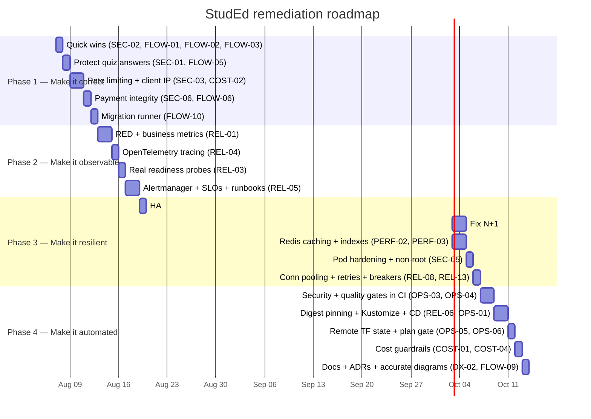

# 00 — Executive Summary

**Audit date:** 2026-08-06 · **Commit:** `8ab6b94` · **Total findings:** 77
(7 Critical, 19 High, 40 Medium, 11 Low)

---

## Verdict

**StudEd is a well-architected system that is not yet production-ready, and — more
urgently — is not currently demonstrable end to end.**

The service decomposition, contract design, ownership enforcement, network
segmentation, and infrastructure-as-code are genuinely good. This is not a
project that needs re-architecting. It is a project where **a striking number of
components exist but are not wired to actually do their job.**

That pattern is the central finding:

| Component | Present | Actually works |
| :--- | :---: | :---: |
| Prometheus + Grafana + alerts | ✅ | ❌ no service emits any metric |
| Cloud Armor WAF + rate limiting | ✅ | ❌ bypassed for 100% of API traffic |
| ArgoCD GitOps delivery | ✅ | ❌ pinned to `:latest`, never detects drift |
| Default-deny NetworkPolicies | ✅ | ❌ block a call path the product needs |
| 11 Playwright e2e specs | ✅ | ❌ never executed by CI |
| Go test suite | ✅ | ❌ CI ignores failures |
| SQL migrations | ✅ | ❌ nothing runs them |
| Subscription / payments | ✅ | ❌ grants no entitlement, no price check |

Closing these gaps requires **almost no new architecture** — mostly finishing
what is already started, and deleting what is not real. The good news is that
the fixes are concentrated: roughly 60% of the Critical and High findings are
resolved by about ten focused changes.

---

## Domain scorecard

| Domain | Grade | Assessment |
| :--- | :---: | :--- |
| Service architecture & boundaries | **A−** | Clean decomposition, generated contracts, ownership enforced server-side |
| Authorization model | **B** | Consistent role checks, real ownership enforcement — undermined by SEC-01 |
| Network security | **B−** | Genuine default-deny (rare and commendable) — but the policy graph is wrong |
| Infrastructure as code | **B−** | Good GKE hardening; local state, no plan gate |
| CI pipeline structure | **B−** | Well-organised and parallel — but no security or quality gates |
| Authentication | **C+** | Correct cookie handling, bcrypt, no role escalation — no revocation or rate limiting |
| Cost discipline | **C+** | Excellent idle/teardown controls — no guardrail against abuse-driven spend |
| Testing | **D+** | Good assets written; the gate is broken and most of them never run |
| Data protection / privacy | **D** | Serving minors with no consent, retention, or data-rights model |
| Performance | **D** | Severe compounded N+1; Redis deployed but nothing cached |
| Release engineering | **D** | No CD, mutable tags, wrong registry namespace |
| **Observability / SRE** | **F** | **Complete monitoring stack that produces no data** |

---

## The ten findings that matter most

| # | ID | Severity | Finding | Fix effort |
| :-- | :--- | :--- | :--- | :--- |
| 1 | [SEC-01](01-SECURITY.md#-sec-01--quiz-answers-are-readable-by-any-enrolled-student) | 🔴 | Any student can query `correctAnswer` for every quiz via GraphQL | 3 h |
| 2 | [REL-01](02-RELIABILITY-SRE.md#-rel-01--zero-application-metrics-the-entire-monitoring-stack-is-non-functional) | 🔴 | Zero application metrics; every dashboard and alert is inert | 1 d |
| 3 | [SEC-02](01-SECURITY.md#-sec-02--cloud-armor-allows-graphql-past-every-waf-rule-and-the-rate-limit) | 🔴 | Cloud Armor `allow` at priority 999 bypasses the entire WAF and rate limit | 1 h |
| 4 | [FLOW-01](04-CORRECTNESS-FLOWS.md#-flow-01--networkpolicies-break-wave-submission-in-the-cluster) | 🔴 | NetworkPolicies deny progress→course/gamification; quiz submission fails in k8s | 1 h |
| 5 | [SEC-03](01-SECURITY.md#-sec-03--no-rate-limiting-anywhere-in-the-application) | 🔴 | No rate limiting anywhere — credential stuffing, DoS, LLM cost abuse | 1 d |
| 6 | [FLOW-02](04-CORRECTNESS-FLOWS.md#-flow-02--ci-silently-ignores-go-test-failures) | 🟠 | `make go-test` returns 0 when tests fail — CI's green check is meaningless | 15 min |
| 7 | [PERF-01](03-PERFORMANCE-SCALABILITY.md#-perf-01--compounded-n1-one-course-page--600-sequential-grpc-calls) | 🔴 | Compounded N+1: a 50-wave course page ≈ 700 sequential gRPC calls | 2 d |
| 8 | [REL-02](02-RELIABILITY-SRE.md#-rel-02--every-service-is-a-single-replica-with-no-ha-controls) | 🔴 | Every service is `replicas: 1` — every deploy and node event is an outage | 4 h |
| 9 | [FLOW-03](04-CORRECTNESS-FLOWS.md#-flow-03--the-demo-seed-cannot-create-an-educator) | 🟠 | The demo seed cannot create an educator — half the product is undemonstrable | 1 h |
| 10 | [SEC-06](01-SECURITY.md#-sec-06--payhere-webhook-never-verifies-the-amount-replay-reactivates-cancelled-subscriptions) | 🟠 | Payment webhook never checks the amount; replay revives cancelled subscriptions | 4 h |

**Findings 3, 4, 6, and 9 total about three hours and remove one Critical, one
Critical, and two demo blockers.** Start there.

---

## Findings by domain

```mermaid
flowchart LR
    subgraph C["🔴 Critical — 7"]
        C1["SEC-01 quiz answers exposed"]
        C2["SEC-02 WAF bypassed"]
        C3["SEC-03 no rate limiting"]
        C4["REL-01 no metrics"]
        C5["REL-02 no HA"]
        C6["PERF-01 N+1 explosion"]
        C7["FLOW-01 netpol breaks submission"]
    end
    subgraph H["🟠 High — 19"]
        H1["Security ×5"]
        H2["Reliability ×5"]
        H3["Correctness ×4"]
        H4["DevOps ×4"]
        H5["Cost / UX ×1 each"]
    end
    subgraph M["🟡 Medium — 40"]
        M1["hardening · resilience · quality"]
    end
    subgraph L["🔵 Low — 11"]
        L1["hygiene · defence in depth"]
    end
    C --> H --> M --> L
```

---

## Remediation roadmap

Four phases. Each ends in a state worth demonstrating.

| Phase | Duration | Exit criterion |
| :--- | :--- | :--- |
| **1 — Correct** | ~1 week | Every user journey works in Docker Compose *and* in Kubernetes; `verify-demo.sh` passes from a clean state; CI actually fails on a failing test |
| **2 — Observable** | ~1 week | Grafana shows live RED metrics during a demo; a trace waterfall explains any request; alerts route to a real destination |
| **3 — Resilient** | ~1 week | Rolling deploy with zero dropped requests; course page under 500ms p95; non-root pods; load test meets the SLO |
| **4 — Automated** | ~1 week | Merge → scanned, signed, digest-pinned image → staging → approval → production, with auto-rollback on SLO burn |

---

## What to fix before the next demo

If time is short, this is the minimum for a credible presentation:

- [ ] **FLOW-02** — fix `make go-test` exit status *(15 min — do this first; it changes what every other test result means)*
- [ ] **SEC-02** — reorder the Cloud Armor rules *(1 h)*
- [ ] **FLOW-01** — add the two missing NetworkPolicy edges *(1 h)*
- [ ] **FLOW-03** — add `provision-educator.sh` to the seed *(1 h)*
- [ ] **SEC-01** — split the `EvaluateBlock` type *(3 h)*
- [ ] **REL-01** — `/metrics` on every service; fix the scrape config *(1 d)*
- [ ] **FLOW-09** — delete the three stub services; correct the README diagram *(1 h)*
- [ ] **`scripts/verify-demo.sh`** — automate the whole demo path with assertions *(3 h)*

Roughly **two days of work**, and it converts the two most likely
demo failures (blank dashboards, unreachable educator flow) into the two most
impressive moments.

---

## Where this project already stands out

Stated plainly, because these are real and should be foregrounded in any
presentation:

- **Server-authoritative grading.** The client never computes a score. This is
  the correct design and is frequently got wrong.
- **Resource ownership enforced in the domain service** — eight separate
  `course.EducatorID != req.EducatorId` checks. No IDOR in the authoring path.
- **Default-deny NetworkPolicies.** Very few projects at any scale attempt pod
  network segmentation. The concept is right; it needs two missing edges.
- **GKE hardening baseline**: private nodes, Workload Identity, Shielded VMs,
  Calico, STABLE release channel, auto-repair/upgrade.
- **Genuine cost engineering**: `idle-scout` auto scale-to-zero, one-command
  standby/teardown, and a teardown *verification* script. This is more FinOps
  discipline than most production systems have.
- **A partial-unique-index guard against duplicate XP** — a thoughtful,
  database-level integrity control.
- **Clean gRPC/protobuf contracts** with generated code and a shared module.
- **No SQL injection** anywhere; parameterised queries throughout.
- **Constant-time comparison** in the shared service-token middleware, with
  fail-closed defaults.
- **Well-structured CI** — parallel jobs, path filtering, build caching, matrix
  builds. The scaffolding for a great pipeline is already in place.

---

## Closing assessment

The distance between this project and a genuinely production-ready one is
**about four weeks of focused work, and it is almost entirely finishing work
rather than new construction.** Three of the four phases above consist of
wiring up components that were already chosen correctly.

The most valuable change is not technical. It is to **make every claim in the
documentation true** — remove the three stub services from the architecture
diagram, make the monitoring produce data, make GitOps actually deliver, make
the WAF actually filter. A system of eight services that provably works, with
live dashboards and a passing automated demo, is a far stronger showcase of
technical and architectural excellence than eleven services on a diagram.

Fix the fiction first. The engineering underneath it is good.
