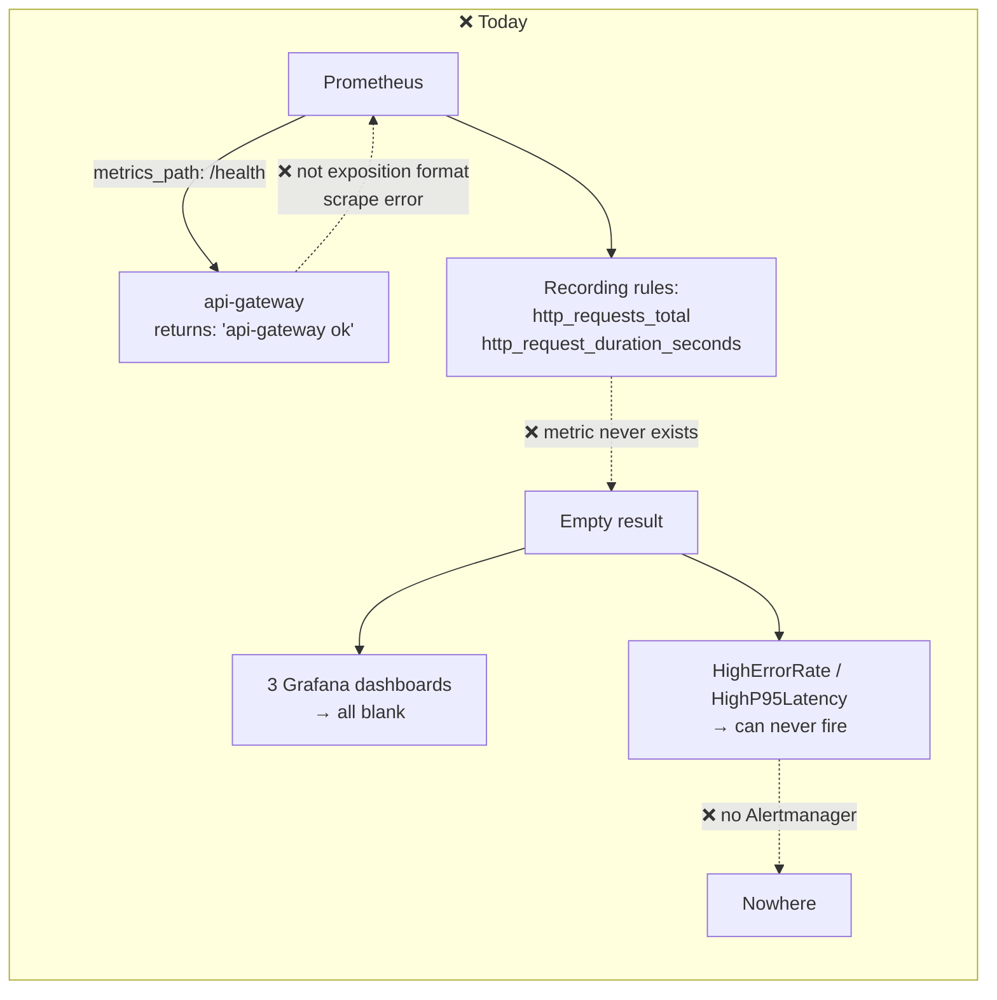
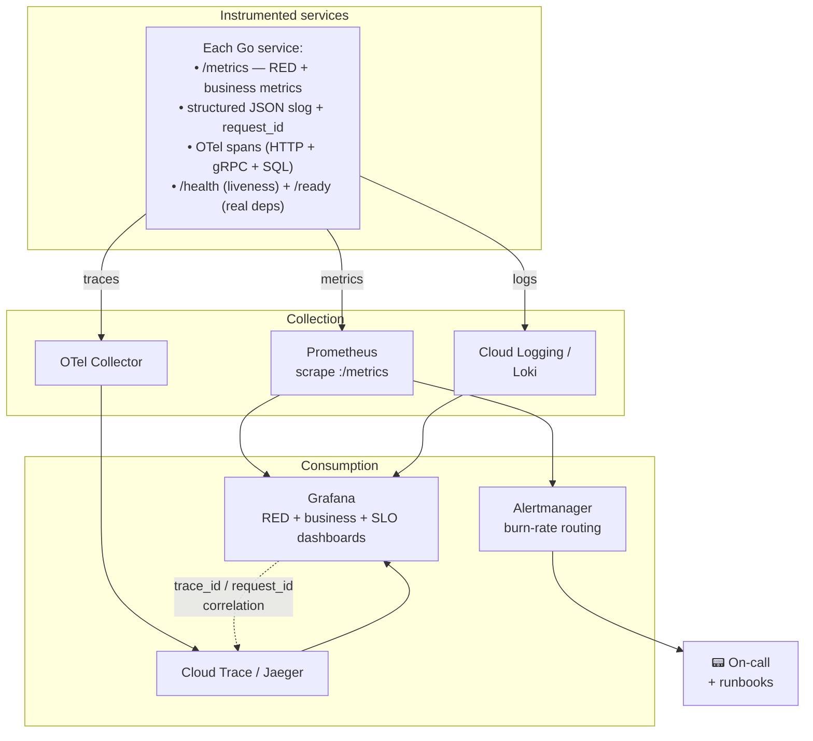

# 02 — Reliability, Observability & SRE

**15 findings · 2 Critical · 5 High · 7 Medium · 1 Low**

---

## The headline

The project ships Prometheus, Grafana, three dashboards, recording rules, and
alert rules. **None of it works.** Not one service in this repository exposes a
single application metric, and every rule and dashboard queries metrics that
are never produced. The observability layer is a facade.

This is the single most important finding in the audit for the stated goal of
demonstrating DevOps/SRE excellence — because it is the one a knowledgeable
reviewer will check first, and it fails immediately.



---

## 🔴 REL-01 — Zero application metrics; the entire monitoring stack is non-functional

**Severity: Critical**

**Evidence, in four parts:**

**(1) No service imports a metrics library.**
```
$ grep -rn "prometheus\|promhttp\|otel\|/metrics" services/ shared/ --include="*.go"
services/course-service/go.mod:27:  go.opentelemetry.io/otel v1.44.0 // indirect
   → the sole hit is a transitive dependency. No instrumentation anywhere.
```

**(2) Prometheus scrapes the health endpoint as if it were a metrics endpoint.**
`infra/monitoring/prometheus/prometheus.yml` — all 8 application jobs:
```yaml
- job_name: "studed-api-gateway"
  metrics_path: "/health"          # ← returns plain text "api-gateway ok"
  static_configs: [{ targets: ["api-gateway:8080"] }]
```
`api-gateway/main.go:110-113` returns `[]byte("api-gateway ok")` with
`Content-Type: text/plain`. Prometheus cannot parse this — every scrape fails,
and every target reports a parse error rather than useful data.

**(3) Recording rules reference metrics that do not exist.**
`infra/monitoring/prometheus/rules/studed.rules.yml:6-19` builds everything on
`http_requests_total` and `http_request_duration_seconds_bucket`. Neither is
ever emitted by any service.

**(4) Therefore the alerts cannot fire.** `HighErrorRate` and `HighP95Latency`
evaluate `job:http_requests_error_rate:percentage > 5` against an empty vector
— which is never true. The only alerts that *can* fire are `StudEdServiceDown`
(from `up`, which Prometheus synthesises itself) and the
Postgres/Redis exporter alerts, because those exporters are real.

**Impact.** There is no way to answer *"is the site working?"*, *"how fast is
it?"*, *"what broke?"*, or *"is the error budget spent?"*. Three Grafana
dashboards render empty panels. MTTD is effectively infinite for anything short
of a total process crash.

**Fix — this is roughly 60 lines of shared code and pays for the whole audit.**

Create `shared/go/metrics/metrics.go`:

```go
package metrics

import (
    "net/http"
    "strconv"
    "time"

    "github.com/prometheus/client_golang/prometheus"
    "github.com/prometheus/client_golang/prometheus/promauto"
    "github.com/prometheus/client_golang/prometheus/promhttp"
)

var (
    RequestsTotal = promauto.NewCounterVec(prometheus.CounterOpts{
        Name: "http_requests_total",
        Help: "Total HTTP requests by service, route, method and status.",
    }, []string{"service", "route", "method", "status"})

    RequestDuration = promauto.NewHistogramVec(prometheus.HistogramOpts{
        Name:    "http_request_duration_seconds",
        Help:    "HTTP request latency.",
        Buckets: prometheus.DefBuckets,
    }, []string{"service", "route", "method"})

    GRPCDuration = promauto.NewHistogramVec(prometheus.HistogramOpts{
        Name:    "grpc_client_duration_seconds",
        Help:    "Outbound gRPC call latency.",
        Buckets: prometheus.DefBuckets,
    }, []string{"service", "target", "method", "code"})
)

// Middleware records RED metrics for every HTTP request.
func Middleware(service string) func(http.Handler) http.Handler { /* ... */ }

// Handler exposes /metrics.
func Handler() http.Handler { return promhttp.Handler() }
```

Then in every service:
```go
r.Use(metrics.Middleware("api-gateway"))
r.Handle("/metrics", metrics.Handler())
```

And fix the scrape config — remove every `metrics_path: "/health"` line so the
default `/metrics` applies. Add business metrics that make the dashboards
genuinely interesting: `studed_wave_submissions_total{passed}`,
`studed_xp_awarded_total`, `studed_ai_tokens_total{operation}`,
`studed_active_enrollments`.

Finally, add `make promtool-check` to CI (the target already exists in the
Makefile but CI never runs it) and add a smoke test asserting `/metrics`
returns `text/plain; version=0.0.4`.

---

## 🔴 REL-02 — Every service is a single replica with no HA controls

**Severity: Critical · Availability**

```
$ grep -rn "replicas:" infra/k8s/production/
   → all 10 workloads: replicas: 1
$ grep -rln "HorizontalPodAutoscaler\|PodDisruptionBudget" infra/
   → (none)
```

No HPA, no PDB, no `topologySpreadConstraints`, no anti-affinity. The GKE
cluster is **zonal** (`gke.tf` uses `var.zone`, not a region), so there is not
even zone redundancy.

**Impact.** Every one of these is a full outage:
- a rolling deployment (no surge capacity with 1 replica),
- a node auto-upgrade (enabled — `gke.tf:96`),
- a node auto-repair,
- a single OOMKill (likely, given the 128Mi limit — PERF-04),
- a preemption or zone incident.

There is no autoscaling, so a traffic spike degrades into timeouts rather than
scaling out. Availability under any realistic definition is well below 99%.

**Fix.** This is inexpensive and is the difference between "a demo" and "a
production architecture":

```yaml
spec:
  replicas: 2
  strategy:
    rollingUpdate: { maxSurge: 1, maxUnavailable: 0 }
  template:
    spec:
      topologySpreadConstraints:
        - maxSkew: 1
          topologyKey: kubernetes.io/hostname
          whenUnsatisfiable: ScheduleAnyway
          labelSelector: { matchLabels: { app: api-gateway } }
---
apiVersion: policy/v1
kind: PodDisruptionBudget
metadata: { name: api-gateway, namespace: studed }
spec:
  minAvailable: 1
  selector: { matchLabels: { app: api-gateway } }
---
apiVersion: autoscaling/v2
kind: HorizontalPodAutoscaler
metadata: { name: api-gateway, namespace: studed }
spec:
  scaleTargetRef: { apiVersion: apps/v1, kind: Deployment, name: api-gateway }
  minReplicas: 2
  maxReplicas: 6
  metrics:
    - type: Resource
      resource: { name: cpu, target: { type: Utilization, averageUtilization: 70 } }
```

Cost impact is modest — these are 25m-CPU/40Mi-request pods. If budget is the
constraint, apply `replicas: 2` + PDB to `api-gateway`, `auth-service`, and
`course-service` (the request path) and leave the rest at 1 with an explicit,
documented decision. **A documented trade-off is architecture; an undocumented
default is an accident.**

Also make the cluster regional, or explicitly document zonal as a cost
decision with its availability implication stated.

---

## 🟠 REL-03 — Readiness probes always return healthy

**Severity: High**

`services/api-gateway/main.go:114-117`:
```go
r.Handle("/ready", http.HandlerFunc(func(w http.ResponseWriter, r *http.Request) {
    w.WriteHeader(http.StatusOK)
    _, _ = w.Write([]byte("ready"))
}))
```

The same pattern exists in every service. The endpoint returns 200 whether or
not the database is reachable, whether or not Redis is up, and whether or not
the four gRPC upstreams are connected.

**Impact.** Kubernetes will route traffic to a pod that cannot serve it. A pod
that has lost its database connection stays in the Service endpoints
indefinitely, and the GCE load balancer's health check
(`backend-config.yaml:12-19`, which points at `/health`) keeps it in the
backend pool. Rollouts complete "successfully" while serving errors.

**Fix.** Make readiness mean something, and keep liveness cheap:

```go
// /health — liveness: is the process alive? Must never depend on upstreams,
// or a database blip will trigger a pod restart storm.
r.Get("/health", func(w http.ResponseWriter, _ *http.Request) {
    w.WriteHeader(200); w.Write([]byte("ok"))
})

// /ready — readiness: can this pod serve a request right now?
r.Get("/ready", func(w http.ResponseWriter, req *http.Request) {
    ctx, cancel := context.WithTimeout(req.Context(), 2*time.Second)
    defer cancel()
    if err := checks.All(ctx, db, redis, authConn, courseConn); err != nil {
        w.WriteHeader(503)
        json.NewEncoder(w).Encode(map[string]string{"status": "unready", "error": err.Error()})
        return
    }
    w.WriteHeader(200); w.Write([]byte("ready"))
})
```

For gRPC connections use `conn.GetState()` rather than issuing a call, so
readiness stays cheap. Add a `startupProbe` (REL-14) so slow starts are not
mistaken for liveness failures.

---

## 🟠 REL-04 — No distributed tracing

**Severity: High**

Eight services, gRPC between them, and no OpenTelemetry instrumentation
(the sole `otel` reference in the repo is an indirect dependency of
course-service). There is no trace ID, no span, no correlation ID, and
`middleware.RequestID` is not even installed on the chi router.

**Impact.** A single `submitWaveAnswers` mutation fans out across gateway →
progress → course (×N) → gamification → Postgres. When it is slow — and per
PERF-01 it will be — there is no mechanism to determine *which hop*. Debugging
is reduced to reading unstructured logs across eight pods and correlating by
wall-clock time.

**Fix.** OTel is a small, well-supported addition and it is exactly the kind of
thing that demonstrates platform maturity:

```go
// shared/go/tracing/tracing.go
tp, _ := tracing.Init(ctx, "api-gateway", cfg.OTLPEndpoint)
defer tp.Shutdown(ctx)

// HTTP server
r.Use(otelhttp.NewMiddleware("api-gateway"))
// gRPC clients + servers
grpc.WithStatsHandler(otelgrpc.NewClientHandler())
grpc.StatsHandler(otelgrpc.NewServerHandler())
// GraphQL
srv.Use(otelgqlgen.Middleware())
```

Export to Google Cloud Trace in production (no extra infrastructure — the API
is already enabled) and to a local Jaeger container in `docker-compose.yml` for
development. Add `trace_id` to every structured log line so logs and traces
join. Budget: ~half a day, and it makes PERF-01 immediately visible and
provable.

---

## 🟠 REL-05 — No Alertmanager, no SLOs, no on-call

**Severity: High**

`docker-compose.yml` runs Prometheus and Grafana but **no Alertmanager**, and
`prometheus.yml` has no `alerting:` block. Alerts — even the ones that could
fire (`StudEdServiceDown`, `PostgresDatabaseDown`) — evaluate to
`firing` inside Prometheus and are delivered nowhere.

There are also no SLO definitions, no SLIs, no error budgets, no burn-rate
alerts, no runbooks, and no severity/escalation policy. `severity: critical`
labels exist on the rules but nothing consumes them.

**Fix.**

1. Add Alertmanager to the compose stack and the cluster, with routing:
   ```yaml
   alerting:
     alertmanagers: [{ static_configs: [{ targets: ["alertmanager:9093"] }] }]
   ```
   Route `severity=critical` to a real channel (email/Discord/Slack webhook),
   `warning` to a digest.

2. Define SLOs in `docs/SLO.md` and encode them as burn-rate alerts. Suggested
   starting targets for this system:

   | SLI | Definition | SLO |
   | :--- | :--- | :--- |
   | Availability | non-5xx `/graphql` responses | 99.5% / 30d |
   | Latency | p95 `/graphql` | < 500ms |
   | Wave submission success | non-error `submitWaveAnswers` | 99.9% / 30d |
   | Auth latency | p99 `login` | < 1s |

3. Multi-window multi-burn-rate alerting (SRE Workbook ch. 5) rather than the
   current static `> 5%` threshold, which is simultaneously too noisy for
   short spikes and too slow for a real outage.

4. Write three runbooks — *service down*, *database unreachable*, *error-rate
   spike* — and link them from the alert annotations via a `runbook_url` label.

---

## 🟠 REL-06 — Deployments pin `:latest`

**Severity: High · Release engineering**

```
$ grep -rn "image:" infra/k8s/production/services/
  → all 8: ghcr.io/warunaudara/studed-<svc>:latest   with imagePullPolicy: Always
```

**Impact.**
- **No rollback.** `kubectl rollout undo` re-pulls the same mutable tag.
- **No reproducibility.** Two pods of the same Deployment can run different code.
- **GitOps is defeated.** ArgoCD compares desired vs. live state; with `:latest`
  the manifest never changes, so Argo believes the app is synced while the
  running image drifts. The stated "ArgoCD GitOps continuous delivery" does not
  actually deliver anything.
- **No audit trail** connecting a running container to a commit.

**Fix.** Pin by digest, and let CI write it:
```yaml
image: ghcr.io/<owner>/studed-api-gateway@sha256:<digest>
```
CI already produces `type=sha,prefix=sha-` tags (`ci.yml:154`) — add a CD job
that updates the manifest with the digest and commits, or adopt Argo CD Image
Updater in digest mode. See [OPS-01](05-DEVOPS-CICD-IAC.md#ops-01).

---

## 🟠 REL-07 — Manifests reference a registry namespace CI never publishes to

**Severity: High · The deployment cannot work as committed**

- CI publishes to `ghcr.io/${{ github.repository_owner }}/studed-<svc>`
  (`ci.yml:135`). The repository owner is **`VidunThamuditha`**.
- Manifests pull `ghcr.io/warunaudara/studed-<svc>:latest`
  (all 8 files in `infra/k8s/production/services/`).

These are different namespaces. Either the manifests point at stale images from
a different account (which GitOps will faithfully keep deploying), or the pull
fails outright with `ImagePullBackOff`. In no case does the cluster run the code
that CI built.

**Fix.** Parameterise the registry — this is exactly what the Helm chart should
be for (see OPS-10, which notes the chart currently only templates a ConfigMap
and a Secret):

```yaml
# values.yaml
image:
  registry: ghcr.io
  owner: vidunthamuditha
  tag: ""        # set by CD to a digest
```

Add a CI check that asserts every `image:` reference in `infra/k8s/` matches the
namespace CI publishes to. This is a two-line grep that would have caught it.

---

## 🟡 REL-08 — No database connection pool limits against a serverless Postgres

**Severity: Medium**

```
$ grep -rn "SetMaxOpenConns\|SetMaxIdleConns\|SetConnMaxLifetime" services/
   → (no matches in any service)
```

Every service opens GORM/`database/sql` with defaults: `MaxIdleConns = 2`,
**`MaxOpenConns = unlimited`**, `ConnMaxLifetime = forever`.

Production uses **Neon**, which is serverless Postgres with a hard connection
ceiling (typically ~100 on smaller compute sizes) and which bills on compute
time. Eight services × unlimited connections × 2 replicas (once REL-02 is
fixed) will exhaust the ceiling under load, and the failure mode is
`FATAL: too many connections` — a total outage, not degradation.

`ConnMaxLifetime = forever` is also wrong for Neon specifically, whose
scale-to-zero recycles compute and silently invalidates long-lived connections.

**Fix.**
```go
sqlDB, _ := db.DB()
sqlDB.SetMaxOpenConns(10)                 // × services × replicas << Neon limit
sqlDB.SetMaxIdleConns(5)
sqlDB.SetConnMaxLifetime(5 * time.Minute) // survives Neon compute recycling
sqlDB.SetConnMaxIdleTime(1 * time.Minute)
```
Use Neon's **pooled connection string** (PgBouncer endpoint) for all services —
it is a one-line change to `DATABASE_URL` and is the documented pattern.
Add `pg_stat_activity` connection-count to the Grafana dashboard so the ceiling
is visible before it is hit.

---

## 🟡 REL-09 — Rollouts drop in-flight requests

**Severity: Medium**

The Go services implement graceful shutdown correctly (`main.go:139-152`) —
`SIGTERM` triggers `server.Shutdown` with a 15s timeout. But Kubernetes removes
a pod from Service endpoints **asynchronously** with respect to sending
`SIGTERM`. Without a `preStop` delay, the pod stops accepting connections while
kube-proxy/the LB is still routing to it.

No manifest sets `preStop`, `terminationGracePeriodSeconds`, or
`lifecycle`. The GCE LB's `connectionDraining.drainingTimeoutSec: 30`
(`backend-config.yaml:9`) helps at the edge but not for in-cluster traffic.

**Fix.**
```yaml
terminationGracePeriodSeconds: 45
lifecycle:
  preStop:
    exec: { command: ["sleep", "10"] }   # let endpoint removal propagate first
```
Ensure the app's shutdown timeout (15s) is comfortably less than the grace
period (45s), so `SIGKILL` is never reached.

---

## 🟡 REL-10 — Single-replica stateful Redis and Elasticsearch in-cluster

**Severity: Medium**

`infra/k8s/production/redis-deployment.yaml` and
`elasticsearch-deployment.yaml` are `Deployment`s (not `StatefulSet`s) with
`replicas: 1`.

- **Redis** holds leaderboard sorted sets and the Pub/Sub event bus. A restart
  loses all leaderboard state and silently drops every in-flight subscription
  event (`api-gateway/internal/events/bus.go`).
- **Elasticsearch** holds the course search index. A restart loses the index
  and search returns empty results until something re-indexes — and no
  re-index job exists.

Neither has a documented rebuild path, so recovery is manual and undefined.

**Fix.** Either (a) accept the loss and make it explicit — add a startup
re-index job for ES and rebuild leaderboards from Postgres on Redis start, both
of which are small and make the system self-healing; or (b) use managed
services (Memorystore) and drop Elasticsearch entirely in favour of Postgres
full-text search (see COST-03 — this is the recommendation, and it *removes*
complexity).

---

## 🟡 REL-11 — No backup, restore, or disaster recovery

**Severity: Medium**

There is no backup configuration, no restore procedure, no RTO/RPO statement,
no tested recovery, and no incident-response process anywhere in the repository.
Neon provides point-in-time restore, but nothing in the project documents the
retention window, who can trigger a restore, or how long it takes.

`prod-destroy` exists as a one-command teardown (`Makefile:150`) with a
verification script — good operational hygiene for a cost-controlled demo, and
notably dangerous without a tested restore path.

**Fix.** Add `docs/DR.md` stating: RPO (Neon PITR window), RTO (measured, not
guessed), what is backed up, what is *deliberately* not (Redis, ES — both
rebuildable), and the restore runbook. Then **actually perform a restore drill
once** and record the measured RTO. A tested 4-hour RTO is worth more than an
aspirational 15-minute one.

---

## 🟡 REL-12 — Unstructured request logs, no correlation, no aggregation

**Severity: Medium**

`services/api-gateway/main.go:105` installs chi's `middleware.Logger`, which
writes human-formatted text to stdout via the standard library — completely
bypassing the structured `slog` logger built in `shared/go/logger` and used
everywhere else. So the gateway emits two incompatible log formats.

There is also no `middleware.RequestID`, no correlation ID propagated over
gRPC metadata, no log aggregation pipeline, and no log-based alerting. Logs
land in Cloud Logging by default on GKE but with no structure to query.

**Fix.**
1. Replace chi's `Logger` with a `slog`-based structured middleware emitting
   JSON: `{ts, level, service, request_id, trace_id, method, route, status, duration_ms, user_id}`.
2. Add `middleware.RequestID` and propagate it through gRPC metadata to every
   downstream service.
3. Never log tokens, passwords, or PII — add a redaction helper and a CI grep
   for obvious offenders.
4. Once REL-04 lands, include `trace_id` so a log line links to its trace.

---

## 🟡 REL-13 — No retries, circuit breakers, or bulkheads between services

**Severity: Medium**

`shared/go/grpcauth/grpcauth.go:56` provides
`UnaryClientTimeoutInterceptor` — a good start, and the only resilience
primitive present. There is no retry with backoff, no circuit breaker, no
bulkhead, and no fallback.

**Impact.** `progress-service` calls `course-service` up to ~2N times per
request (PERF-01). If course-service becomes slow, progress-service's
goroutines and connections pile up until it too becomes unresponsive, which
takes down the gateway — a textbook cascading failure. Nothing sheds load and
nothing degrades gracefully.

**Fix.** Add to the shared gRPC client interceptor chain:
- **Retry** on `UNAVAILABLE`/`DEADLINE_EXCEEDED` only, 2 attempts, jittered
  exponential backoff, and only for idempotent reads. Never retry
  `RecordAttempt`.
- **Circuit breaker** (`sony/gobreaker`) per target: open after 5 consecutive
  failures, half-open after 30s.
- **Graceful degradation** where it is safe: `populateWavesProgress`
  (`resolver_helpers.go:59`) already ignores errors — make that a deliberate,
  documented degradation that returns the course without progress rather than
  an accidental one.

---

## 🔵 REL-14 — No startup probes

No manifest defines a `startupProbe`. `livenessProbe` uses
`initialDelaySeconds: 15`; if a service ever takes longer to start (payment
service retries the database up to 15 times = 15s, plus GORM `AutoMigrate`),
the liveness probe kills it mid-startup, producing a `CrashLoopBackOff` that
looks like an application bug. Add a `startupProbe` with
`failureThreshold: 30, periodSeconds: 2` and drop the liveness
`initialDelaySeconds`.

---

## 🔵 REL-15 — Terraform state is local and unlocked

`infra/gcp/terraform/versions.tf:11` — `backend "local" {}`.

State lives on one developer's laptop. Consequences: no locking (concurrent
applies corrupt state), no history, no encryption at rest, no team access, and
**total loss of the ability to manage or destroy the infrastructure if the
laptop dies** — which for a cost-sensitive cloud deployment means orphaned
billable resources with no tracked way to find them.

Terraform state also contains secret values in plaintext.

**Fix.**
```hcl
terraform {
  backend "gcs" {
    bucket = "studed-tfstate"
    prefix = "gcp/production"
  }
}
```
GCS backends provide native state locking and object versioning. Enable bucket
versioning and CMEK. Bootstrap the bucket with a tiny separate root module that
*does* use local state — that is the standard chicken-and-egg pattern and
should be documented as such.

---

## Target observability architecture


