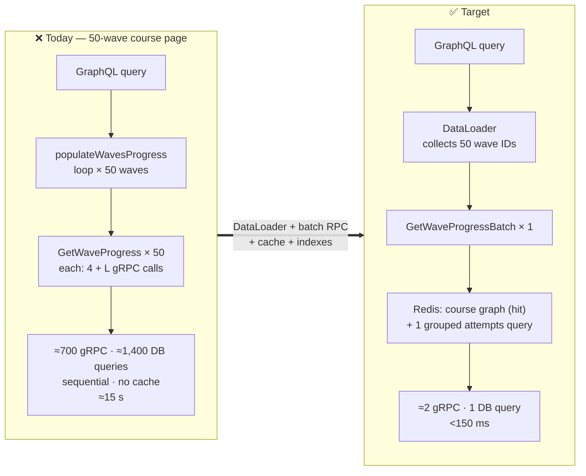

# 03 — Performance & Scalability

**8 findings · 1 Critical · 2 High · 4 Medium · 1 Low**

---

## 🔴 PERF-01 — Compounded N+1: one course page ≈ 600+ sequential gRPC calls

**Severity: Critical**

This is the worst performance defect in the system, and it is a *product* of
two independently reasonable-looking pieces of code.

**Layer 1 — the gateway loops over every wave.**
`services/api-gateway/graph/resolver_helpers.go:59-76`:

```go
func (r *Resolver) populateWavesProgress(ctx context.Context, userID string, course *model.Course) {
    for _, lesson := range course.Lessons {
        for _, wave := range lesson.Waves {
            progress, err := r.ProgressClient.GetWaveProgress(ctx, userID, wave.ID)  // ← per wave
            ...
        }
    }
}
```

Sequential. No batching, no concurrency, no DataLoader.

**Layer 2 — each of those calls is itself expensive.**
`services/progress-service/internal/service/progress.go:245-300` —
`GetWaveProgress` performs, *per invocation*:

1. `course.GetWave(waveID)` — gRPC + DB
2. `course.GetLesson(wave.LessonId)` — gRPC + DB
3. `course.ListLessons(courseID)` — gRPC + DB
4. `course.ListWaves(lessonID)` — **gRPC + DB, once per lesson in the course**
5. `repo.GetAttemptsByWave(...)` — DB
6. …then a second `GetAttemptsByWave` for the previous wave's lock check

**The multiplication.** For a course with L lessons and W waves total:

$$\text{calls} \approx W \times (4 + L)$$

| Course size | gRPC calls | DB queries | Realistic latency |
| :--- | ---: | ---: | ---: |
| 3 lessons, 9 waves | ~63 | ~130 | ~1.5 s |
| 10 lessons, 50 waves | **~700** | **~1,400** | **~15 s** |
| 20 lessons, 100 waves | ~2,400 | ~4,800 | timeout |

The 30s `WriteTimeout` (`api-gateway/main.go:124`) is the only thing bounding
this, and the GCE backend timeout is 60s. A moderately sized course simply does
not load.

Note that `GetCourseProgress` (`progress.go:333-400`) was **already optimised**
— it uses `ListWavesByLessonIds` for a single batched call and
`CountPassedWavesGroupedByLesson` for one grouped query, with a comment
explaining the change. The same treatment was never applied to the far hotter
`GetWaveProgress` path.

**Fix — three steps, in order of impact:**

**1. Add a batch RPC.** Extend `progress.proto`:
```protobuf
rpc GetWaveProgressBatch(GetWaveProgressBatchRequest) returns (GetWaveProgressBatchResponse);
message GetWaveProgressBatchRequest { string user_id = 1; repeated string wave_ids = 2; }
```
Implement it with **one** course-graph fetch and **one** grouped attempts query
for the whole course, then compute lock state in memory. This alone takes ~700
calls to ~4.

**2. Add a DataLoader at the gateway.** `gqlgen` integrates with
`vikstrous/dataloadgen`; make `myProgress` a field resolver backed by a
per-request loader so any query shape batches automatically:
```go
func (r *waveResolver) MyProgress(ctx context.Context, obj *model.Wave) (*model.WaveProgress, error) {
    return dataloader.For(ctx).WaveProgress.Load(ctx, obj.ID)
}
```

**3. Cache the course graph.** Lessons and waves change rarely. Cache
`course:{id}:graph` in Redis (already deployed) with a 5-minute TTL, invalidated
on `publishCourse`/`publishLesson`/`publishWave`. This removes steps 1-4 of
`GetWaveProgress` almost entirely.

Combined, a 50-wave course page goes from ~700 calls to ~2. Once REL-04
(tracing) lands, this is trivially visible in a flame graph — which makes it a
compelling thing to *show*, before and after.

---

## 🟠 PERF-02 — Redis is deployed but nothing is cached

**Severity: High**

Redis runs in `docker-compose.yml`, in the cluster, and in the NetworkPolicies.
It is used for exactly one thing: the Pub/Sub event bus
(`api-gateway/internal/events/bus.go`) and gamification leaderboard sorted sets.

**Nothing is cached.** Every course listing, every lesson fetch, every wave
fetch, every leaderboard read goes to Postgres — over the public internet to
Neon, with per-query network latency, on a compute instance that bills for
being awake.

Course content is the ideal cache candidate: read constantly, written rarely,
and with explicit invalidation points (`publishCourse`, `publishLesson`,
`publishWave` already exist as mutations).

**Fix.** A small cache-aside layer in course-service:

| Key | TTL | Invalidated by |
| :--- | :--- | :--- |
| `course:{id}` | 10m | `updateCourse`, `publishCourse` |
| `course:{id}:lessons` | 10m | `create/update/publishLesson` |
| `lesson:{id}:waves` | 10m | `create/update/publishWave` |
| `courses:published:{page}` | 2m | any publish |
| `leaderboard:{scope}:{courseID}` | 30s | natural expiry |

Expected effect: 80-90% reduction in Postgres queries on the read path, which
directly reduces the Neon bill (COST-04) as well as latency.

---

## 🟠 PERF-03 — Missing indexes on the hottest query path

**Severity: High**

`services/progress-service/migrations/001_create_progress.up.sql:28` defines
exactly one index on `wave_attempts`:

```sql
CREATE INDEX IF NOT EXISTS idx_attempt_user_wave ON wave_attempts(user_id, wave_id);
```

But the repository also runs `CountPassedWavesInCourse(user_id, course_id)`,
`CountPassedWavesInLesson(user_id, lesson_id)`, and
`CountPassedWavesGroupedByLesson(user_id, course_id)` — all called on every
wave submission and every course-progress read
(`progress.go:172, 213, 355, 372`). None of them can use that index; all
degrade to sequential scans over a table that grows without bound (PERF-06).

There are also no foreign keys, so nothing enforces referential integrity
between `wave_attempts` and courses/lessons/waves.

**Fix.** New migration `002_add_progress_indexes.up.sql`:

```sql
CREATE INDEX IF NOT EXISTS idx_attempt_user_course_passed
    ON wave_attempts(user_id, course_id) WHERE passed;
CREATE INDEX IF NOT EXISTS idx_attempt_user_lesson_passed
    ON wave_attempts(user_id, lesson_id) WHERE passed;
CREATE INDEX IF NOT EXISTS idx_attempt_user_wave_created
    ON wave_attempts(user_id, wave_id, created_at DESC);
```

Partial indexes (`WHERE passed`) are markedly smaller here because most
attempts fail. Verify each with `EXPLAIN (ANALYZE, BUFFERS)` and record the
before/after in the audit — measured index work is exactly the kind of evidence
that demonstrates engineering rigour.

---

## 🟡 PERF-04 — Memory limits will OOMKill the gateway

**Severity: Medium**

`infra/k8s/production/services/api-gateway.yaml:28-34`:
```yaml
requests: { memory: "40Mi",  cpu: "25m" }
limits:   { memory: "128Mi", cpu: "250m" }
```

A Go GraphQL gateway holding gqlgen's generated schema, a parsed-query LRU,
four gRPC connection pools, a Redis client, and per-request allocation churn
will not reliably fit in 128Mi under load — particularly with no request body
cap (SEC-21). The Go runtime's default `GOGC=100` also means heap can double
between collections.

`requests` far below `limits` puts every pod in **Burstable** QoS, so these are
the first pods evicted under node memory pressure. With `replicas: 1`
(REL-02), an eviction is an outage.

**Fix.**
```yaml
resources:
  requests: { memory: "128Mi", cpu: "100m" }
  limits:   { memory: "256Mi", cpu: "500m" }
env:
  - name: GOMEMLIMIT
    value: "230MiB"        # soft limit — GC pressure instead of OOMKill
  - name: GOMAXPROCS
    valueFrom: { resourceFieldRef: { resource: limits.cpu } }
```
`GOMEMLIMIT` (Go 1.19+) is the correct answer to container OOMKills and is
absent throughout. `GOMAXPROCS` matched to the CPU limit prevents the runtime
from assuming all node cores, which causes scheduler thrashing under CFS
throttling. Both are one-line additions with real effect.

Then right-size from actual data once REL-01 lands, rather than from guesswork.

---

## 🟡 PERF-05 — Unbounded result sets

**Severity: Medium**

`courses` accepts a `PaginationInput` (`schema.graphql`), but `lessons`,
`waves`, `myEnrollments`, `achievements`, and — most importantly —
`leaderboard` do not. The leaderboard query returns every ranked user with no
limit parameter and no server-side cap.

At demo scale this is invisible. At 10,000 students the leaderboard response is
megabytes of JSON serialised on every request, and the gateway holds it all in
a 128Mi container.

**Fix.** Add a server-enforced maximum to every list field (`limit`, default 20,
hard cap 100) and move to cursor-based pagination for the leaderboard, which
Redis sorted sets support natively via `ZREVRANGE`.

---

## 🟡 PERF-06 — `wave_attempts` grows forever

**Severity: Medium**

Every quiz submission inserts a row containing `answers_json TEXT` — the full
serialised answer payload — with no retention policy, no archival, no
partitioning, and no `TABLESPACE` consideration.

With reattempts enabled, a single student generates several rows per wave. At
1,000 students × 200 waves × 3 attempts that is 600,000 rows of unbounded TEXT,
scanned by the un-indexed count queries of PERF-03, on a Neon instance billed
by storage and compute.

**Fix.** Partition `wave_attempts` by month (`PARTITION BY RANGE (created_at)`),
retain the latest attempt and the best attempt per `(user_id, wave_id)`
indefinitely, and archive or drop older detail after 12 months. Store
`answers_json` as `JSONB` rather than `TEXT` so it compresses via TOAST and
becomes queryable for analytics.

---

## 🟡 PERF-07 — No frontend performance budget

**Severity: Medium**

`frontend/` bundles Puck (visual editor), KaTeX, Recharts, TanStack Router,
Zustand, and per `08-Research-&-References/` the intent to add 3Dmol, Matter.js,
and tscircuit. There is no bundle analysis, no size budget, no Lighthouse check
in CI, and no evidence of route-level code splitting for the heavy editor
dependencies.

The target audience is Sri Lankan students, many on mobile connections. A
multi-megabyte initial bundle is a product problem, not just a technical one.

**Fix.**
1. `rollup-plugin-visualizer` in the Vite config; commit a baseline.
2. Lazy-load Puck — it is only needed on educator authoring routes:
   `const PuckEditor = lazy(() => import("./PuckEditor"))`.
3. Add a CI budget gate: fail if the initial JS chunk exceeds 250 KB gzipped.
4. Add Lighthouse CI on the built preview with thresholds for performance and
   accessibility (which also covers UX-01).

---

## 🔵 PERF-08 — GraphQL cost controls are coarse

`extension.FixedComplexityLimit(200)` (`main.go:99`) is present and better than
nothing, but it uses default per-field costs of 1, so it does not reflect actual
expense — `myProgress` (which triggers PERF-01) costs the same as `id`. There
is also no query depth limit and no per-operation timeout.

**Fix.** Assign real complexity to expensive fields:
```go
c.Complexity.Wave.MyProgress   = func(childComplexity int) int { return 10 }
c.Complexity.Query.Leaderboard = func(childComplexity int, ...) int { return 25 }
c.Complexity.Lesson.Waves      = func(childComplexity int) int { return 5 }
```
Add a depth limit (max 10) and a per-operation context timeout (10s) so a slow
query cannot hold a connection for the full 30s write timeout.

---

## Before / after


