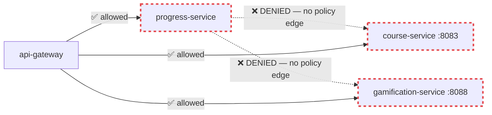
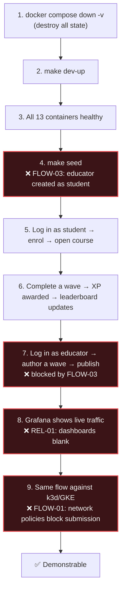

# 04 — Correctness, Business Logic & Demo Readiness

**12 findings · 1 Critical · 4 High · 6 Medium · 1 Low**

> The goal states the project *"must work and be correctly demonstrable"*.
> This section is specifically about the gap between what the system claims to
> do and what it actually does.

---

## 🔴 FLOW-01 — NetworkPolicies break wave submission in the cluster

**Severity: Critical · Cross-referenced as [SEC-07](01-SECURITY.md#-sec-07--networkpolicy-denies-the-progress-service-call-graph)**

`infra/k8s/production/network-policies.yaml` applies `default-deny-all` for
both ingress and egress, then grants service-to-service egress **only** to
`api-gateway`. But `progress-service` calls `course-service:8083` and
`gamification-service:8088` directly on every submission
(`progress.go:75, 130, 165, 175, 200, 219`).

No egress policy permits it; no ingress policy on those services admits
`progress-service`. Calico enforces (`gke.tf:44-49`).



**What breaks in production:** submitting quiz answers, awarding XP, unlocking
achievements, computing wave lock state, and course progress — i.e. the core
learning loop. `RecordAttempt` fails at its very first call
(`progress.go:75: s.course.GetWave`).

This does not manifest in Docker Compose (no network policies), which likely
explains why the demo path is the compose stack rather than the cluster. **The
Kubernetes deployment, as committed, cannot serve the product's primary
function.**

**Fix:** see SEC-07 for the exact policy additions, plus a CI check that
reconciles gRPC client targets in Go against policy edges.

---

## 🟠 FLOW-02 — CI silently ignores Go test failures

**Severity: High · The pipeline's green checkmark is not trustworthy**

`Makefile:96-103` — this is what `.github/workflows/ci.yml:73` runs as its
"Run Microservices Tests" step:

```makefile
go-test:
	@for svc in services/*; do \
		if [ -f "$$svc/go.mod" ]; then \
			echo "testing $$svc..."; \
			cd "$$svc" && go test ./... && cd ../..; \
		fi \
	 done
```

Two compounding bugs:

1. **The loop's exit status is only that of the final iteration.** A `for` loop
   in `sh` returns the status of the last command executed. If
   `auth-service` fails but `user-service` (alphabetically last) passes, the
   recipe exits 0 and **CI reports success**.

2. **`cd ../..` is chained with `&&`.** When `go test` fails, `cd ../..` never
   runs, so the shell stays inside the failed service directory. Every
   *subsequent* iteration's `cd "$$svc"` then resolves relative to the wrong
   path and fails — cascading into a run where most services are never tested
   at all.

The identical pattern exists in `go-build` (`Makefile:87-94`).

**Verification.** Introduce a deliberately failing test in `auth-service` and
run `make go-test; echo $?` — it exits 0.

**Fix.** Use a Go workspace or an explicit failure accumulator:

```makefile
go-test:
	@fail=0; \
	for svc in services/*; do \
		if [ -f "$$svc/go.mod" ]; then \
			echo "==> testing $$svc"; \
			( cd "$$svc" && go test -race -coverprofile=coverage.out ./... ) || fail=1; \
		fi; \
	done; \
	exit $$fail
```

Note the subshell `( cd ... )` — it cannot corrupt the parent's working
directory. Also add `-race`, which is currently absent and is the single
highest-value flag for a concurrent Go service (and would likely surface
FLOW-04).

**Until this is fixed, no claim about test status in this repository is
verifiable.** Fix it first; it changes what everything else means.

---

## 🟠 FLOW-03 — The demo seed cannot create an educator

**Severity: High · Directly blocks "correctly demonstrable"**

`scripts/seed.sh:99`:
```bash
register_or_login "educator@studed.lk" "password123" "Demo Educator" "EDUCATOR"
```

`scripts/mock-data-loader.ts:375`:
```ts
const educator = await registerOrLogin("demo.educator@studed.lk", "EDUCATOR", "Demo Educator");
```

Both pass `role: "EDUCATOR"` to the `register` mutation. Both are ignored:

- `api-gateway/internal/client/auth.go:65` — `Role: authpb.Role_ROLE_STUDENT` (hardcoded)
- `auth-service/internal/service/auth.go:64` — `Role: model.RoleStudent` (hardcoded)

The security behaviour is correct (SEC-22). The consequence is that **`make
seed` produces a student account named "Demo Educator"**, and no automated path
exists to create a real educator. Every educator-side feature — course
authoring, the Puck editor, AI content generation, the educator dashboard,
publishing — is unreachable from a clean environment without manual SQL.

**Fix.** Add an explicit, operator-only provisioning path — this is the correct
production design as well as the fix for the demo:

```bash
# scripts/provision-educator.sh — requires direct DB access, never the public API
psql "$DATABASE_URL" -c \
  "UPDATE users SET role = 'EDUCATOR' WHERE email = '$1';"
```

Call it from `mock-data-loader.sh` after registration, and document it in the
README as the intended way to create staff accounts. Longer term, add an
admin-only `promoteUser` mutation guarded by `requireRole(ADMIN)`.

Then verify the whole demo end-to-end from `docker compose down -v` — see
"Demo readiness gate" below.

---

## 🟠 FLOW-04 — Wave submission is not transactional and has a TOCTOU race

**Severity: High · Gamification integrity**

`services/progress-service/internal/service/progress.go:100-160`:

```go
attempts, _ := s.repo.GetAttemptsByWave(ctx, userID, waveID)      // ← READ
if wave.MaxReattempts > 0 && int32(len(attempts)) >= wave.MaxReattempts {
    return nil, fmt.Errorf("maximum reattempts reached")           // ← CHECK
}
// ... scoring ...
xpResp, err := s.gamification.CalculateAndAwardXp(...)             // ← side effect 1
// ...
if err := s.repo.CreateAttempt(ctx, attempt); err != nil { ... }   // ← side effect 2 (WRITE)
```

**Race.** Two concurrent submissions both read `len(attempts) == 2` against
`MaxReattempts == 3`, both pass the check, both award XP, both insert. The
reattempt cap is advisory. `attempt_number` is likewise computed from a stale
read, so duplicates occur.

**Non-atomicity.** XP is awarded *before* the attempt is recorded. If
`CreateAttempt` fails, the student keeps XP for an attempt that does not exist.
Conversely a `gamification` failure aborts the request after scoring, so a
correct submission is lost entirely.

**Partial mitigation exists.** `gamification-service/migrations/003` adds:
```sql
CREATE UNIQUE INDEX uq_xp_history_wave_completion
    ON xp_history(user_id, source_id, reason) WHERE reason = 'wave_completed';
```
This correctly prevents *duplicate XP for the same wave* — good defensive
design. It does not prevent the duplicate attempts, the bypassed cap, or the
XP/attempt divergence.

**Fix.**
1. Wrap the read-check-write in a single database transaction and take a row
   lock on the enrolment (`SELECT … FOR UPDATE`), or add a unique constraint on
   `(user_id, wave_id, attempt_number)` and treat the conflict as the cap.
2. Reorder: record the attempt first, then award XP, so XP is never granted for
   an unrecorded attempt.
3. Make the whole mutation idempotent on a client-supplied `submissionId`
   (UUID), so retries — including the automatic ones REL-13 proposes — cannot
   double-submit.
4. Run tests with `-race` (FLOW-02) and add a concurrency test that fires N
   simultaneous submissions and asserts exactly one succeeds past the cap.

---

## 🟠 FLOW-05 — Failed attempts reveal every correct answer

**Severity: High · The second half of [SEC-01](01-SECURITY.md#-sec-01--quiz-answers-are-readable-by-any-enrolled-student)**

`services/progress-service/internal/service/progress.go:503-520` —
`scoreAnswers` builds feedback for **every** block unconditionally:

```go
feedback[i] = &progresspb.QuestionFeedback{
    EvaluateBlockId: block.ID,
    Correct:         correct,
    CorrectAnswer:   block.CorrectAnswer,   // ← always
    Explanation:     block.Explanation,     // ← always
}
```

This is returned on a failed attempt too. Combined with reattempts, the optimal
strategy for any student is: submit garbage once, read every answer from the
response, resubmit for 100%. No exploit tooling required — the frontend already
displays it (`QuizBlock.tsx:84-85`).

**Fix.** Gate answer disclosure on the outcome and the remaining-attempt count:

```go
reveal := passed || remainingAttempts == 0   // only when learning value > gaming risk
if reveal {
    fb.CorrectAnswer = block.CorrectAnswer
    fb.Explanation   = block.Explanation
}
```

On a failed attempt with attempts remaining, return only `correct: false` — and
optionally a hint field authored separately from the answer. That is also
better pedagogy: revealing the answer immediately removes the reason to
reattempt at all.

---

## 🟡 FLOW-06 — Subscription lifecycle is incomplete

**Severity: Medium**

Three distinct gaps in `services/payment-service/internal/handler/handler.go`:

**(a) Expiry is evaluated lazily, only on read** (`handler.go:151-155`). A
subscription whose `end_date` has passed remains `ACTIVE` in the database until
that specific user happens to fetch it. Any other service (or an admin query,
or a report) reading `status` directly sees a stale `ACTIVE`. There is no
reconciliation job.

**(b) Renewal never extends `end_date`.** The webhook activation
(`handler.go:210-220`) updates `provider`, `provider_external_id`, and `status`
— not `end_date`. A user who pays for a second month remains expired on the
original date.

**(c) Nothing consumes subscription status.** No resolver, no course access
check, and no gating logic anywhere references it. The entire subscription
model is currently decorative — a student with no subscription has identical
access to one with `PREMIUM`.

**Fix.**
1. Add a periodic reconciliation (CronJob or an in-process ticker) that
   transitions `ACTIVE AND end_date < now()` → `EXPIRED` in one statement.
2. On activation, set `end_date = GREATEST(end_date, now()) + interval '1 month'`.
3. Decide and implement the actual entitlement model, or **remove the payment
   service from the architecture diagram** until it is real. Right now the
   README advertises "Stripe / PayHere Billing" for a service that grants
   nothing. Removing it would be the simpler, more honest choice for a demo.

---

## 🟡 FLOW-07 — The role model is incomplete

**Severity: Medium**

Four roles are defined (`STUDENT`, `EDUCATOR`, `HEAD_EDUCATOR`, `ADMIN`) but the
authorization logic recognises only two tiers:

- `requireEducator` (`resolver_helpers.go:24-32`) treats `EDUCATOR`,
  `HEAD_EDUCATOR`, and `ADMIN` identically.
- course-service enforces strict `EducatorID` ownership on all eight mutation
  paths (`course.go:197, 240, 279, 345, 380, 430, 526, 587`) with **no
  administrative override**. So an `ADMIN` cannot moderate, unpublish, or fix
  another educator's course.
- `HEAD_EDUCATOR` has no distinct capability anywhere in the codebase.
- Only `queryResolver.Wave` has a partial admin bypass
  (`schema.resolvers.go:607-613`), which is inconsistent with every other path.

For a platform publishing content to children, the inability of an
administrator to unpublish inappropriate material is a genuine operational and
safety gap.

**Fix.** Either implement the roles properly — pass the caller's role into
course-service and allow `ADMIN` to act on any course, `HEAD_EDUCATOR` on any
course within their scope, with an audit log entry for every override — or
**delete the two unused roles**. Both are defensible; the current middle state
is not.

---

## 🟡 FLOW-08 — Integer truncation makes grading unfair at boundaries

**Severity: Medium**

`progress.go:519`:
```go
score := int32((correctCount * 100) / len(blocks))
```

Integer division truncates. With 3 questions and a 70% passing threshold, 2
correct answers yields `200/3 = 66` — a fail, where the true value is 66.67%
and a 3-question quiz cannot express 70% at all. With 7 questions, 5 correct
gives 71 (pass) but 4 gives 57.

The thresholds and question counts interact in ways educators cannot predict,
and a student can fail a quiz they arguably passed.

**Fix.** Round rather than truncate, and validate authored content:
```go
score := int32(math.Round(float64(correctCount) * 100 / float64(len(blocks))))
```
Additionally, warn the educator at authoring time when the question count
cannot express the chosen threshold (e.g. 3 questions with a 70% threshold
effectively means 100%).

---

## 🟡 FLOW-09 — Three services exist in the architecture diagram but not in the system

**Severity: Medium · Accuracy of the technical story**

| Service | `.go` files | In compose? | In CI image matrix? | In k8s? | In README diagram? |
| :--- | ---: | :---: | :---: | :---: | :---: |
| `user-service` | 1 | ❌ | ❌ | ❌ | (implied) |
| `content-service` | 1 | ❌ | ❌ | ❌ | (implied) |
| `upload-service` | 1 | ❌ | ❌ | ❌ | ✅ "Port 8096, Media & R2 Signatures" |

The README's master architecture diagram presents `Upload Service (Port 8096)`
as a live component of the microservices mesh. It is a single-file stub that is
never built, never deployed, and never called.

**Impact on the goal.** The stated aim is to *"showcase with pride of technical
and architectural excellence"*. A reviewer who opens `services/upload-service/`
after reading that diagram will discount the entire document — and by extension
the parts of it that *are* accurate and impressive. Overstatement is more
costly than a smaller honest claim.

**Fix.** Delete the three stub directories, and correct the README diagram to
show the eight services that genuinely exist. If media upload is planned,
show it in a clearly labelled "Roadmap" section. An accurate eight-service
architecture is genuinely impressive; an inaccurate eleven-service one is not.

---

## 🟡 FLOW-10 — Two incompatible migration strategies

**Severity: Medium**

- `auth`, `course`, `progress`, `gamification` use versioned SQL migrations with
  `.up.sql`/`.down.sql` pairs (8 files) — the correct approach.
- `payment-service` uses GORM `AutoMigrate` at startup
  (`payment-service/main.go:49`) — no version history, no down-migration, no
  review, and schema changes applied automatically by whichever pod starts first.

Worse: **nothing runs the SQL migrations.** There is no migration job, no
`golang-migrate` invocation in any Dockerfile, entrypoint, Makefile target, or
Kubernetes manifest. The `.sql` files exist but no automated path applies them.

**Impact.** Schema state in any environment is undefined. A fresh cluster
deploy produces services pointing at a database with no tables (except
payment's, which self-creates). This is a deployment-blocking issue that
compose masks only because of manual seeding.

**Fix.**
1. Standardise on `golang-migrate` for every service; remove `AutoMigrate`
   (`AutoMigrate` in production is unsafe — it will happily add columns but
   never drop or alter destructively, so schema drifts silently).
2. Run migrations as a Kubernetes `Job` with an ArgoCD `PreSync` hook, so they
   complete before the new pods roll:
   ```yaml
   metadata:
     annotations:
       argocd.argoproj.io/hook: PreSync
       argocd.argoproj.io/hook-delete-policy: HookSucceeded
   ```
3. Add `make migrate-up` / `make migrate-down` and a CI check that every
   `.up.sql` has a matching `.down.sql` and that both apply cleanly against a
   throwaway Postgres.

---

## 🔵 FLOW-11 — Money handled as `float64`

`payhere.Amount(v float64)` (`payhere.go:45`) formats currency from a
floating-point value. IEEE-754 cannot represent most decimal amounts exactly;
`fmt.Sprintf("%.2f", …)` masks but does not remove the error, and the value
feeds directly into a signature computation where a one-cent discrepancy causes
verification failure.

Use integer minor units (`AmountCents int64`) throughout, formatting only at the
boundary. Combine with the price table from SEC-06.

---

## 🔵 FLOW-12 — `RegisterInput.role` is required but ignored

See [SEC-22](01-SECURITY.md#-sec-22--registerinputrole-is-a-required-field-that-is-silently-ignored).
The root cause of FLOW-03. Remove the field from the schema.

---

## Demo readiness gate

Before presenting, this sequence must pass from a completely clean state.
Today, steps 4 and 7 fail.



**Make this an executable script**, not a checklist. `scripts/verify-demo.sh`
should run the whole path end to end with assertions and exit non-zero on
failure — then run it in CI nightly. A demo that is verified by a machine every
night is a substantially stronger claim than one verified by hand the morning
of the presentation.
