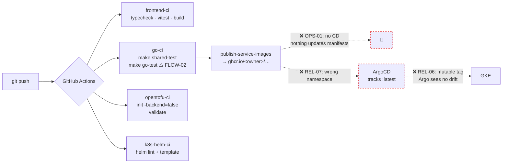
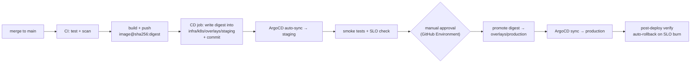
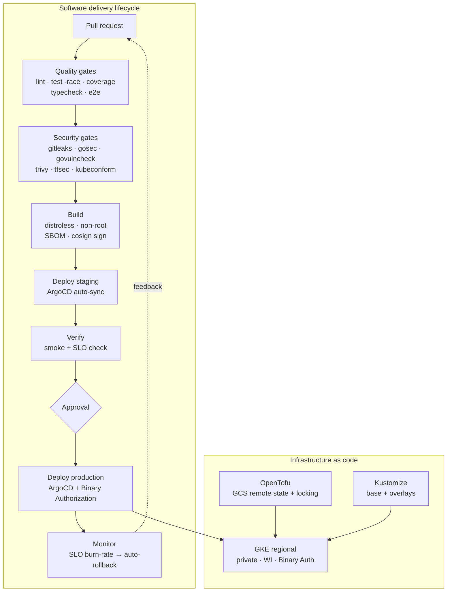

# 05 — DevOps, CI/CD, IaC & Platform Engineering

**11 findings · 0 Critical · 4 High · 6 Medium · 1 Low**

---

## Current pipeline



The CI is genuinely well structured — parallel jobs, path filtering, build
caching, a matrix build, and sensible separation of concerns. The problems are
what it *doesn't* do: no security gates, no quality gates, and no continuous
delivery. The pipeline stops at "image published" and a human bridges the gap.

---

## 🟠 OPS-01 — There is no continuous delivery

**Severity: High**

`ci.yml` builds and pushes images. Nothing then updates the deployment
manifests. `infra/k8s/argocd/application-production.yaml` points ArgoCD at the
manifests, which pin `:latest` (REL-06) — so Argo compares an unchanging
manifest against an unchanging manifest and always reports **Synced**, whatever
is actually running.

Missing entirely: environments (there is only `production`), a promotion path,
approval gates, deployment strategy (no canary, no blue/green), automated
rollback, deployment markers in monitoring, and any record of which commit is
live.

The README claims *"ArgoCD GitOps continuous delivery"*. What exists is
continuous integration plus a manual `make prod-deploy`.

**Fix — a real GitOps loop, without adding much machinery:**



Concretely:
1. Restructure `infra/k8s/` into Kustomize `base/` + `overlays/{staging,production}`.
2. Add a CD job that patches the overlay's image digest and commits back.
3. Two ArgoCD `Application`s, staging with `automated: {prune: true, selfHeal: true}`,
   production gated on a GitHub Environment approval.
4. Enable ArgoCD's Slack/Discord notifications so sync status is visible.

---

## 🟠 OPS-02 — The frontend build silently falls back to unpinned dependencies

**Severity: High · Supply chain / reproducibility**

`.github/workflows/ci.yml:49`:
```yaml
run: cd frontend && bun install --frozen-lockfile || bun install
```

`--frozen-lockfile` exists precisely to fail when `bun.lock` does not match
`package.json`. The `|| bun install` fallback converts that intentional
failure into a silent re-resolution — installing whatever versions are current
at build time, and rewriting the lockfile inside CI.

**Impact.** Builds are not reproducible. A compromised or simply broken
transitive dependency published between two CI runs enters the production
bundle with no signal. This is the exact mechanism behind most npm supply-chain
incidents.

**Fix.** Remove the fallback:
```yaml
run: cd frontend && bun install --frozen-lockfile
```
If it fails, that is correct behaviour — commit the updated lockfile. Add
Dependabot/Renovate (OPS-11) so lockfile drift is handled deliberately by a PR
rather than silently by CI.

---

## 🟠 OPS-03 — No security or quality gates in the pipeline

**Severity: High · Cross-referenced as [SEC-18](01-SECURITY.md#-sec-18--no-supply-chain-security-in-ci)**

Absent: SAST, dependency vulnerability scanning, container image scanning,
secret scanning, IaC scanning, Kubernetes manifest policy validation, SBOM
generation, and image signing. Also absent on the quality side: Go linting,
test coverage measurement, and any coverage threshold.

**Fix — a single additional workflow file covers most of it:**

```yaml
# .github/workflows/security.yml
name: Security & Quality Gates
on: [push, pull_request]
permissions: { contents: read, security-events: write }

jobs:
  secrets:
    runs-on: ubuntu-latest
    steps:
      - uses: actions/checkout@v4
        with: { fetch-depth: 0 }
      - uses: gitleaks/gitleaks-action@v2

  go-quality:
    runs-on: ubuntu-latest
    steps:
      - uses: actions/checkout@v4
      - uses: actions/setup-go@v5
        with: { go-version: "1.25" }
      - uses: golangci/golangci-lint-action@v6      # includes gosec, errcheck, staticcheck
      - run: go install golang.org/x/vuln/cmd/govulncheck@latest
      - run: |
          for svc in services/*/; do
            [ -f "$svc/go.mod" ] && (cd "$svc" && govulncheck ./...) || true
          done

  iac:
    runs-on: ubuntu-latest
    steps:
      - uses: actions/checkout@v4
      - uses: aquasecurity/tfsec-action@v1.0.3
      - uses: bridgecrewio/checkov-action@master
        with: { directory: infra/ , framework: terraform,kubernetes }
      - run: |          # every manifest must be valid against the real API schema
          curl -sL https://github.com/yannh/kubeconform/releases/latest/download/kubeconform-linux-amd64.tar.gz | tar xz
          ./kubeconform -strict -summary infra/k8s/

  image-scan:
    runs-on: ubuntu-latest
    strategy: { matrix: { service: [api-gateway, auth-service, course-service] } }
    steps:
      - uses: actions/checkout@v4
      - run: docker build -f services/${{ matrix.service }}/Dockerfile -t scan:${{ matrix.service }} .
      - uses: aquasecurity/trivy-action@master
        with:
          image-ref: scan:${{ matrix.service }}
          severity: CRITICAL,HIGH
          exit-code: "1"
          format: sarif
          output: trivy.sarif
      - uses: github/codeql-action/upload-sarif@v3
        with: { sarif_file: trivy.sarif }

  frontend-audit:
    runs-on: ubuntu-latest
    steps:
      - uses: actions/checkout@v4
      - uses: oven-sh/setup-bun@v1
      - run: cd frontend && bun install --frozen-lockfile && bun audit --audit-level=high
```

Add to the publish job: SBOM via `anchore/sbom-action`, and signing via
`sigstore/cosign-installer` + `cosign sign --yes` with GitHub OIDC (keyless — no
key management required). Then enable Binary Authorization on GKE (SEC-15) so
only signed images run. That chain — signed build → verified admission — is a
genuinely strong story to present.

Add `golangci.yml` at the repo root; `gosec`, `errcheck`, `staticcheck`,
`ineffassign`, and `bodyclose` alone will find real issues in 21k lines of Go.

---

## 🟠 OPS-04 — Tests that exist are not run; no coverage anywhere

**Severity: High**

| Suite | Exists | Runs in CI |
| :--- | :---: | :---: |
| Go unit tests (9 files) | ✅ | ⚠️ but failures ignored — FLOW-02 |
| Vitest (2 files) | ✅ | ✅ |
| Playwright e2e (11 specs) | ✅ | ❌ **never** |
| `scripts/integration-test.sh` | ✅ | ❌ **never** |
| `make promtool-check` | ✅ | ❌ **never** |
| Coverage measurement | ❌ | ❌ |

Eleven Playwright specs covering login, registration, enrolment, wave
completion, the leaderboard, and both portals were written and are never
executed by automation. That is the most valuable existing asset in the
repository going unused.

**Fix.** Add an e2e job that stands up the compose stack and runs the suite:

```yaml
  e2e:
    runs-on: ubuntu-latest
    steps:
      - uses: actions/checkout@v4
      - run: docker compose up -d --build --wait      # --wait respects healthchecks
      - run: ./scripts/mock-data-loader.sh
      - uses: oven-sh/setup-bun@v1
      - run: cd frontend && bun install --frozen-lockfile && bunx playwright install --with-deps
      - run: cd frontend && bun run test:e2e
      - uses: actions/upload-artifact@v4
        if: failure()
        with: { name: playwright-report, path: frontend/playwright-report }
      - if: always()
        run: docker compose logs > compose.log && docker compose down -v
```

Add `-coverprofile` to `make go-test`, upload to Codecov, and set an initial
threshold at the current level with a ratchet so it can only improve.

Also run `make promtool-check` in CI — it would have caught REL-01's rule
mismatch had the metrics existed, and it guards the fix from regressing.

---

## 🟡 OPS-05 — `make iac-plan` does not plan; `iac-apply` auto-approves

**Severity: Medium**

`Makefile:35-40`:
```makefile
iac-plan:
	cd infra/gcp/terraform && tofu validate      # ← this is validate, not plan

iac-apply:
	cd infra/gcp/terraform && tofu apply -auto-approve
```

`validate` checks syntax and type correctness. It does not contact the
provider, does not read state, and cannot tell you that an apply is about to
destroy the cluster. The target's name asserts a safety property it does not
provide — and `ci-local` (`Makefile:41`) invokes it as if it were a plan.

`apply -auto-approve` then applies without any plan artifact, review, or record
of what changed. `prod-stop`/`prod-start` (`Makefile:139-145`) do the same with
a `-var "node_count=0"` override, which means the applied configuration differs
from the committed one and subsequent applies will fight it.

**Fix.**
```makefile
iac-validate:
	cd infra/gcp/terraform && tofu validate && tofu fmt -check -recursive

iac-plan:
	cd infra/gcp/terraform && tofu plan -out=tfplan && tofu show -no-color tfplan

iac-apply:
	cd infra/gcp/terraform && tofu apply tfplan      # apply the reviewed plan only
```
In CI, run `tofu plan` on PRs and post the output as a PR comment
(`dflook/terraform-pr-commenter` or similar) so infrastructure changes get the
same review as code. Move `node_count` into the committed tfvars per
environment rather than a CLI override.

---

## 🟡 OPS-06 — Terraform state is local

See [REL-15](02-RELIABILITY-SRE.md#-rel-15--terraform-state-is-local-and-unlocked).
No remote backend, no locking, no versioning, no encryption, no drift detection.
Move to a GCS backend and add a scheduled `tofu plan` that alerts on drift.

---

## 🟡 OPS-07 — Container images are not production-grade

**Severity: Medium**

`services/api-gateway/Dockerfile` (representative):

| Issue | Detail | Fix |
| :--- | :--- | :--- |
| Runs as root | No `USER` directive (SEC-05) | Distroless `nonroot` |
| Full Alpine base | Shell, package manager, busybox in the runtime image | `gcr.io/distroless/static-debian12` |
| Base not digest-pinned | `alpine:3.21.2` is a mutable tag | Pin `@sha256:…` |
| No OCI labels | No source, revision, or version metadata | `LABEL org.opencontainers.image.*` |
| No `HEALTHCHECK` | — | Add, or rely solely on k8s probes and document that |
| Toolchain skew | Image builds with Go **1.24.0**, CI tests with Go **1.25** | Align both |

The Go-version mismatch is the most concerning: unit tests validate against a
different compiler than the one that builds the shipped binary.

**Fix.**
```dockerfile
FROM golang:1.25-alpine AS builder
ARG VERSION=dev
ARG COMMIT=unknown
# ...
RUN go build -trimpath -ldflags="-w -s -X main.version=${VERSION} -X main.commit=${COMMIT}" -o /app/service .

FROM gcr.io/distroless/static-debian12:nonroot
LABEL org.opencontainers.image.source="https://github.com/<owner>/studed-project"
LABEL org.opencontainers.image.revision="${COMMIT}"
COPY --from=builder /app/service /app/service
USER 65532:65532
ENTRYPOINT ["/app/service"]
```
`-trimpath` also removes build-host paths from the binary — small, free, and
correct. Expose `version`/`commit` on `/health` so a running pod can be traced
to a commit (which also addresses REL-06's audit-trail gap).

---

## 🟡 OPS-08 — Over-broad workflow permissions; actions not pinned

**Severity: Medium**

`.github/workflows/ci.yml:11-14` grants at workflow level:
```yaml
permissions:
  contents: read
  packages: write        # ← granted to EVERY job, including PR builds
  pull-requests: read
```

`packages: write` should belong only to `publish-service-images`. A compromised
action in `frontend-ci` currently inherits the ability to push images to GHCR.

Every action is also referenced by mutable tag (`actions/checkout@v4`,
`docker/build-push-action@v6`). Tags are reassignable by the action's
maintainer, so a compromised upstream repository silently changes what runs in
CI — the `tj-actions/changed-files` incident of 2025 is the canonical example.

**Fix.**
```yaml
permissions:
  contents: read                    # workflow default: minimal

jobs:
  publish-service-images:
    permissions:
      contents: read
      packages: write               # ← scoped to the one job that needs it
      id-token: write               # for cosign keyless signing
```
Pin every action to a full commit SHA with the version in a trailing comment:
```yaml
- uses: actions/checkout@11bd71901bbe5b1630ceea73d27597364c9af683 # v4.2.2
```
Renovate (OPS-11) updates SHA pins automatically, so this costs nothing ongoing.

---

## 🟡 OPS-09 — Makefile contains another machine's absolute paths

**Severity: Medium · Developer experience**

`Makefile:63-67`:
```makefile
graph-refresh:
	@/Users/warunaudarasampath/Library/Python/3.14/bin/graphify extract . --code-only --force

graph-query:
	@/Users/warunaudarasampath/Library/Python/3.14/bin/graphify query "$(Q)"
```

`Makefile:38`:
```makefile
helm-lint:
	/opt/homebrew/bin/helm lint infra/helm/studed || helm lint infra/helm/studed
```

These are hardcoded to a specific user's home directory on a specific machine —
and not even the current git user's (`VidunThamuditha`). They fail for every
other developer and in CI. The `helm` target's `||` fallback works but encodes
an Apple-Silicon-Homebrew assumption as the primary path.

This pairs with REL-07 (`ghcr.io/warunaudara/…`) — there are two developers'
environments fossilised in the build system.

**Fix.** Resolve tools from `PATH`, and fail with a helpful message if absent:
```makefile
GRAPHIFY ?= graphify
HELM     ?= helm

helm-lint:
	@command -v $(HELM) >/dev/null || { echo "helm not found — brew install helm"; exit 1; }
	$(HELM) lint infra/helm/studed
```
Add a `make doctor` target that checks for docker, bun, go, protoc, tofu, helm,
and kubectl, and prints install instructions for whatever is missing. That is
the single highest-value DX addition in this repository.

---

## 🟡 OPS-10 — The Helm chart deploys nothing

**Severity: Medium**

```
infra/helm/studed/
├── Chart.yaml
├── values.yaml
└── templates/
    ├── _helpers.tpl
    ├── configmap.yaml
    └── secret.yaml          ← that's all
```

There are no Deployment, Service, Ingress, HPA, or PDB templates. So
`helm lint` and `helm template` in CI (`ci.yml:96-101`) validate a ConfigMap and
a Secret and report success — a green check that means almost nothing, while
the eight real Deployments in `infra/k8s/production/` are never validated by CI
at all.

There are also **two parallel deployment mechanisms** — the Helm chart and raw
manifests under `infra/k8s/` (plus a third variant in `infra/k8s/services/`) —
with no documented relationship. That ambiguity is itself a production risk.

**Fix.** Pick one. Given ArgoCD and the goal of *reducing* complexity, the
recommendation is **Kustomize** — `base/` + `overlays/{dev,staging,production}` —
and delete the Helm chart. Kustomize needs no templating language, is native to
`kubectl` and ArgoCD, and makes the per-environment diff explicit and readable.

Then make CI validate what actually ships:
```yaml
- run: kubectl kustomize infra/k8s/overlays/production | kubeconform -strict -summary -
```

---

## 🔵 OPS-11 — Repository governance is absent

No `dependabot.yml` or `renovate.json`, no `CODEOWNERS`, no PR or issue
templates, no `CONTRIBUTING.md`, no documented branch protection, no
`CHANGELOG.md`, no release automation, and no conventional-commit enforcement
(despite the git history already using conventional-commit style consistently —
`feat(ui):`, `fix(ui):`, `feat(devops):`).

**Fix.** Low effort, visible payoff:
- `renovate.json` with grouped minor updates and automerge for patch versions.
- Branch protection on `main`: require the CI checks, require one review,
  no force-push.
- `release-please` to generate a changelog and tags from the existing
  conventional commits — this works immediately with zero history rewriting.
- `CODEOWNERS` mapping `infra/` and `services/auth-service/` to a reviewer.

---

## Target platform architecture


