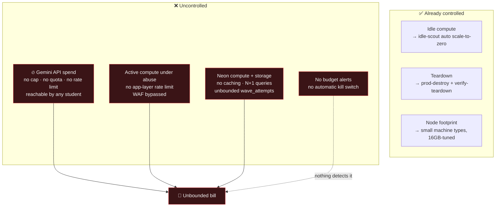

# 06 — Cost & FinOps

**5 findings · 0 Critical · 1 High · 3 Medium · 1 Low**

> Credit first: this project takes cost seriously in a way most student and
> early-stage projects do not. `make prod-stop` scales the node pool to zero,
> an hourly `idle-scout` Cloud Run job auto-scales down after 2h of no traffic,
> `make prod-destroy` tears everything to $0, and `verify-teardown.sh` audits
> that it actually happened. `docs/COSTS.md` exists. That is genuinely good
> FinOps discipline and should be highlighted, not just the gaps.
>
> The gaps below are about **spend that an attacker or a bug can cause**, which
> the existing controls do not cover.

---

## 🟠 COST-01 — Any authenticated user can drive unbounded LLM spend

**Severity: High · Financial denial of wallet**

Three GraphQL mutations reach the Gemini API. Their authorization:

| Mutation | Required role | Guard |
| :--- | :--- | :--- |
| `generateLearnBlocks` | EDUCATOR+ | `requireEducator` (`schema.resolvers.go:304`) |
| `generateEvaluateBlocks` | EDUCATOR+ | `requireEducator` (`schema.resolvers.go:320`) |
| `translateContent` | **any logged-in user** | `requireUser` only (`schema.resolvers.go:332`) |

`translateContent(content: String!, targetLanguage: String!)` accepts an
arbitrary-length string from **any student account** and forwards it to Gemini.

And in `services/ai-service/internal/gemini/client.go:52-56`:

```go
type generationConfig struct {
    ResponseMimeType string  `json:"responseMimeType,omitempty"`
    Temperature      float64 `json:"temperature"`
}
```

There is **no `maxOutputTokens`**. There is no input length cap, no per-user
quota, no daily budget, no request counter, and — per SEC-03 — no rate limit at
any layer of the stack, including Cloud Armor (SEC-02).

**The attack.** Register a free student account (registration is open and
unthrottled), then loop:

```graphql
mutation { translateContent(content: "<100KB of text>", targetLanguage: "si") }
```

Each call bills input + output tokens. At a few hundred requests per second
from a single machine, a meaningful bill accrues in minutes. There is no
alerting to detect it (REL-01, REL-05) and no mechanism to stop it short of
revoking the API key.

**Fix — defence in depth, cheapest first:**

1. **Cap the model.** `maxOutputTokens: 2048` in `generationConfig`, and reject
   input over ~8,000 characters at the handler.
2. **Quota per user.** Redis counter, e.g. 20 AI calls/day for students, 200 for
   educators. Return a clear `RATE_LIMITED` error.
3. **Restrict `translateContent`.** It is an authoring tool; gate it on
   `requireEducator` like its two siblings. There is no student flow that needs
   it.
4. **Global circuit breaker.** A daily token budget in Redis; when exceeded,
   the AI service returns `503` and fires an alert instead of calling Gemini.
5. **Observe the spend.** `studed_ai_tokens_total{operation, user_role}` and
   `studed_ai_requests_total` metrics (REL-01), with a Grafana panel and a
   burn-rate alert.
6. **Set a hard cap at the provider.** A quota limit on the Gemini API key in
   the Google Cloud console is the last-resort backstop that no application bug
   can bypass.

Items 1 and 3 are ~10 lines and remove most of the risk immediately.

---

## 🟡 COST-02 — The edge strips the client IP, making rate limiting impossible at the origin

**Severity: Medium · Root cause enabler for SEC-03 and COST-01**

`functions/graphql.ts:11-18`:

```ts
headers.delete("cf-connecting-ip");
headers.delete("cf-ray");
headers.delete("cf-visitor");
headers.delete("x-forwarded-for");
headers.delete("x-real-ip");
```

Every identifier of the original client is removed before proxying. The origin
sees only Cloudflare's egress IPs.

**Consequences:** per-IP rate limiting cannot be implemented at the gateway;
abuse cannot be attributed or blocked; audit logs cannot record who did what;
geo/fraud signals are unavailable; and Cloud Armor's per-IP throttle
(`enforce_on_key = "IP"`) would throttle *Cloudflare*, not the attacker — even
if SEC-02 were fixed.

The stripping is presumably defensive (avoid header spoofing). The correct
pattern preserves the signal while keeping it trustworthy.

**Fix.**
```ts
// Strip anything client-supplied, then set a value only the proxy can produce.
headers.delete("x-forwarded-for");
headers.delete("x-studed-client-ip");
headers.set("x-studed-client-ip", context.request.headers.get("cf-connecting-ip") ?? "");
headers.set("x-studed-edge-token", context.env.EDGE_SHARED_SECRET);
```
The gateway trusts `x-studed-client-ip` **only** when `x-studed-edge-token`
matches, so a client hitting the origin directly cannot forge it. Also:
- add a `signal: AbortSignal.timeout(30_000)` to the `fetch` (currently
  unbounded), and
- return a proper 502 with a JSON error body on upstream failure rather than
  letting the Worker throw.

Additionally, `API_ORIGIN` is a **hardcoded IP-derived hostname**
(`https://api.34.149.224.124.sslip.io`, `functions/graphql.ts:3`). Any change
to the load balancer IP requires a code change and redeploy, and production DNS
depends on `sslip.io` — a free third-party wildcard DNS service with no SLA and
no security guarantees. Move the origin to a Pages environment binding
(`context.env.API_ORIGIN`) and, before any real launch, register a real domain
with Cloudflare DNS and a managed certificate.

---

## 🟡 COST-03 — Elasticsearch is expensive and probably unnecessary

**Severity: Medium**

Elasticsearch is deployed in compose and in the cluster with
`ES_JAVA_OPTS=-Xms512m -Xmx512m` — so ~1GB+ of RAM including JVM overhead, on a
cluster whose entire stated budget is *"< 1.1GB total memory footprint"*
(README). It serves exactly one purpose: `course-service/internal/search`
indexes and searches the course catalogue.

At the current and foreseeable scale — hundreds of courses — PostgreSQL's
built-in full-text search covers this comprehensively:

```sql
ALTER TABLE courses ADD COLUMN search_vector tsvector
  GENERATED ALWAYS AS (
    setweight(to_tsvector('english', coalesce(title,'')), 'A') ||
    setweight(to_tsvector('english', coalesce(description,'')), 'B')
  ) STORED;
CREATE INDEX idx_courses_search ON courses USING GIN(search_vector);
```

**What removing it buys:** ~1GB RAM (a whole node's worth at this sizing), one
fewer stateful service to run/back up/secure (it currently runs with
`xpack.security.enabled=false`, SEC-20), one fewer index to rebuild after a
restart (REL-10), one fewer NetworkPolicy, and a meaningfully simpler
architecture diagram.

**This is the clearest "reduce complexity while improving the system"
opportunity in the audit**, which aligns directly with the stated goal.
If Elasticsearch is retained for demonstration value, that is a legitimate
choice — but it should be recorded as a deliberate ADR with the trade-off
stated, not left as an unexamined default.

---

## 🟡 COST-04 — No budget guardrails at any layer

**Severity: Medium**

`infra/gcp/terraform/` provisions APIs, networking, GKE, IAM, Cloud Armor, and
the idle-scout — but contains no `google_billing_budget`, no quota constraints,
and no spend alerting. The same applies to Neon (no usage alerts configured or
documented) and Gemini (no quota cap on the key).

The scale-to-zero automation controls *idle* cost very well. It does nothing
about *active* cost — a runaway loop, a traffic spike, or COST-01 keeps the
cluster awake and billing.

**Fix.** Add to Terraform:
```hcl
resource "google_billing_budget" "studed" {
  billing_account = var.billing_account
  display_name    = "StudEd monthly budget"
  budget_filter { projects = ["projects/${var.project_id}"] }
  amount { specified_amount { currency_code = "USD", units = "50" } }

  dynamic "threshold_rules" {
    for_each = [0.5, 0.8, 1.0, 1.2]
    content { threshold_percent = threshold_rules.value }
  }

  all_updates_rule {
    pubsub_topic                     = google_pubsub_topic.budget_alerts.id
    disable_default_iam_recipients   = false
  }
}
```
Wire the Pub/Sub topic to a Cloud Function that, at 120% of budget, calls the
existing `prod-stop` logic to scale the node pool to zero. That turns the
manual cost control already built here into an automatic one — a nice piece of
platform engineering to demonstrate.

Also set a Gemini API key quota in the console, and enable Neon's usage alerts.

---

## 🔵 COST-05 — No cost attribution or right-sizing feedback loop

Nodes carry `labels = { app = "studed" }` (`gke.tf:76`), which is a start, but
there is no billing-export-based attribution, no per-service cost visibility,
and no FinOps dashboard.

Right-sizing is also guesswork today, because there are no metrics (REL-01) to
size against. Requests of 25m CPU / 40Mi memory across the board look like
copy-paste defaults rather than measurements — and PERF-04 argues at least one
of them is materially wrong.

Other opportunities once metrics exist: `pd-standard` disks are appropriate for
the workload; a Spot node pool for non-request-path workloads (elasticsearch,
notification) would cut ~70% of their node cost; and the fixed
`initial_node_count` with no cluster autoscaler means capacity is never matched
to demand.

**Fix.** Enable BigQuery billing export, build a simple Grafana/Looker Studio
cost-per-service view keyed on the existing labels, and revisit resource
requests from real p95 usage after REL-01 lands. Add a quarterly right-sizing
review to `docs/`.

---

## Cost risk summary


