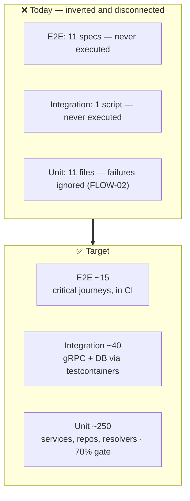

# 08 — Testing & Quality Engineering

**6 findings · 0 Critical · 2 High · 3 Medium · 1 Low**

---

## Current state

| Layer | Files | Lines | Runs in CI | Verdict |
| :--- | ---: | ---: | :---: | :--- |
| Go unit tests | 9 | 2,361 | ⚠️ failures ignored | Thin, and the gate is broken |
| Frontend unit (Vitest) | 2 | ~200 | ✅ | Minimal |
| E2E (Playwright) | 11 | — | ❌ never | Written, unused |
| Integration script | 1 | — | ❌ never | Written, unused |
| Contract tests | 0 | — | — | Absent |
| Load tests | 0 | — | — | Absent |
| Coverage measurement | — | — | ❌ | Absent |

**Ratio:** 2,361 lines of Go test against 21,311 lines of Go source — roughly
11%. Industry norm for services handling authentication, payments, and grading
is 60-80% coverage on the critical paths.



---

## 🟠 TEST-01 — The critical paths are untested

**Severity: High**

Where the 9 Go test files sit:

```
services/api-gateway/graph/resolver_helpers_test.go
services/api-gateway/internal/middleware/auth_test.go
services/auth-service/internal/service/auth_test.go
services/payment-service/internal/handler/handler_test.go
services/ai-service/internal/handler/handler_test.go
services/course-service/internal/service/course_test.go
… + 3 others
```

What has **no test at all**:

| Untested area | Why it matters |
| :--- | :--- |
| `progress-service` — the entire service | Contains all grading, XP, and unlock logic. Zero tests. FLOW-04, FLOW-05, FLOW-08 all live here. |
| `scoreAnswers` / `answersEquivalent` | ~120 lines of fraction/percentage/LaTeX equivalence parsing that decides every student's grade. Completely untested. |
| All repository layers | No DB-level tests in any service. |
| All gRPC handlers | The transport boundary is unverified. |
| PayHere webhook activation | The handler test exists but does not cover the activation path where SEC-06 lives. |
| Gateway resolvers | Only `resolver_helpers`; the 839-line `schema.resolvers.go` is untested. |
| Authorization matrix | No test asserts a student cannot call an educator mutation. |

`answersEquivalent` alone is a compelling case: it is pure, deterministic,
input-output code with well-defined edge cases — the single easiest and highest
value test target in the repository, and it has none.

**Fix — start here, in this order:**

```go
// services/progress-service/internal/service/progress_test.go
func TestAnswersEquivalent(t *testing.T) {
    cases := []struct{ given, expected string; want bool }{
        {"0.5", "1/2", true},
        {".5", "0.50", true},
        {"50%", "0.5", true},
        {"1 1/2", "1.5", true},
        {`\frac{1}{2}`, "0.5", true},
        {"-2 3/4", "-2.75", true},
        {"1/0", "0", false},          // division by zero
        {"", "0.5", false},
        {"Paris", "paris", true},     // case-insensitive text
        {"0.1", "0.2", false},
    }
    // ...
}

func TestScoreAnswers_Rounding(t *testing.T) {
    // 2 of 3 correct must be 67, not 66 — see FLOW-08
}

func TestRecordAttempt_ConcurrentSubmissionsRespectCap(t *testing.T) {
    // fires N goroutines; asserts exactly MaxReattempts succeed — see FLOW-04
}

func TestScoreAnswers_HidesAnswersOnFailedAttemptWithRetriesLeft(t *testing.T) {
    // see FLOW-05
}
```

Then an authorization matrix test at the gateway — one table, every
role × every mutation, asserting allow/deny. That single test would have caught
SEC-01's exposure surface and prevents an entire class of regression.

---

## 🟠 TEST-02 — Existing test assets are never executed

**Severity: High · Cross-referenced as [OPS-04](05-DEVOPS-CICD-IAC.md#-ops-04--tests-that-exist-are-not-run-no-coverage-anywhere)**

Eleven Playwright specs — `login`, `register`, `auth-flow`, `student-flow`,
`student-enrollment`, `student-complete-wave`, `student-ux`, `educator-flow`,
`educator-ux`, `leaderboard`, `profile-pages` — cover exactly the journeys that
matter, and CI never runs any of them. `scripts/integration-test.sh` is
likewise never invoked.

Meanwhile `make go-test` swallows failures (FLOW-02), so even the Go tests that
do run provide no guarantee.

**The net position: this repository currently has no working automated quality
gate.** Every green check on `main` is uninformative.

**Fix.** Fix `make go-test` first (FLOW-02) — until then, nothing else about
testing can be measured. Then add the e2e job from OPS-04. These two changes
convert a decorative pipeline into a real one, and they cost roughly an hour.

---

## 🟡 TEST-03 — No contract testing across service boundaries

**Severity: Medium**

Two contracts are shared across independently deployable units, and neither is
verified:

**(a) Protobuf.** `shared/proto/buf.yaml` exists — so `buf` was considered —
but there is no `buf.gen.yaml`, no `buf lint`, and crucially no
`buf breaking --against '.git#branch=main'`. Generated code is committed
(`shared/proto/gen/go/`) with no CI check that it matches the `.proto` sources.
A developer can edit a `.proto`, forget `make proto-gen`, and CI passes while
the wire format silently diverges.

**(b) GraphQL.** `shared/graphql-schema/schema.graphql` is the frontend/backend
contract. `services/api-gateway/graph/generated.go` is committed with no check
that it is current, and no breaking-change detection on the schema. The
frontend has no generated types from the schema at all — `QuizBlock.tsx` and
friends declare their own hand-written interfaces, which is how a field like
`correctAnswer` ends up available and unnoticed (SEC-01).

**Fix.**
```yaml
- run: buf lint shared/proto
- run: buf breaking shared/proto --against '.git#branch=main,subdir=shared/proto'
- run: make proto-gen && git diff --exit-code shared/proto/gen   # generated code is current
- run: cd services/api-gateway && go run github.com/99designs/gqlgen && git diff --exit-code
- run: npx graphql-inspector diff main:schema.graphql schema.graphql   # breaking-change gate
```
Add GraphQL Codegen to the frontend so its types derive from the schema rather
than being hand-maintained — that makes schema/client drift a compile error.

---

## 🟡 TEST-04 — No load or performance testing

**Severity: Medium**

The README makes specific performance claims — *"Sub-Second Live Demo Ingress"*,
*"~24ms cold-start"*, *"< 1.1GB total memory footprint"* — and none is backed by
a reproducible benchmark in the repository.

Meanwhile PERF-01 indicates a 50-wave course page issues ~700 sequential gRPC
calls. A single k6 script would have surfaced that immediately, and would make
the fix demonstrable with before/after numbers.

**Fix.** Add `tests/load/` with k6 scripts for the three paths that matter:

```js
// tests/load/course-page.js
import http from "k6/http";
import { check } from "k6";

export const options = {
  stages: [{ duration: "30s", target: 20 }, { duration: "1m", target: 20 }, { duration: "30s", target: 0 }],
  thresholds: {
    http_req_duration: ["p(95)<500"],   // matches the SLO in REL-05
    http_req_failed:   ["rate<0.01"],
  },
};

export default function () {
  const res = http.post(`${__ENV.API}/graphql`,
    JSON.stringify({ query: COURSE_WITH_PROGRESS_QUERY, variables: { id: __ENV.COURSE_ID } }),
    { headers: { "Content-Type": "application/json", Cookie: __ENV.COOKIE } });
  check(res, { "200": r => r.status === 200, "no errors": r => !r.json("errors") });
}
```

Scenarios: course page load (PERF-01), concurrent wave submission (FLOW-04
race), and login throughput (SEC-03 rate limiting, once added). Run nightly
against staging with the thresholds as the pass criterion — that makes the SLOs
from REL-05 continuously verified rather than aspirational.

---

## 🟡 TEST-05 — No coverage measurement or ratchet

**Severity: Medium**

`make go-test` runs `go test ./...` with no `-coverprofile` and no `-race`. No
coverage is reported, uploaded, or gated, so there is no signal on whether
testing is improving or decaying.

`-race` is the more urgent omission: it is the standard tool for exactly the
class of bug in FLOW-04, and it costs one flag.

**Fix.**
```makefile
go-test:
	@fail=0; for svc in services/*; do \
		[ -f "$$svc/go.mod" ] && ( cd "$$svc" && \
			go test -race -coverprofile=coverage.out -covermode=atomic ./... ) || fail=1; \
	done; exit $$fail
```
Upload to Codecov, set `target: auto, threshold: 0%` so coverage may not
decrease, and set an explicit floor of 70% on
`services/*/internal/service/**` — the business-logic packages — rather than a
blanket repository number that generated code would distort.

---

## 🔵 TEST-06 — No chaos, DAST, or resilience testing

Untested failure modes: database unavailable, Redis down (does the event bus
degrade or crash?), a gRPC upstream timing out, Gemini returning 429, pod
eviction mid-request, and network partition.

Given REL-13 (no circuit breakers) and REL-03 (readiness always healthy), the
behaviour under each is currently unknown.

**Fix.** Start manually — `docker compose stop redis` and exercise the app; note
what breaks. That five-minute experiment will likely justify REL-13 on its own.
Then add a `chaos` Playwright project that runs the critical journey with one
dependency stopped, asserting graceful degradation rather than a crash. DAST
(OWASP ZAP baseline scan against the staging URL) is a further easy CI addition.

---

## Recommended test strategy

| Priority | Action | Effort | Unblocks |
| :--- | :--- | :--- | :--- |
| **1** | Fix `make go-test` exit status + add `-race` | 15 min | Makes every other test claim meaningful |
| **2** | Unit-test `scoreAnswers`/`answersEquivalent` | 2 h | Grading correctness (FLOW-08) |
| **3** | Wire Playwright into CI | 1 h | Uses 11 specs already written |
| **4** | Authorization matrix test (role × mutation) | 3 h | Prevents SEC-01/SEC-22 class of bug |
| **5** | Coverage reporting + ratchet | 1 h | Prevents decay |
| **6** | Repository tests via testcontainers | 1 d | DB-layer confidence |
| **7** | `buf breaking` + gqlgen drift check | 2 h | Contract safety (TEST-03) |
| **8** | k6 load scripts + thresholds | 1 d | Validates SLOs and PERF-01 fix |

Items 1-3 total under three hours and change the repository from "has no
working quality gate" to "has one". That is the highest-leverage work in this
entire audit.
