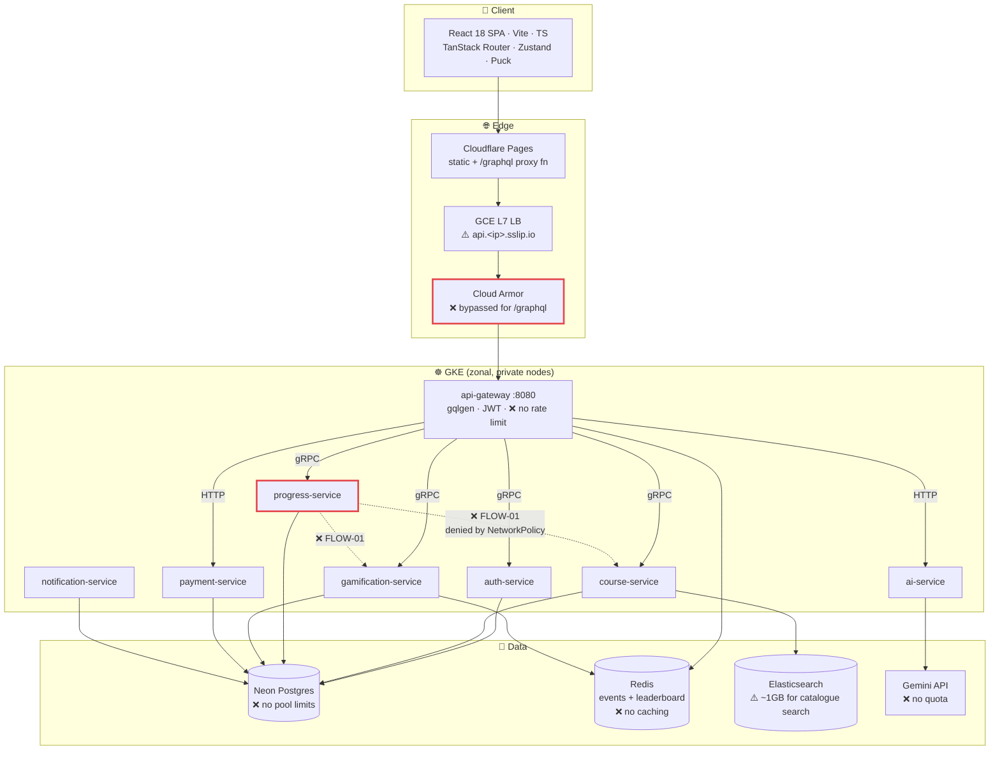
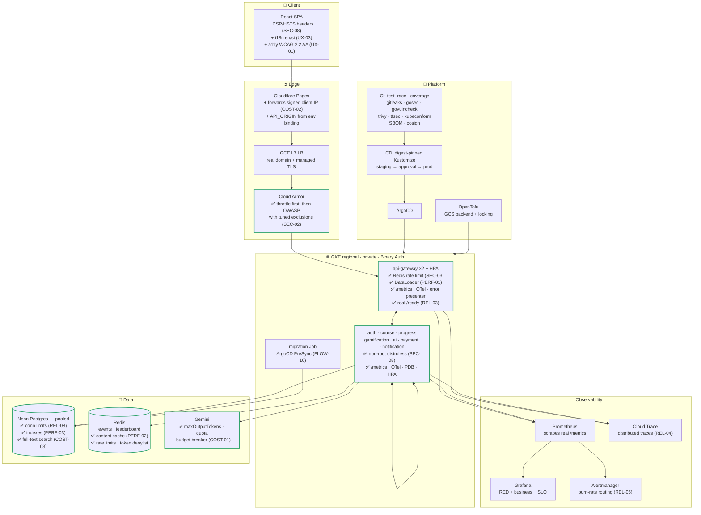
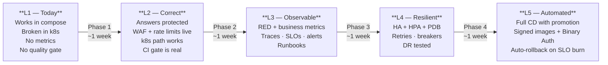

# 09 — Target Production Architecture

> The guiding principle: **make the system smaller and completely honest about
> itself.** Most of what follows removes things or makes existing things real.
> Very little is genuinely new.

---

## Architectural assessment

The bones are good. This is a properly decomposed system with real service
boundaries, a typed gateway, generated protobuf contracts, server-side
authoritative grading, enforced resource ownership, default-deny networking,
and infrastructure as code. That is a stronger foundation than most projects at
this scale ever build.

The problem is a consistent pattern: **components exist but are not wired to
do their job.**

| Component | Present | Functional |
| :--- | :---: | :---: |
| Prometheus + Grafana + alert rules | ✅ | ❌ no metrics exist (REL-01) |
| Cloud Armor WAF + rate limit | ✅ | ❌ bypassed for `/graphql` (SEC-02) |
| ArgoCD GitOps | ✅ | ❌ tracks `:latest`, never drifts (REL-06) |
| NetworkPolicies | ✅ | ❌ deny a required call path (FLOW-01) |
| Playwright e2e suite | ✅ | ❌ never runs (TEST-02) |
| Go test suite | ✅ | ❌ failures ignored (FLOW-02) |
| SQL migrations | ✅ | ❌ nothing applies them (FLOW-10) |
| Payment / subscriptions | ✅ | ❌ grants no entitlement (FLOW-06) |
| Helm chart | ✅ | ❌ templates only a ConfigMap (OPS-10) |
| `upload/user/content-service` | ⚠️ stubs | ❌ never built or deployed (FLOW-09) |

Closing that gap — rather than adding anything — is what turns this into a
system worth showcasing. **A reviewer is far more impressed by five things that
provably work than by twelve that are declared.**

---

## Current architecture (as actually built)



---

## Target architecture



Note what is **not** in the target: no service mesh, no Kafka, no CQRS, no
multi-region, no new services. Elasticsearch is removed, three stub services are
removed, and the Helm chart is replaced by Kustomize. The target is a *smaller*
system.

---

## Request flow: wave submission (target)

The most important path in the product, with every fix applied:

```mermaid
sequenceDiagram
    autonumber
    participant S as Student
    participant CF as Pages proxy
    participant A as Cloud Armor
    participant G as api-gateway
    participant R as Redis
    participant P as progress-service
    participant C as course-service
    participant X as gamification-service
    participant D as Neon Postgres

    S->>CF: submitWaveAnswers(waveID, answers, submissionId)
    CF->>CF: set signed x-studed-client-ip (COST-02)
    CF->>A: POST /graphql
    A->>A: rate limit (priority 900) → OWASP rules (SEC-02)
    A->>G: forward
    G->>G: verify JWT: sig, exp, iss, aud, type=access (SEC-13)
    G->>R: GET revoked:{jti} (SEC-04)
    G->>R: INCR ratelimit:{userID} (SEC-03)
    G->>P: RecordAttempt(userID, waveID, answers, submissionId)

    rect rgb(24,40,32)
        Note over P,D: One transaction — atomic, idempotent (FLOW-04)
        P->>D: BEGIN; SELECT … FOR UPDATE
        P->>D: idempotency check on submissionId
        P->>C: GetWaveGraph(courseID)  [Redis-cached, PERF-02]
        C-->>P: wave + lesson + course graph
        P->>P: scoreAnswers — rounded (FLOW-08)
        P->>D: INSERT wave_attempts
        P->>X: CalculateAndAwardXp
        X->>D: INSERT xp_history (unique index guards duplicates)
        P->>D: COMMIT
    end

    P-->>G: score, passed, remainingAttempts,<br/>feedback (answers hidden unless<br/>passed or no attempts left — FLOW-05)
    G->>R: PUBLISH wave.completed, leaderboard.updated
    G-->>S: WaveResult

    Note over G,X: every hop emits OTel spans + RED metrics (REL-01, REL-04)
```

---

## Architectural decisions to record

Each of these should become a short ADR in `docs/DECISIONS/`. Writing them down
is itself a mark of engineering maturity — and it converts several audit
findings into deliberate, defensible choices.

| ADR | Decision | Rationale |
| :--- | :--- | :--- |
| 001 | Postgres full-text search **instead of** Elasticsearch | Saves ~1GB RAM and a stateful service; catalogue scale does not justify ES (COST-03) |
| 002 | Kustomize **instead of** Helm | ArgoCD-native, no templating language, explicit env diffs; removes the dual-mechanism ambiguity (OPS-10) |
| 003 | Remove `upload/user/content-service` stubs | Never built or deployed; the diagram must match reality (FLOW-09) |
| 004 | Redis for cache, rate limits, token denylist, and events | One dependency serving four needs; already deployed (SEC-03, SEC-04, PERF-02) |
| 005 | Digest-pinned images with GitOps promotion | Rollback, reproducibility, real drift detection (REL-06) |
| 006 | JWT + Redis denylist **instead of** stateful sessions | Keeps the stateless gateway; adds revocation for ~0.2ms per request (SEC-04) |
| 007 | Zonal vs regional GKE | If zonal is kept for cost, state the availability implication explicitly (REL-02) |
| 008 | Server-authoritative grading; answers never leave the server pre-submission | The product's integrity depends on it (SEC-01, FLOW-05) |
| 009 | `golang-migrate` for every service; no `AutoMigrate` | Versioned, reviewable, reversible schema changes (FLOW-10) |
| 010 | SLOs: 99.5% availability, p95 < 500ms | Makes reliability measurable rather than aspirational (REL-05) |

---

## Scope boundary — deliberately excluded

Adding any of these would make the project worse against its stated goals.
Record the exclusion; do not build them.

| Excluded | Why |
| :--- | :--- |
| Service mesh (Istio/Linkerd) | NetworkPolicies + gRPC interceptors already cover auth, timeouts, and (once added) retries at a fraction of the operational cost |
| Kafka / event streaming | Redis Pub/Sub is sufficient for the two real-time features; Kafka would add a stateful cluster for no benefit |
| CQRS / event sourcing | The domain is CRUD with a progression rule; the complexity would be unjustified |
| Multi-region / active-active | The audience is single-country; regional GKE is more than enough |
| Microfrontends | One SPA, one team |
| Separate read replicas | Caching (PERF-02) solves the read load far more cheaply |
| More microservices | Eight is already generous for the domain; three stubs are being removed, not completed |

---

## Maturity progression



**L3 is the demo target.** A system that is correct, observable, and provably
tested — with a Grafana dashboard showing live traffic during the presentation
and a trace waterfall explaining a request — demonstrates more engineering
judgement than one with more features and no evidence.
