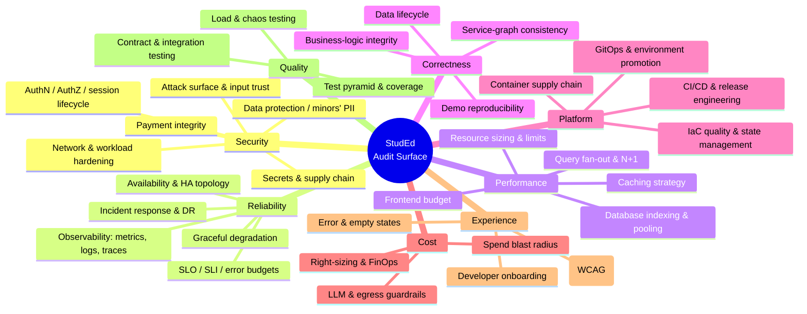

# StudEd — Enterprise Production-Readiness Audit

> A critical, evidence-based review of the StudEd platform against enterprise
> production standards: security, reliability/SRE, performance, correctness,
> DevOps/platform engineering, cost, testing, and experience.
>
> **Audit date:** 2026-08-06 · **Commit:** `8ab6b94` · **Branch:** `main`
> **Scope:** 21,311 LOC Go (11 services) · 17,464 LOC TypeScript/React · IaC (OpenTofu, Helm, K8s) · CI/CD · Monitoring stack

---

## How to read this audit

Every finding has a stable ID (`SEC-01`, `REL-01`, …), a severity, concrete
file/line evidence, an explanation of *why it matters in production*, and a
prescribed fix. Nothing here is speculative — each item was verified against
the source in this repository.

| Doc | Domain | Findings |
| :--- | :--- | :--- |
| [00-EXECUTIVE-SUMMARY.md](00-EXECUTIVE-SUMMARY.md) | Verdict, scorecard, top 10, roadmap | — |
| [01-SECURITY.md](01-SECURITY.md) | AuthN/Z, attack surface, data protection, supply chain | 23 |
| [02-RELIABILITY-SRE.md](02-RELIABILITY-SRE.md) | Observability, HA, SLOs, incident response | 15 |
| [03-PERFORMANCE-SCALABILITY.md](03-PERFORMANCE-SCALABILITY.md) | N+1s, caching, indexes, resource sizing | 8 |
| [04-CORRECTNESS-FLOWS.md](04-CORRECTNESS-FLOWS.md) | Business-logic flaws, demo-readiness | 12 |
| [05-DEVOPS-CICD-IAC.md](05-DEVOPS-CICD-IAC.md) | Pipelines, GitOps, IaC, platform engineering | 11 |
| [06-COST.md](06-COST.md) | FinOps, spend blast radius, guardrails | 5 |
| [07-EXPERIENCE-UX-DX.md](07-EXPERIENCE-UX-DX.md) | Accessibility, error UX, developer onboarding | 7 |
| [08-TESTING-QUALITY.md](08-TESTING-QUALITY.md) | Test pyramid, contracts, load, coverage | 6 |
| [09-ARCHITECTURE-TARGET.md](09-ARCHITECTURE-TARGET.md) | Target production architecture + diagrams | — |
| [10-FRONTEND-VISUAL-DESIGN.md](10-FRONTEND-VISUAL-DESIGN.md) | Rendered UI: theme, colour, typography, layout (browser-driven) | 13 |
| [TODO.md](TODO.md) | **Consolidated, prioritised action checklist** | 77 |

---

## Severity model

| Severity | Definition | Response |
| :--- | :--- | :--- |
| 🔴 **Critical** | Actively exploitable, causes data/integrity/financial loss, or the system provably does not work as claimed | Fix before any public demo or launch |
| 🟠 **High** | Serious production risk; will cause an incident under real load or real users | Fix before launch |
| 🟡 **Medium** | Meaningful gap vs. industry best practice; increases MTTR, cost, or risk | Fix in the first hardening iteration |
| 🔵 **Low** | Polish, hygiene, or defence-in-depth | Backlog |

---

## Audit surface

The scan deliberately covered a wide surface. Every dimension below was
examined against the actual repository, not against the documentation.

---

## Methodology

1. **Static review** of all Go services, the GraphQL gateway and schema, the
   React frontend, every Kubernetes manifest, the OpenTofu modules, the Helm
   chart, the CI workflow, the Prometheus/Grafana stack, and the Cloudflare
   Pages function.
2. **Trust-boundary tracing** — every path from an untrusted client to a
   privileged action was followed end to end.
3. **Claim verification** — statements in `README.md`, `DEPLOYMENT.md`, and
   `docs/` were checked against what the code actually does. Several did not
   survive.
4. **Best-practice comparison** — OWASP ASVS / API Top 10, CIS Kubernetes
   Benchmark, Google SRE workbook, Twelve-Factor, SLSA, WCAG 2.2 AA.

---

## Guiding constraint

The stated goal is a project that is **simple, demonstrable, and architecturally
excellent** — not one that is complex. This audit therefore separates:

- **Must fix** — things that are broken, insecure, or misrepresented. These
  *reduce* complexity when fixed, because they remove fiction from the system.
- **Should add** — the small number of genuinely load-bearing additions
  (metrics, rate limiting, HA, CD) that turn a demo into a production system.
- **Explicitly out of scope** — service mesh, multi-region, event sourcing,
  and similar. Adding these would hurt the project, not help it.

Excellence here means *a smaller system that is completely honest about
itself and provably correct*, not a bigger one.
