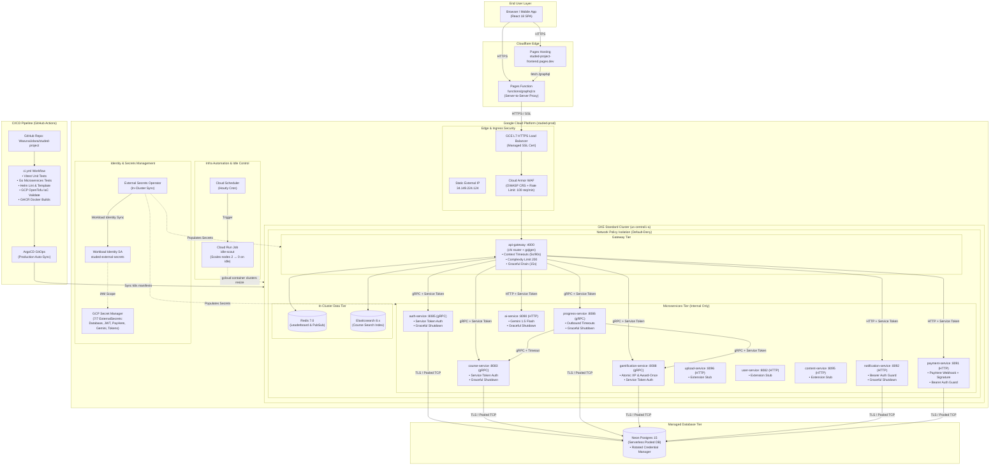

# StudEd Production Architecture

End-to-end architecture of the live StudEd deployment (GCP backend, Cloudflare frontend, Neon Postgres).

## Full GCP Architecture Diagram

## Component Inventory

| Component | Architecture Role | Security & Reliability Controls |
| :--- | :--- | :--- |
| **GKE Standard Cluster** | Private zonal cluster (`us-central1-a`) hosting 9 microservices | NetworkPolicies default-deny, Shielded VMs, Workload Identity |
| **GCE HTTPS Load Balancer** | Ingress termination with Google-managed TLS & static IP | Managed TLS, Cloud Armor WAF attachment, SSL redirect |
| **Cloud Armor WAF** | Web application firewall & DDoS mitigation | OWASP CRS rules, 100 req/min IP rate limit, GraphQL pass rule |
| **GCP Secret Manager** | Centralized secrets storage (7 ExternalSecrets) | KMS encrypted, zero hardcoded cluster credentials, Workload Identity sync |
| **Neon Postgres 15** | Serverless PostgreSQL database | Connection pooling, rotation tooling (`rotate-neon-password`), SSL mode |
| **Cloudflare Pages & Functions** | Front-end static distribution & same-origin GraphQL proxy | Server-to-server TLS proxying, zero public origin exposure |
| **Idle-Scout (Cloud Run)** | Operational cost control automation | Scales node pool to 0 after 2h idle; preserves cluster state |
| **GitHub Actions & ArgoCD** | Declarative CI/CD & GitOps engine | Vitest, Go unit tests, GCP OpenTofu IaC validation, Helm lint |

## Core Architectural Guarantees

1. **Defense-in-Depth Network Isolation**: Default-deny NetworkPolicies restrict pod communication so that microservices are reachable strictly via `api-gateway` or explicitly permitted inter-service gRPC paths.
2. **Strict Service-to-Service Authentication**: All internal calls carry a cryptographically random shared service token verified via gRPC interceptors and HTTP middleware.
3. **Outbound Resilience & Drain**: Every outbound gRPC and HTTP client call enforces a strict context timeout (3s-5s for standard RPCs, 90s for AI generation). All services implement `signal.NotifyContext` graceful SIGTERM draining.
4. **XP & Gamification Integrity**: XP increments execute atomically (`UPDATE ... SET xp = xp + $1`), guarded by single-completion checks on wave attempts to eliminate race conditions and farming.
5. **Continuous Verification (CI/IaC)**: The automated CI pipeline validates GCP OpenTofu IaC configurations, runs Vitest frontend unit tests, executes Go service test suites, and lints Helm manifests on every commit.
