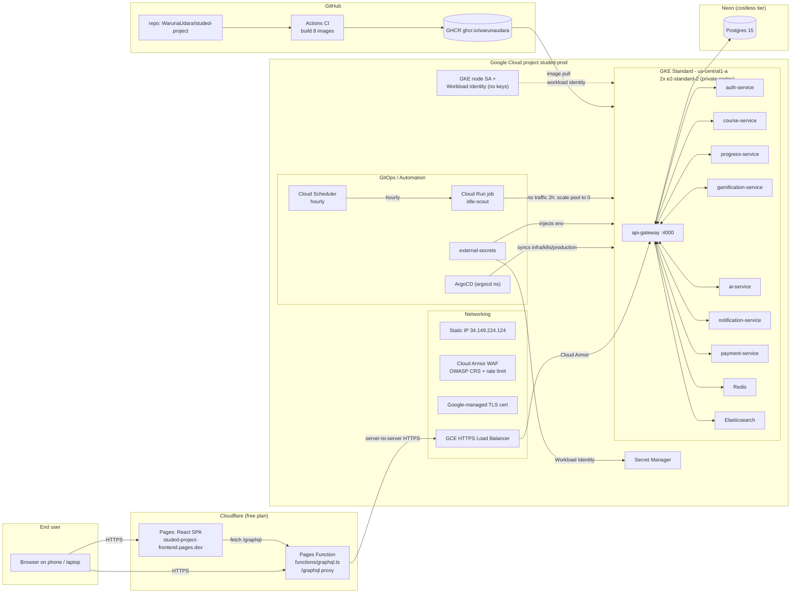

# StudEd Production Architecture

End-to-end architecture of the live StudEd deployment (GCP backend, Cloudflare
frontend, Neon Postgres).

## Diagram

## Component inventory

| Component | What it is | Cost (USD/mo) |
| :--- | :--- | :--- |
| GKE Standard cluster | Private zonal cluster, control plane free on Standard | $0 |
| GKE nodes | 2x `e2-standard-2` (8 vCPU / 16 GB total) | ~$0.105/h (~$75/mo running 24/7) |
| GCE HTTPS Load Balancer | L7 ingress + static IP + managed cert | ~$18/mo while provisioned |
| Cloud Armor | OWASP CRS + rate limiting | ~$5/mo |
| Cloud NAT | egress for private nodes | ~$0.5/mo |
| Secret Manager | 7 secrets, low access | free tier |
| Cloud Scheduler + Cloud Run job | idle-scout auto scale-down | ~$0 (free tier) |
| Neon Postgres | costless tier | $0 |
| Cloudflare Pages | SPA + GraphQL proxy function | $0 |
| GitHub Actions + GHCR | CI image builds | $0 (public repo) |
| Redis + Elasticsearch | in-cluster, on GKE nodes | included in node cost |

## Data flow (request path)

1. Browser loads the SPA from Cloudflare Pages (no backend involved).
2. The SPA calls `/graphql` (same origin). The Pages Function
   `functions/graphql.ts` forwards the request server-to-server to
   `https://api.34.149.224.124.sslip.io/graphql`.
3. The GCE load balancer terminates TLS (managed cert), Cloud Armor evaluates
   the WAF policy (`/graphql` allow-listed to avoid the SQLi false positive;
   rate limit still applies), and routes to the `api-gateway` pod.
4. `api-gateway` (gqlgen) authenticates via the HttpOnly `access_token` cookie
   (passed through the proxy unchanged), calls the relevant gRPC service,
   which reads/writes Neon Postgres.
5. Auth cookies set by the gateway flow back through the proxy to the browser.

## Auth flow

- `register` / `login` set two HttpOnly cookies: `access_token` (15 min) and
  `refresh_token` (7 days), `SameSite=Lax`, `Path=/`.
- `refreshToken` reads the refresh cookie and issues a new access cookie.
- The frontend `authExchange` detects "unauthorized" errors and calls
  `refreshToken` automatically.
- Cookies are `Secure: false` but work over HTTPS; the browser only ever talks
  to the frontend origin (the proxy is same-origin), so SameSite=Lax is fine.

## Security posture

- **No keys in the cluster**: GKE nodes use the attached `studed-gke-node` SA;
  external-secrets uses Workload Identity (`studed-external-secrets`) to read
  Secret Manager with `secretmanager.secretAccessor` scoped per secret.
- **Least-privilege IAM**: node SA has only image-pull + logging/monitoring;
  the idle-scout SA has a custom role limited to `container.clusters.update`
  plus `monitoring.viewer`.
- **Private nodes** behind Cloud NAT; control-plane API locked to
  `authorized_cidrs` (only the admin's public IP).
- **WAF**: OWASP CRS SQLi/XSS/LFI/protocol-attack rules + per-IP rate limit,
  with a narrow allow rule for the GraphQL path.
- **Shielded VMs**: secure boot, integrity monitoring on all nodes.
- **GitOps**: nothing is applied by hand in prod; ArgoCD reconciles
  `infra/k8s/production` from `main` (auto-sync, prune, self-heal).

## CI / GitOps

- **CI** (`.github/workflows/ci.yml`): on push to `main` / tags / `services/**`
  it builds all 8 microservice images to GHCR (`ghcr.io/warunaudara/studed-*`).
  Image tags: `latest`, `main`, and `sha-<commit>`.
- **ArgoCD** (`infra/k8s/argocd/application-production.yaml`): points at
  `infra/k8s/production` in the repo, auto-syncs on push. Submodule recursion
  is disabled because a nested gitlink under `submodules/math-to-manim` breaks
  manifest generation.

## Cost-saving automation

- **Idle-scout** (hourly Cloud Scheduler → Cloud Run job): queries the load
  balancer's `https/request_count` metric; if there is no traffic for 2 hours
  it scales the node pool to **0** (stops ~$75/mo of node cost). Wake up with
  `make prod-start`.
- **Manual standby**: `make prod-stop` / `make prod-start` (OpenTofu
  `-var node_count=0/2` keeps state consistent).
- **Full teardown**: `make prod-destroy` (`tofu destroy` + Pages project
  delete). Audit with `make prod-teardown-audit`.

## What's deliberately not here

- No Cloud SQL (Neon is the DB) - no DB admin overhead.
- No Artifact Registry for the app images (GHCR is free for public repos).
- No regional cluster / HA (a single-zone Standard cluster is ~half the price
  and plenty for the demo; the free-trial credit covers everything).
- No monitoring stack inside the cluster (GKE + Cloud Monitoring free tier
  cover the demo; Prometheus/Grafana exist for dev via docker-compose).
