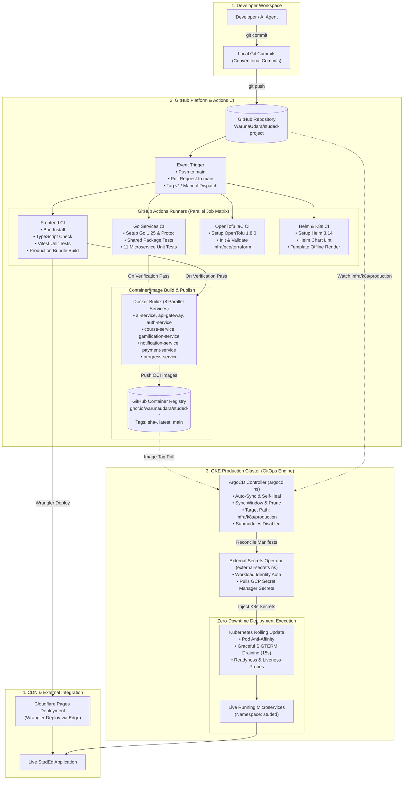

# Enterprise DevOps CI/CD & GitOps Pipeline Architecture

This document specifies the end-to-end continuous integration, continuous delivery (CI/CD), and GitOps architecture powering the **StudEd** educational platform.

---

## 1. CI/CD & GitOps Pipeline Flowchart

---

## 2. Pipeline Stages & Verification Matrix

| Stage | Trigger / Scope | Command / Tooling | Success Criteria |
| :--- | :--- | :--- | :--- |
| **Local Pre-Flight** | Pre-commit / Pre-PR | `make ci-local` | Typecheck, Vitest, Go tests, Helm lint, OpenTofu validate pass |
| **Frontend CI** | PR & Main branch | `bun run typecheck`, `bun run test --run`, `bun run build` | 0 TypeScript errors, 27/27 Vitest unit tests pass, bundle built |
| **Go Microservices CI** | PR & Main branch | `make shared-test`, `make go-test` | 100% Go test package pass across all 11 microservices |
| **OpenTofu IaC CI** | PR & Main branch | `cd infra/gcp/terraform && tofu validate` | OpenTofu configuration schema valid |
| **Kubernetes / Helm CI**| PR & Main branch | `helm lint`, `helm template` render | 0 Helm chart syntax errors, valid manifest generation |
| **Container Build** | Main branch / Tag | `docker/build-push-action@v6` | Multi-stage Docker build success, image pushed to GHCR |
| **GitOps Reconcile** | Post image publish | ArgoCD Application (`studed-production`) | Kubernetes cluster syncs desired state from `infra/k8s/production` |
| **Zero-Downtime Rollout**| Cluster sync | Kubernetes RollingUpdate | SIGTERM drain window allows zero dropped in-flight requests |

---

## 3. Key Pipeline Guarantees & Industrial Controls

1. **Strict Automated Pre-Flight Gate (`make ci-local`)**: Developers can execute the identical verification suite locally before creating pull requests.
2. **Immutable OCI Artifacts (GHCR)**: Service containers are tagged with the exact Git commit SHA (`sha-<commit>`) ensuring total auditability and reproducible rollbacks.
3. **Submodule-Safe GitOps Rendering**: ArgoCD `reposerver` explicitly disables recursive git submodule expansion (`reposerver.enable.git.submodule=false`) to prevent nested repository links (such as `submodules/math-to-manim`) from breaking manifest rendering.
4. **Secretless CI/CD Pipeline**: GitHub Actions does not store long-lived Cloud SQL or GKE credentials; workload deployments are handled pull-style by in-cluster ArgoCD via Workload Identity.

