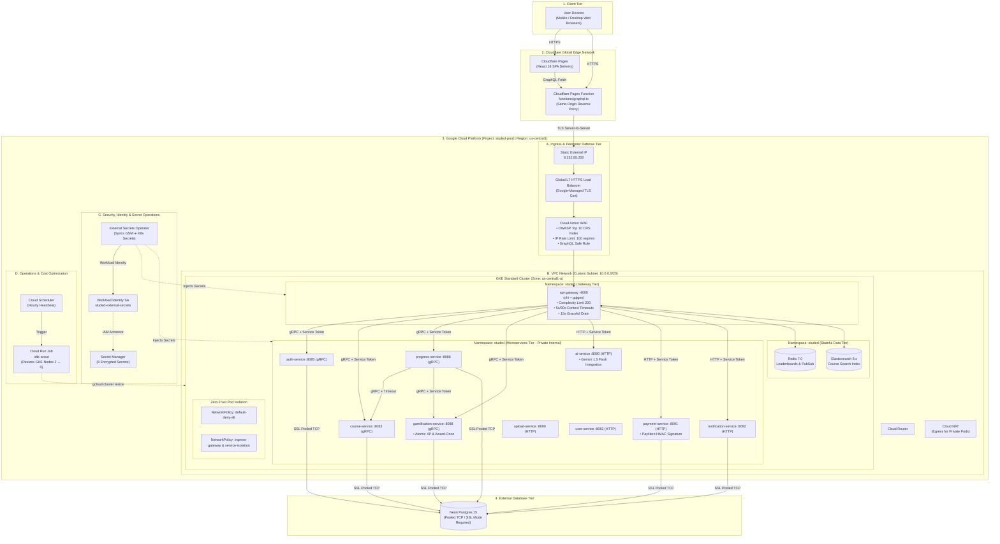

# GCP Cloud Architecture & Icon Mapping Specification

This document provides an enterprise-grade architectural specification for the **StudEd** production environment on **Google Cloud Platform (GCP)**. It is structured to serve as both an authoritative technical reference and a direct blueprint for generating official GCP architecture diagrams in tools like **Draw.io**, **Lucidchart**, **Excalidraw**, **Eraser.io**, **Cloudcraft**, or Python's `diagrams` module.

---

## 1. Official GCP Service Icon & Tooling Mapping

When rendering this architecture in visual diagramming tools, use official Google Cloud Architecture Icons (v2024+) with the following mapping:

| Logical Component | Official GCP Service / Symbol | Category / Shape | Official Color Code |
| :--- | :--- | :--- | :--- |
| **GCP Project Boundary** | GCP Project | Container / Boundary | `#4285F4` (Google Blue) |
| **GCP Region & Zone** | `us-central1` / `us-central1-a` | Sub-boundary | `#E8EAED` (Light Gray) |
| **VPC Network & Subnet** | Virtual Private Cloud (VPC) | Network Boundary | `#34A853` (Google Green) |
| **Public External IP** | Compute Engine Static External IP | Network Endpoint | `#EA4335` (Google Red) |
| **HTTPS Load Balancer** | Cloud Load Balancing (Global L7) | Networking / Traffic | `#4285F4` (Google Blue) |
| **Managed TLS Certificate** | Certificate Manager / SSL | Security | `#FBBC05` (Google Yellow) |
| **WAF & Rate Limiter** | Cloud Armor | Security / Defense | `#EA4335` (Google Red) |
| **Kubernetes Cluster** | Google Kubernetes Engine (GKE) | Compute | `#4285F4` (Google Blue) |
| **Private Worker Nodes** | Compute Engine Virtual Machines (`e2-standard-2`) | Compute | `#4285F4` (Google Blue) |
| **Outbound Internet Egress** | Cloud NAT & Cloud Router | Networking | `#34A853` (Google Green) |
| **Secrets Repository** | Secret Manager | Security & Identity | `#FBBC05` (Google Yellow) |
| **Identity / Service Account** | IAM & Admin / Workload Identity | Security | `#FBBC05` (Google Yellow) |
| **Cost Optimization Cron** | Cloud Scheduler | Management Tools | `#4285F4` (Google Blue) |
| **Automated Resizing Job** | Cloud Run Jobs (`idle-scout`) | Compute / Serverless | `#4285F4` (Google Blue) |
| **Managed Relational DB** | Neon Serverless Postgres 15 (External) | Database | `#34A853` (Google Green) |
| **Edge CDN & Proxy** | Cloudflare Pages & Workers/Functions | External Edge | `#F38020` (Cloudflare Orange) |

---

## 2. Structural Layer-by-Layer Architecture

---

## 3. Detailed Component Technical Specifications

### Tier 1: External Edge & Ingress Security
- **Cloudflare Pages & Functions**: Delivers static asset bundle globally with sub-50ms latency. The server-to-server proxy (`functions/graphql.ts`) hides backend origin IPs and eliminates CORS constraints by proxying same-origin `/graphql` calls over TLS.
- **Google Cloud Armor WAF**: Applies pre-configured OWASP Core Rule Set (CRS) for SQL Injection (SQLi), Cross-Site Scripting (XSS), Local File Inclusion (LFI), and Remote Code Execution (RCE). Enforces an IP-level rate limit of 100 requests/minute.
- **GCE L7 Global HTTPS Load Balancer**: Handles TLS termination with Google-managed certificates (`studed-api-cert`), directing clean traffic to GKE NodePort services.

### Tier 2: GKE Compute & Microservice Mesh
- **GKE Standard Cluster**: Zonal private cluster in `us-central1-a` running two `e2-standard-2` nodes (8 vCPUs, 16 GB RAM total). Private node IPs eliminate direct internet attack surface. Outbound internet connectivity flows through Cloud NAT.
- **Default-Deny Pod Isolation**: Kubernetes `NetworkPolicy` objects block all inter-pod traffic by default. Specific policies allow ingress strictly from `api-gateway` to microservices and required gRPC channels (e.g. `progress-service` ➔ `course-service`).
- **Resilient Microservice Design**:
  - **Context Timeouts**: Outbound gRPC and HTTP client calls enforce 3s–5s deadlines for standard RPCs and 90s for AI generation.
  - **Graceful Draining**: Signal interceptors (`signal.NotifyContext`) handle `SIGTERM` on deploys, allowing a 15-second drain window before process termination.
  - **Service-to-Service Auth**: Internal gRPC and HTTP APIs validate a cryptographically random shared service token passed via metadata headers (`Authorization: Bearer <token>`).

### Tier 3: Identity & Secrets Management
- **GCP Secret Manager**: Stores 8 encrypted production secrets (`database-url`, `jwt-access-secret`, `jwt-refresh-secret`, `service-token`, `gemini-api-key`, `payhere-merchant-id`, `payhere-merchant-secret`, `payhere-notify-url`).
- **Workload Identity Integration**: Eliminates long-lived GCP service account keys inside Kubernetes. The `studed-external-secrets` Kubernetes service account maps directly to GCP IAM role `roles/secretmanager.secretAccessor`.
- **External Secrets Operator**: Continuously syncs GCP Secret Manager entries into native Kubernetes `Secret` resources in namespace `studed`.

### Tier 4: Automated Cost Control Architecture
- **`idle-scout` Engine**: An automated Cloud Run Job triggered hourly by Cloud Scheduler. It inspects GCP Cloud Monitoring metrics for frontend/backend HTTP request volume over the past 2 hours.
- **Auto-Standby & Wake**: If zero traffic is detected for 2 hours, `idle-scout` resizes the GKE node pool from `2` ➔ `0`, saving ~90% of operational node costs while preserving cluster state.
