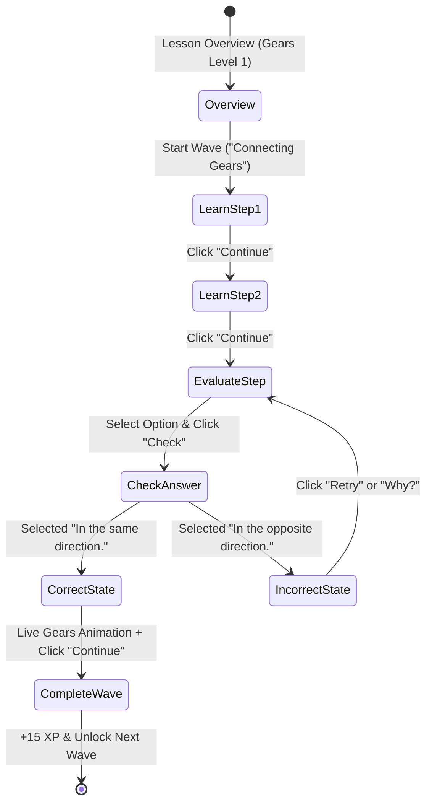

# Scientific Thinking: Connecting Gears & Mechanism Waves Specification

## 1. Overview & Pedagogical Goal

The **Scientific Thinking** curriculum teaches physics, mechanics, and computational modeling through tactile, visual puzzles. 

The first foundational topic is **Level 1: Gears (Connecting Gears)**. Learners explore the physical laws governing gear trains:
1. **Adjacent Gears Inversion**: When two gears mesh, they must rotate in opposite directions ($\omega_1 \cdot \omega_2 < 0$).
2. **Chain Parity Principle**: In a chain of $N$ simple gears, the $N$-th gear rotates in:
   - The **same direction** as the first gear if $N$ is **odd** ($N=3, 5, 7 \dots$).
   - The **opposite direction** as the first gear if $N$ is **even** ($N=2, 4, 6 \dots$).
3. **Idler Gear Role**: An intermediate gear changes the direction of rotation without altering the overall gear ratio.

---

## 2. Mascot & UX Persona

- **Blob Mascot**: Our friendly green StudEd companion accompanies the student on every screen:
  - Peeking from the bottom-left corner during Learn steps.
  - Floating above the glowing wave pedestal on the course overview.
  - Delivering speech bubbles (`"That's it!"`, `"Think about the middle gear!"`) during evaluations.

---

## 3. Wave Structure & Flow

### Step 1: Learn Block 1 — Introduction to Connecting Gears
- **Visual**: 3 meshed 3D gears (Yellow, Teal, Grey) actively rotating in gear mesh harmony, driven by hand.
- **Title**: `Connecting Gears`
- **Text**: `"Let's use intuition to predict the behavior of a chain of gears."`
- **Action**: `"Continue"` button advances to Step 2.

### Step 2: Learn Block 2 — Core Principle of Adjacent Gears
- **Visual**: 2 meshed gears (Yellow and Teal) with radius reference lines.
- **Teaching Text**: `"Adjacent gears in a chain rotate in opposite directions."`
- **Action**: `"Continue"` button advances to the Evaluate Block.

### Step 3: Evaluate Block — 3-Gear Chain Prediction
- **Question**: `"When the yellow gear is turned in one direction, which way does the blue gear turn?"`
- **Visual**: 3 connected gears (Yellow Gear with Counter-Clockwise rotation indicator $\curvearrowleft$, Grey center idler gear, Blue right gear).
- **Options**:
  - `In the same direction.` *(Correct)*
  - `In the opposite direction.` *(Incorrect)*
- **Interactive Check & Physics Simulation**:
  - When the student selects `In the same direction.` and clicks **Check**:
    1. The gears immediately start **rotating in realistic synchronized motion**:
       - Yellow gear spins $\curvearrowleft$ (Counter-Clockwise)
       - Grey gear spins $\curvearrowright$ (Clockwise)
       - Blue gear spins $\curvearrowleft$ (Counter-Clockwise)
    2. Blob Mascot appears at bottom-left with speech bubble `"That's it!"`.
    3. Confetti and $+15\text{ XP}$ reward awarded.
    4. `"Why?"` button opens the detailed mechanical explanation modal.
    5. `"Continue"` button advances to the next wave (`Gears Changing Speeds`).

---

## 4. Technical Architecture

- **`GearTrainSvg.tsx`**: High-performance SVG component that calculates trigonometric gear tooth profiles:
  $$x(\theta) = r \cdot \cos(\theta), \quad y(\theta) = r \cdot \sin(\theta)$$
  with synchronized Framer Motion continuous rotation (`transform: rotate(...)`).
- **`ScienceGearsWave.tsx`**: Self-contained interactive wave component supporting multi-step transitions, live physics activation, Blob Mascot animations, and full Dark/Light mode theme adaptation.
