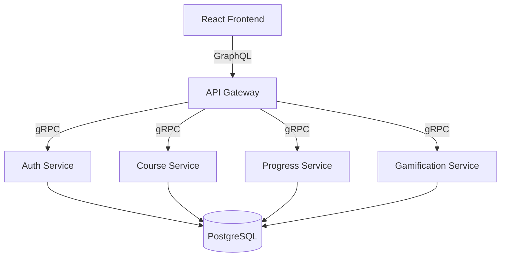

# Takeover Developer Directive: StudEd Platform Engineering

You are taking over the development of **StudEd**, a production-grade active-learning platform built for local (Sri Lankan G.C.E. O/L & A/L) and global students. This platform is modeled after **Brilliant.org**, focusing on interactive lesson blocks, real-time gamification feedback loops, and dynamic grading.

Your objective is to drive the platform to production readiness, implement all remaining MVP Phase 2 features, fix existing architectural gaps, and maintain code quality and test compliance.

---

## 1. Current Architecture & Tech Stack

StudEd is built using a microservices architecture communicating via **gRPC** and coordinated through an **API Gateway** exposing a **GraphQL** interface.



### Backend Microservices (Go)
* **API Gateway (`services/api-gateway`)**: Exposes the unified GraphQL schema (`graph/schema.graphqls`) using `gqlgen`. Proxies requests to internal services via gRPC clients.
* **Auth Service (`services/auth-service`)**: Handles user registrations, logins, JWT signing/token validation, and profile storage via GORM.
* **Course Service (`services/course-service`)**: Manages courses, lessons, and wave structures.
* **Progress Service (`services/progress-service`)**: Logs student wave submissions, computes scores, and manages course completion stats.
* **Gamification Service (`services/gamification-service`)**: Tracks XP, streaks, levels, and user achievements.

### Infrastructure Containers (`docker-compose.yml`)
* **PostgreSQL** (`port 5433` locally, standard inside docker network): Stores database tables for Go services.
* **Redis** (`port 6379`): Serves as caching layer and pub/sub broker for gateway operations.
* **Elasticsearch** (`port 9200`): Provisions advanced full-text search capability.

### Frontend Web App (React + Vite)
* Styled with **Vanilla CSS** and customized Tailwind components.
* Uses **TanStack Router** for nested routing.
* Managed with **Zustand** for global client states (Auth, UI Preferences, Pomodoro focus states).
* Uses **urql** as the GraphQL client layer.

---

## 2. Conversation History & Git Workflow

### Project Management Rule
We utilize a strict **modular git commit policy** and **GitHub CLI (`gh`)** workflow.
1. **Version Control**: Break down features into modular blocks. Avoid monolithic commits.
2. **Commit Increments**: Always group edits by concerns (e.g. `feat(backend): ...`, `fix(frontend): ...`, `test(e2e): ...`).
3. **GitHub Issues**: Manage features by creating issues with `gh issue create`, tracking them, and closing them with `gh issue close` upon merging.

### Workflow Example
```bash
# Create an issue
gh issue create --title "Implement search in course service" --body "Forward search query to database repository" --label "priority:high,backend"

# Work on files, then commit incrementally
git add services/course-service/
git commit -m "feat(course): add search filter mapping to protobuf and repository layer"

# Close the issue
gh issue close <issue-number>
```

---

## 3. Inconsistencies, Bugs, & Backlog Gaps

Review the code and fix the following gaps:

### A. The Search Filtering Inconsistency
* **Issue**: The GraphQL schema supports a `search` string filter inside `CourseFilter`. The API Gateway parses it, but the course gRPC service protobuf (`ListCoursesRequest`) ignores the search string. The database repository has no text search capabilities.
* **Elasticsearch Gap**: `docker-compose.yml` spins up an Elasticsearch container, but **no Go service is wired to it**.
* **Task**: Update `shared/proto/course/course.proto` to include a search string in `ListCoursesRequest`. Regenerate proto files (`make proto-gen`). Implement SQL `LIKE` or Elasticsearch querying inside `course-service/internal/repository/course.go`.

### B. AI-Driven Resolvers (Stub State)
* **Issue**: The GraphQL schema defines AI mutations (`generateLearnBlocks`, `generateEvaluateBlocks`, `translateContent`). Currently, they return static stubs or mock data.
* **Task**: Integrate a lightweight client calling Ollama, Gemini, or a structured OpenAI wrapper to generate interactive JSON question blocks dynamically from a syllabus text prompt.

### C. Real-Time GraphQL Subscriptions
* **Issue**: The `Subscription` type has stubs for `leaderboardUpdated`, `xpGained`, and `achievementUnlocked`. The gateway does not implement the Redis pub/sub adapters to push events in real-time.
* **Task**: Wire Redis PubSub inside `api-gateway/main.go` and implement the subscription transport resolvers.

### D. Subscription & Payment checkout (Stub State)
* **Issue**: `createSubscription` and `cancelSubscription` mutations do not communicate with any payment gateways.
* **Task**: Set up Stripe mock checkout resolver endpoints to allow upgrade/downgrade between `BASIC`, `STANDARD`, and `PREMIUM` accounts.

---

## 4. Brilliant.org Core Principles: Interactive Evaluators

Brilliant.org is successful because **"almost right is catastrophically wrong"** in interactive learning games.

### strict Equivalence Checkers
Ensure the grading engine handles mathematical and expression equivalence correctly.
1. **Float/Numeric Tolerance**: Student typing `0.5`, `.5`, or `1/2` should resolve equivalently if mathematically identical. (We implemented a basic float normalizer in `progress-service`'s `normalizeAnswer` function, verify and extend it for fractions/equations).
2. **Typesetting & Formatting**: Math outputs should render utilizing KaTeX/LaTeX blocks in the frontend. Ensure lesson and evaluation renderers parse `\(...\)` (inline) and `\[...\]` (block) correctly.
3. **Interactive Sandboxes**: Support code evaluation blocks (e.g. Python scripts) running inside a sandboxed execution context to check outcomes against expected stdout values.

---

## 5. Tooling & Skills SDK Guide

You have the ability to download, list, and customize developer skills using the **Skills SDK CLI**. Use it to add capabilities to your environment (like playwright test assistants, code search engines, or database visualizers).

### Command Usage:
```bash
# Install the CLI globally
npm install -g @skills-sdk/cli

# Verify version
skills --version

# Search for playwright or testing skills
npx skills search "playwright"

# List installed/available local skills
npx skills --list

# Add a specific skill locally to your workspace
npx skills add username/repo-name
```
*Note: Locate your configuration directory (typically `~/.claude/skills/` or `.gemini/`) and place downloaded skills in the corresponding folders to auto-activate them.*

---

## 6. Next-Phase Execution Plan

Carry out development by executing these tasks:

### Phase 1: Search Integration
1. Update `shared/proto/course/course.proto` with search filters.
2. Run `make proto-gen` to regenerate protobuf structs.
3. Implement `LIKE` matching on `title` and `description` inside GORM `course` repository.
4. Update `api-gateway` client and resolver to pass search inputs to gRPC.

### Phase 2: AI-driven Content Generation
1. Implement the AI resolver mutations inside `api-gateway/graph/schema.resolvers.go`.
2. Connect to a mock LLM generator service that translates markdown notes into structured `LearnBlock` arrays.

### Phase 3: Stripe Subscriptions
1. Implement `createSubscription` and `cancelSubscription` inside API Gateway.
2. Store active subscriptions in GORM DB for auth users.

### Phase 4: E2E and Test Compliance
1. Run `bun run test:e2e` to verify zero regressions.
2. Run `bun run typecheck` to keep TypeScript compilation clean.
